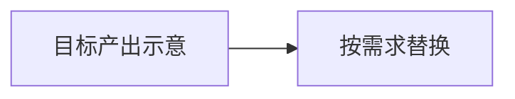
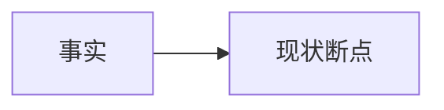

# Skill 升级需求：{一句话标题}

> 一句话痛点：**{加粗一句}**

- **所属 Skill**：chrono-pm-project / chrono-pm-portfolio
- **执行中的 Skill 版本**：{skill_version_installed}
- **工作空间实际版本**：{workspace_skill_version} / schema {workspace_schema}
- **所属项目**：{project}
- **日期**：YYYY-MM-DD
- **提出人**：{姓名或对话用户}
- **优先级**：高 / 中 / 低（AI 建议，不是发布决定）

版本两行不一致时，下一行写清差在哪。

---

## 〇、开场

{通俗场景，让没参加对话的人看懂发生了什么。}

---

## 〇·五、示例图

> 展示「做成之后长什么样」。形态/图形/可视化类必须贴目标图。其它类保留本节，写「本条无目标产出形态图」。第二节数据流图不能代替本节。

或：本条无目标产出形态图。

---

## 一、问题描述

### 1.1 现象

| 维度 | 用户期望 | 技能实际 |
|---|---|---|
| {维度} | {期望} | {实际} |

单表 ≤6 列。

### 1.2 用户原话

> {原汁原味引用}

### 1.3 后果

1. {后果}
2. {后果}

---

## 二、为什么会这样

### 2.1 比喻（可选）

{一个贯穿的比喻。说不清则删本节。}

### 2.2 数据流：现状 vs 应有

### 2.3 设计是否仍对（可选）

仅当能说明「设计对、自动化不足」时写。禁止空发议论。

---

## 三、定位

### 3.1 一句话根因

> {根因}

### 3.2 分层

| 层级 | 结论 |
|---|---|
| 直接层 | |
| 机制层 | |
| 系统层 | |

### 3.3 已排除

| 嫌疑人 | 结论 | 为什么排除 |
|---|---|---|
| {至少一条} | 不是 | {证据} |

---

## 四、证据链（按时间）

| 时间 | 发生了什么 | 写进了哪 | 技能做了/没做 |
|---|---|---|---|
| | | | |

---

## 五、缺口全景（可选）

未核过的标「未核」。不要假装已经扫完全部联动。

---

## 六、建议 Skill 补什么（可选）

只列缺口条目。禁止在此写完整升级方案 / CR / AP。

---

## 七、如何复现

1. {口令或步骤}
2. {预期撞上的现象}

---

## 八、迭代记录

| 轮次 | 日期 | 触发（用户原话摘要） | 主文档变更 | 证据 |
|---|---|---|---|---|
| R1 | YYYY-MM-DD | {摘要} | {本节变更} | assets/… / — |
