# ChronoPM 模块链路图

图例：实线=写事实源；虚线=只读/聚合；粗线=等项目经理裁定。

## G0 总览

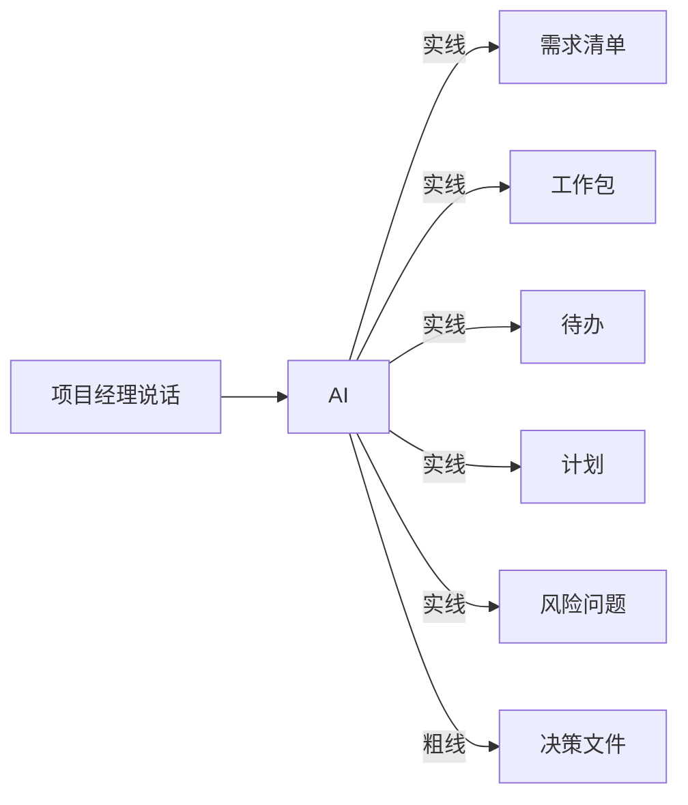

## G1 投喂源文件

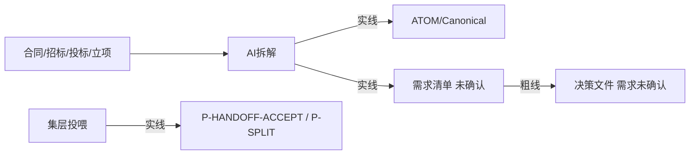

## G2 确认需求

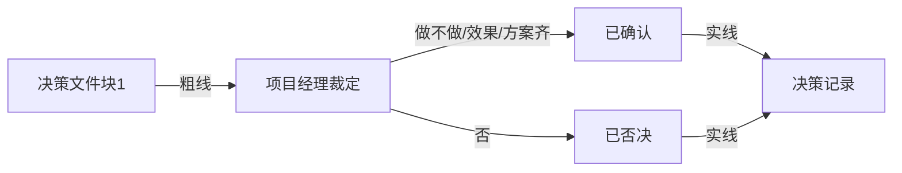

## G3 需求绑工作包


## G4 确认工作包再拆待办

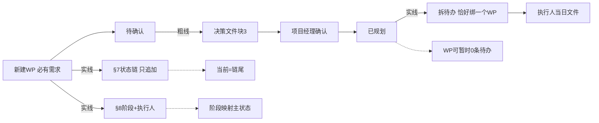

## G5 计划

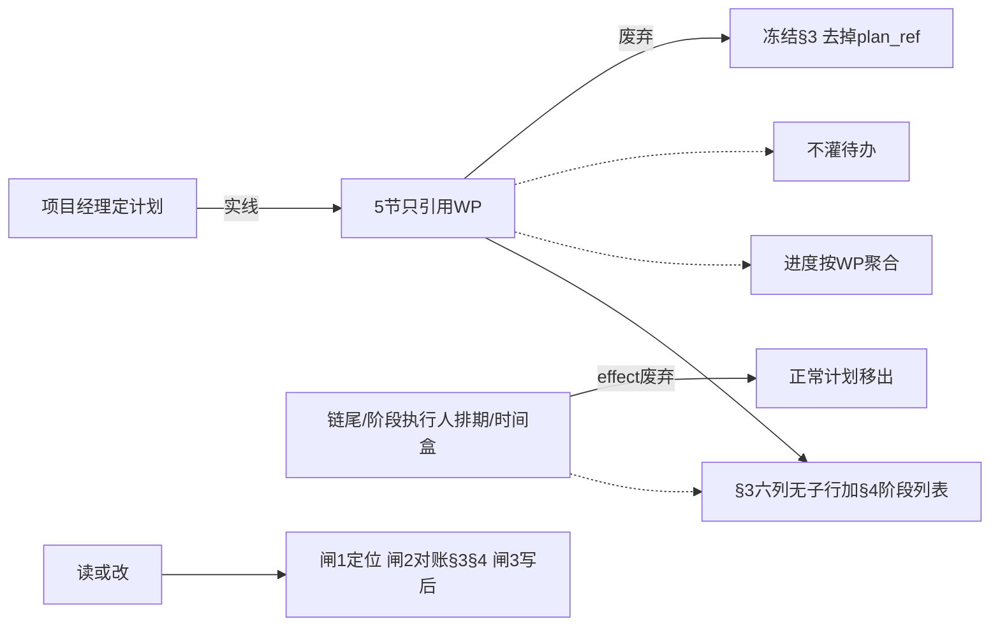

## G6 日报

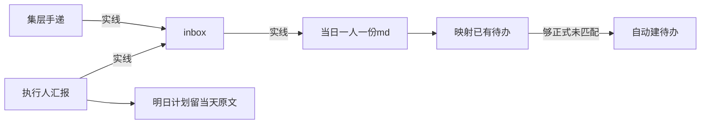

## G7 会议

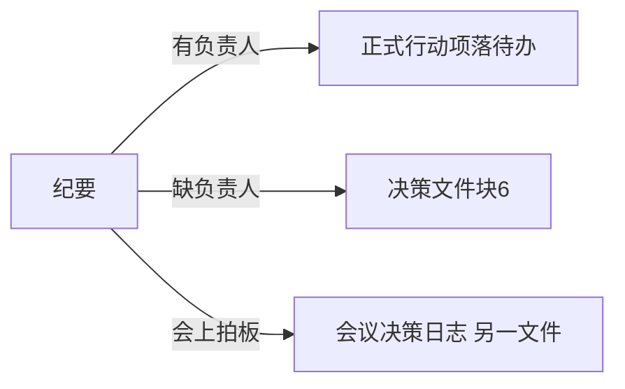

## G8 风险问题

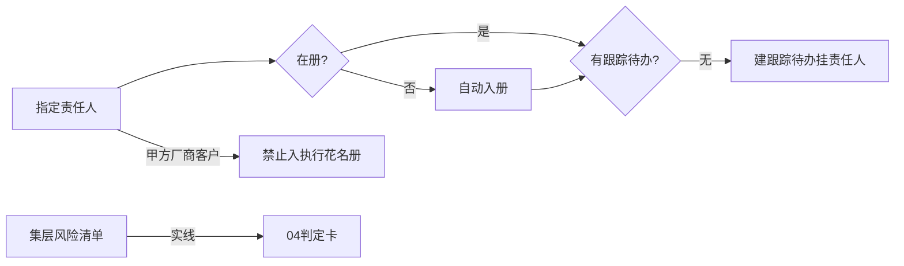

## G9 关联待办

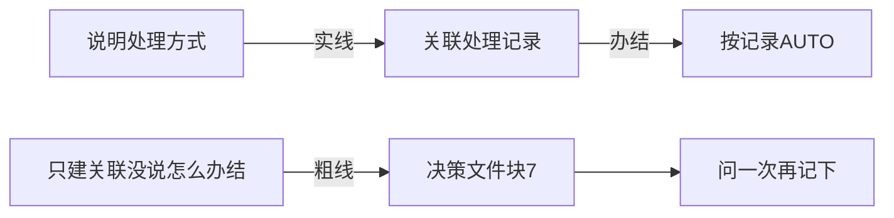

## G10 决策文件本身

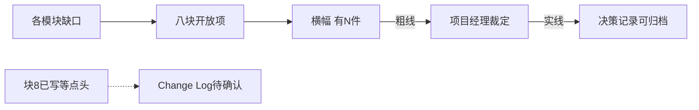

## G11 人员

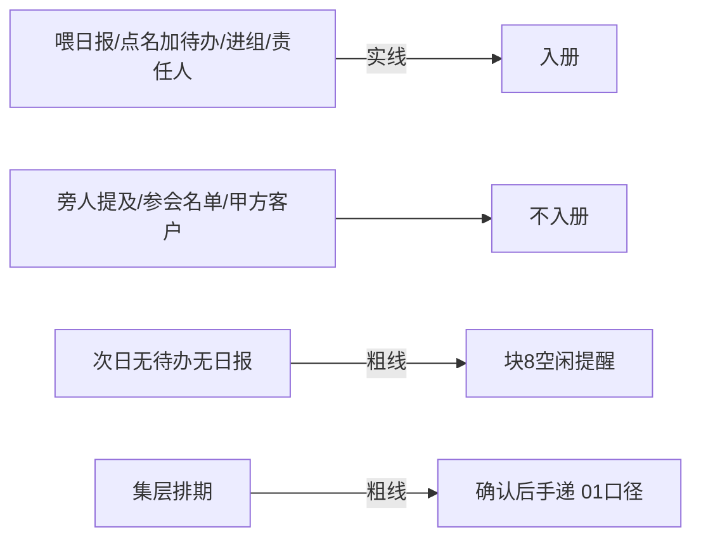

## G12 变更

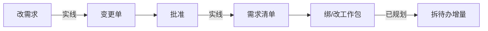

## G13 查询

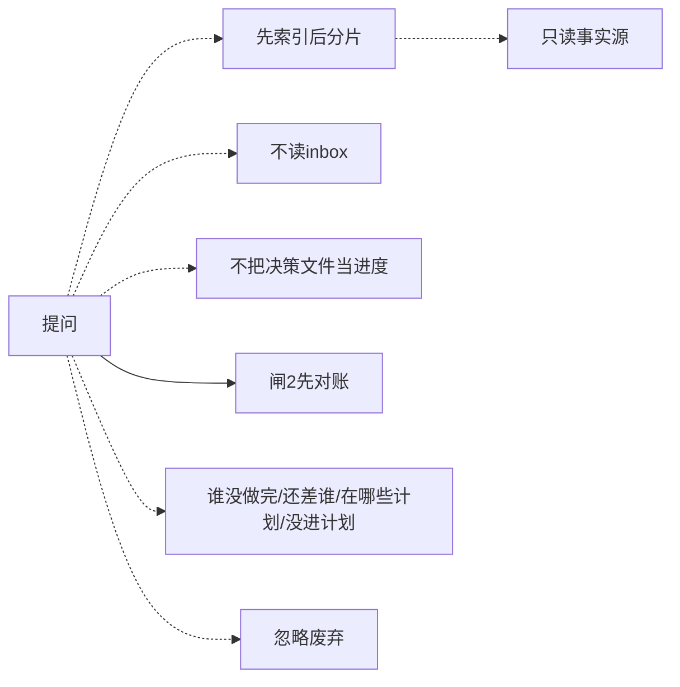

## G14 项目集

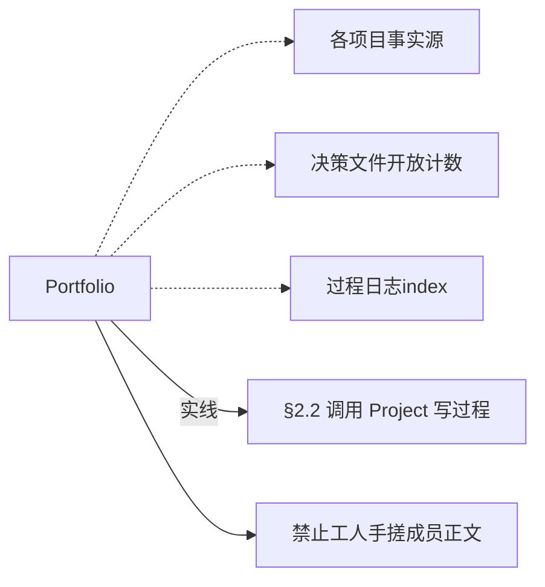

## G15 巡检

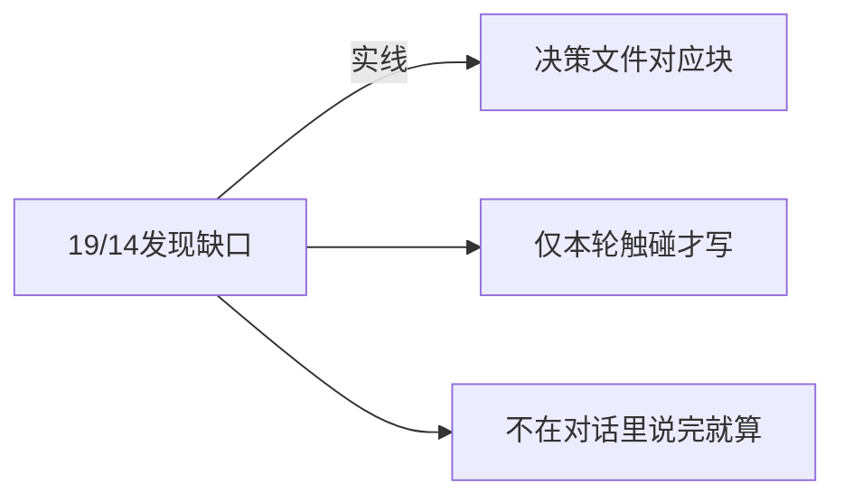

## G16 生成物落盘

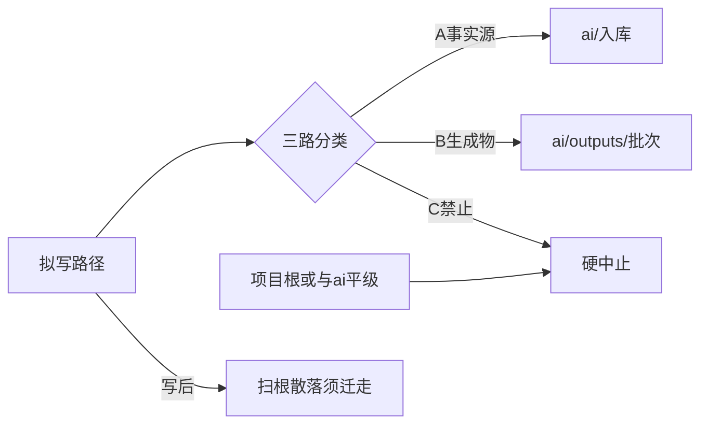

## G17 词库感应

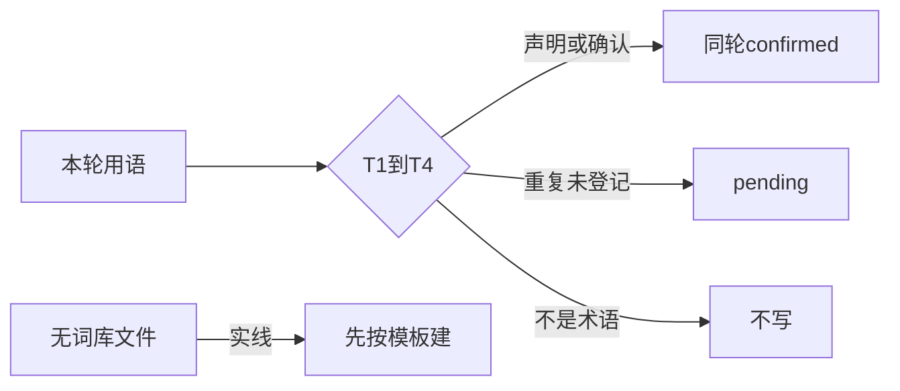

## G18 派活

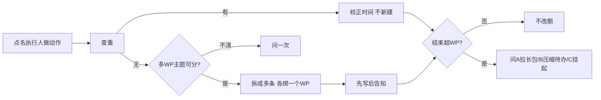

## G21 扫描推进

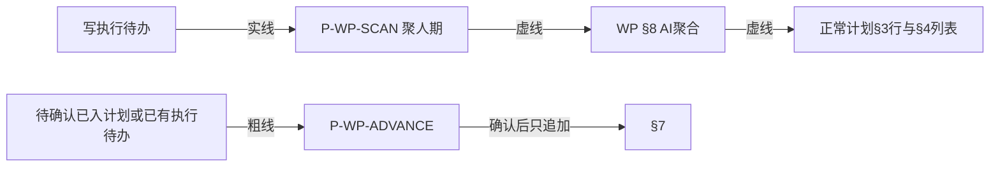

## G21 对外问答（能力目录，不是独立 Skill）

```mermaid
flowchart LR
  U[用户提问] --> R{简单查询?}
  R -->|是| S[SKILL底线14-16 + 05短条]
  R -->|写入/确认/方案/复杂| RN[reply-norm-skill reply-rules]
  RN --> C{真确认?}
  C -->|是| S50[00 5.0]
  C -->|纯查询| BAN[禁止问是否执行方案]
  X[reply-norm SKILL.md] --> BAN2[禁止误注册]
```

## G20 技能缺口

```mermaid
flowchart LR
  U[技能做不到/记升级需求] --> DET[P-ALWAYS第4步只检测]
  DET --> GAP[P-SKILL-GAP]
  GAP -->|实线| OUT[outputs 需求-md]
  X[requirements/wps/plans] --> BAN[禁止]
```

## G19 拆文件入库

```mermaid
flowchart LR
  F[拆文件/拆文档] --> SPLIT[source-split]
  SPLIT --> SRC[sources/编号/六件套]
  SRC --> REQ[需求清单 未确认]
  F -->|还要对外文件| OUT[再走 outputs]
  X[只出HTML不入库] --> BAN[禁止替代]
  PF[集层分法已定] -->|实线| SPLIT
```
