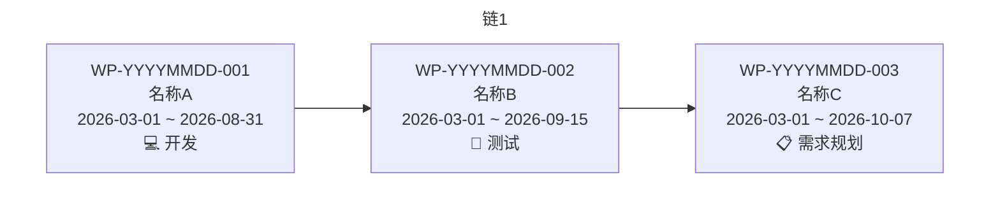
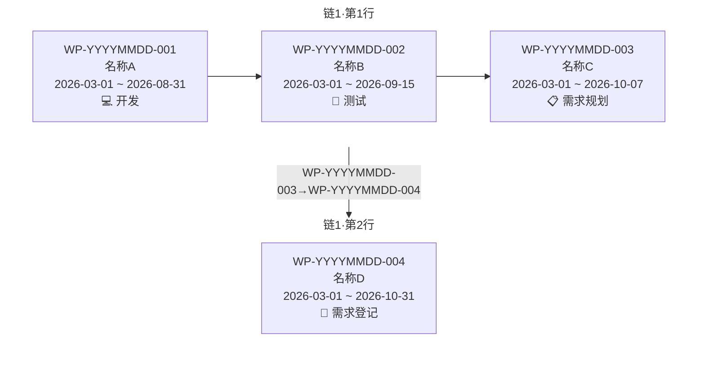
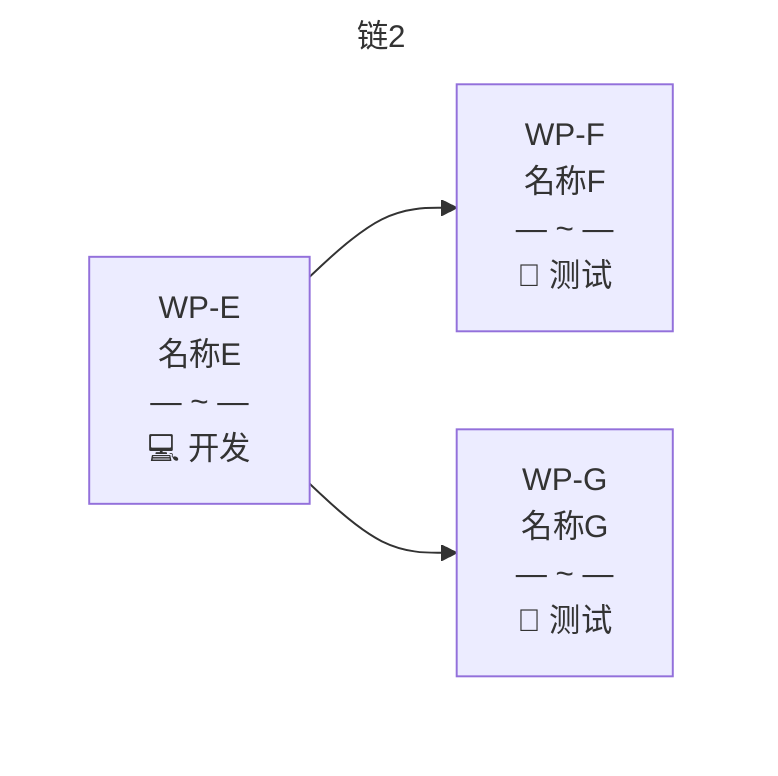
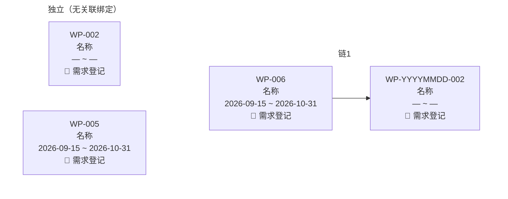
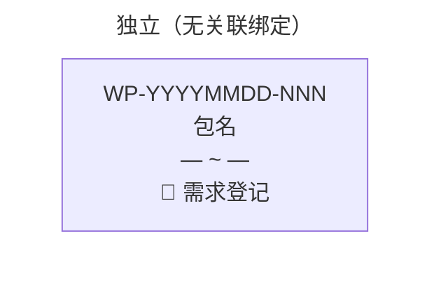

# 工作包总览图（派生视图）

> 非事实源、非生成物。真相 = 各 `wps/WP-*.md` 与 `wps/_index.md`。禁止把手改当真相；数据变则覆盖重写。
> 按正常计划分章节，每章一个 mermaid。废弃与已完成归档不入默认图。连线只认前置/后置且两端同章。
> 排列：有关联横向（超 3 换行用子图级边+标签）；无关联装入「独立（无关联绑定）」竖排。细则 11 §17.2 / §17.2.1。

### PLAN-YYYYMMDD-NNN：{计划名称}

有关联、≤3，单行链：

有关联、>3 换行（行间子图级边；禁止 `WP_C --> WP_D`）：

> 图注：`完整链序：WP-YYYYMMDD-001→WP-YYYYMMDD-002→WP-YYYYMMDD-003→WP-YYYYMMDD-004（超 3 换行，跨行依赖已标注在行间连线上）`

分支（边全在子图内）：

无关联竖排 + 同章混合时链与独立并列、组间无边：

### 未绑定计划

