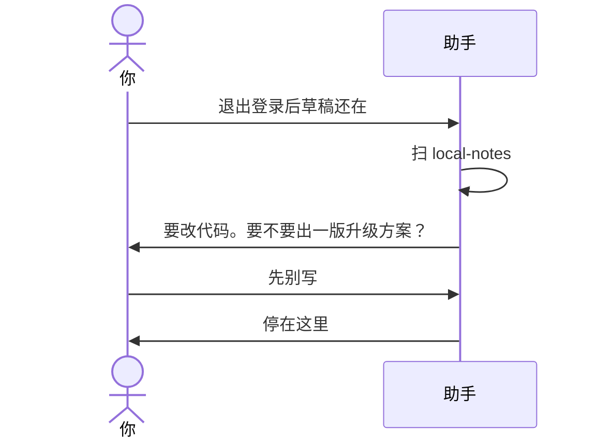

# 示例：先问再出方案

工作区指到业务仓库。你描述问题。助手扫完，发现要改代码，就先问要不要出方案。你点头之前，它不写方案，也不改代码。

> 假例子：林夏的笔记应用在 `D:\workspace\local\local-notes`。退出登录后，草稿还在。

---

## 全过程

### 第 1 轮 · 开口

**你**

> 退出登录后，编辑页的草稿还在。刷新还能看见。看一下 `D:\workspace\local\local-notes`。

**助手**

> 扫过 `src/auth/logout.js` 和 `src/draft/storage.js`。
>
> `logout()` 清了 token，没有删 `localStorage` 的 `draft`。这是要改的代码。
>
> 要不要出一版升级方案？

**你**

> 先别写。

**助手**

> 好。方案还没写，代码也没改。

---

扫完若没有必须改的代码或 bug：助手说明原因，不出方案，不建 `outputs/codeplan/`。
