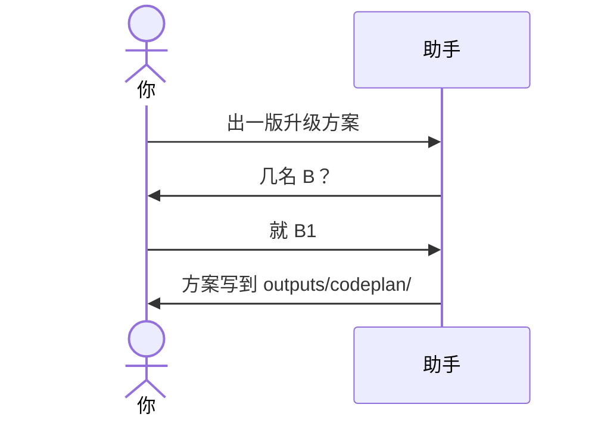

# 示例：人数由你指定

你说要出方案，但没说几名 B。助手只问人数。它不建目录，也不自己定成 2 名，也不定成任何别的人数。

> 假例子：还是林夏的 `local-notes`。她已经同意要方案。

---

## 全过程

### 第 1 轮 · 只问人数

**你**

> 出一版升级方案。

**助手**

> 审核几名？至少 1 名。请给出 B1 起的连续编号，例如只审 B1，或 B1、B2、B3。

这一步没有 `outputs/codeplan/`，也没有派 B。

### 第 2 轮 · 你给出人数

**你**

> 就一名，B1。

**助手**

> 按 1 名写。方案在 `outputs/codeplan/CP-20261004-001/a-body.md`。审核请另开对话。

人数可以是 1、3 或更多。你给出的人数小于 1：再问，不开始。
