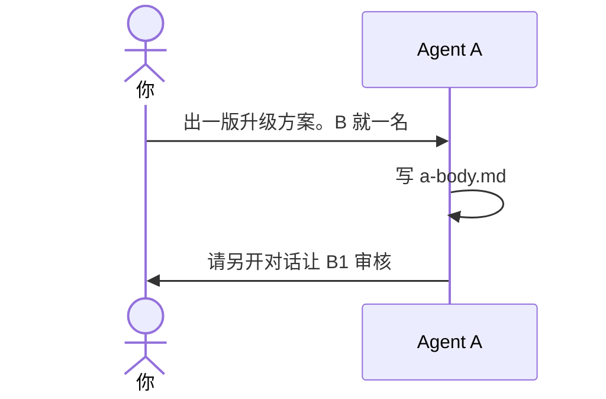

# 示例：你是 Agent A

你同意出方案，并说出了人数。这场对话是 Agent A。它只写方案正文，不写 B 的章节，不改业务代码。

> 假例子：林夏说「B 就一名」。仓库是 `D:\workspace\local\local-notes`。

---

## 全过程



### 开口

**你**

> 出一版升级方案。审核就 B1。问题是退出登录后草稿还在。

**助手**

> 方案在 `outputs/codeplan/CP-20261004-001/a-body.md`。`reviewers` 只有 B1。
>
> 六节是：问题、代码仓、现状、改法、不改什么、验收。现状里有路径和要核对的行为，没有贴源码。
>
> 这场对话写过方案正文，不能再当 B1。请另开对话审核。代码还没改。

`a-body.md` 文首只说明名单形状，例如：

```yaml
---
plan_id: CP-20261004-001
revision: 1
reviewers: [B1]
---
```

名单里有哪些 B，只写你指定的那些。这里写一项，是因为林夏说了就一名。
