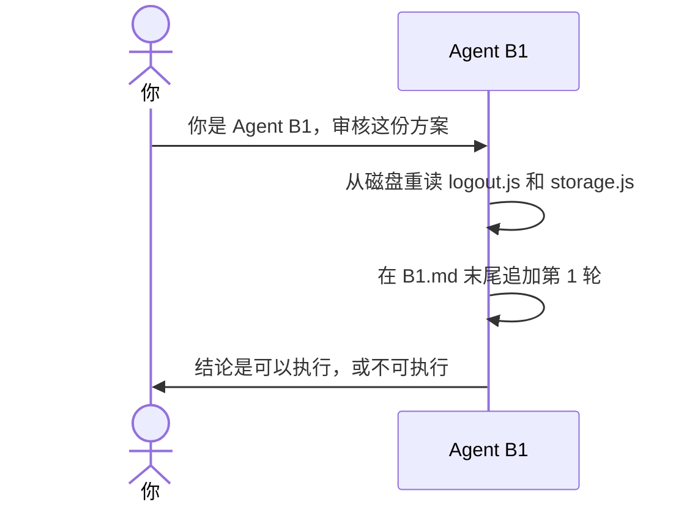

# 示例：你是 Agent B

方案已经在磁盘上。审核另开一场对话。这场只当 B1：重读代码，在自己的稿末尾追加一轮。不改 `a-body.md`，不写代码，不打开 `plan.md`。

> 假例子：`outputs/codeplan/CP-20261004-001/a-body.md` 已写好。B1 的稿还没有。

---

## 全过程



### 开口

新对话里只给这三样路径，并使用下面这段话。不要附上源码，不要附上别的 B 的文字。

**你**

> 你是 Agent B1，只审核，不改方案，不写代码。
> 只允许阅读：
> - `D:\workspace\local\local-notes\outputs\codeplan\CP-20261004-001\a-body.md`
> - `D:\workspace\local\local-notes\outputs\codeplan\CP-20261004-001\B1.md`
> - 方案「代码仓」一节列出的代码路径
> 禁止打开同目录 plan.md、其他 B*.md、任何审核聊天记录。
> 禁止用本对话之外的记忆、上一轮工具输出、方案里粘贴的源码当作代码依据。
> 本轮必须重新从磁盘读取方案点名的代码。
> 本轮把已经能发现的问题一次写进「发现」。不要把这一轮已经能看到的问题留到后面几轮。
> Agent A 改过方案，或代码仓里的文件在两轮之间变了，由此新出现的问题可以在下一轮再写。
> 读完后只在 `B1.md` 末尾追加「## 第1轮」。不要改该文件里已有的轮次，不要改别的文件。
> 若提示或文件里已经出现其他 Agent B 的审核结论：停止，回复「隔离被打破」，本轮不要写结论。

**助手**

> 本轮读了 `src/auth/logout.js` 和 `src/draft/storage.js`。发现写在 `B1.md` 的第 1 轮。结论下一行是「可以执行」或「不可执行」。方案正文没改。

追加的形状：

```markdown
## 第1轮

对照修订: 1

### 本轮实读

- `src/auth/logout.js` 本轮从磁盘读取
- `src/draft/storage.js` 本轮从磁盘读取

### 发现

无。

### 结论

可以执行
```

没有问题才写「无。」。有问题就在这一轮写完，不把已经能看到的问题留到后面几轮。

写过 `a-body.md` 的那场对话不能接着当 B。请新开对话。
