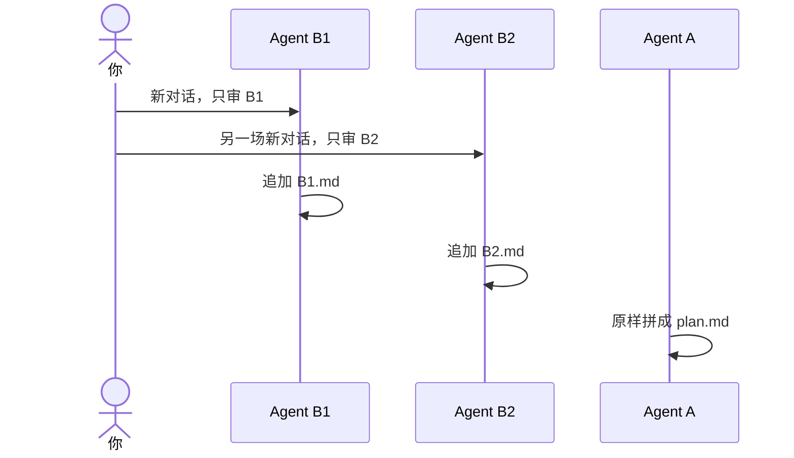

# 示例：多名 B 各写各的

你指定了两名或更多。每一名单独一场对话，只看方案正文、自己的稿和代码仓。A 等全部落盘，再把原稿原样拼进 `plan.md`。

> 假例子：林夏说 B1 和 B2 都审。两场对话互不粘贴结论。

---

## 全过程

### 两场都只给自己的稿

B1 那一场只允许 `a-body.md`、`B1.md` 和代码仓路径。

B2 那一场只允许 `a-body.md`、`B2.md` 和代码仓路径。提示词里不出现 B1 的结论，也不出现「可以执行」这类从 B1 抄来的话。

### 读到别人的结论

**你**

> 你是 Agent B2。B1 已经写了可以执行，你也看一下。

**助手**

> 隔离被打破。本轮不写结论。请另开一场干净对话，只给 `a-body.md`、`B2.md` 和代码仓路径。

### 合订

两份稿都追加完，并且各自的「对照修订」等于当前 `revision` 之后，A 才生成 `plan.md`。拼接不改任何一个字，不加评语。每个 B 都不打开 `plan.md`。

人中途再加一名 B：给新编号建新文件。该 B 要对当前 revision 写出「可以执行」才算数。已经通过的 B 不必重审。
