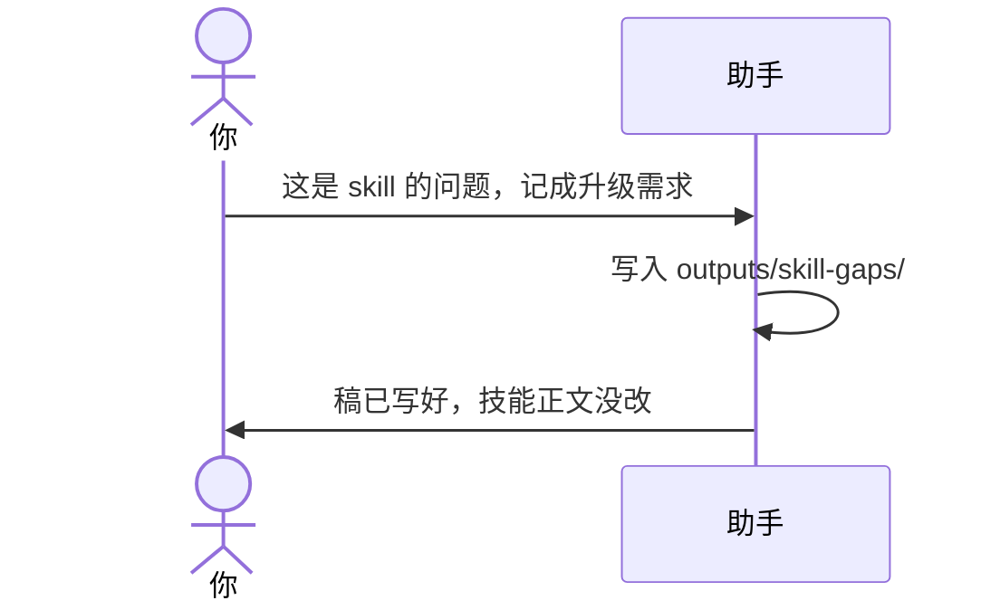

# 示例：记成升级需求

你明确说这是技能本身做不到，要记成升级需求。助手先把缺口稿写到当前业务仓，再告诉你。它不改 `SKILL.md`，也不为此出一套技能升级方案。

> 假例子：林夏希望这个技能在没人点头时也直接改代码。技能不允许这样做。

---

## 全过程

### 开口

**你**

> 每次都要我先同意才写方案，太慢了。这是 skill 的问题，记成升级需求。我希望说出问题就直接改代码。

**助手**

> 已写入 `outputs/skill-gaps/SG-20261004-001-需求-同意前不直接改代码.md`。
>
> 稿按技能包里的模板写了用户原话、期望和实际、现状、建议补丁。状态是 draft。
>
> `SKILL.md` 没改。这份稿不是执行许可。

同一句话里的口令还有：「技能做不到」「记成技能缺口」。助手不问「要不要记」，先写后告知。

你说不要记：这份改为 cancelled。本对话里同类的话不再写新稿。
