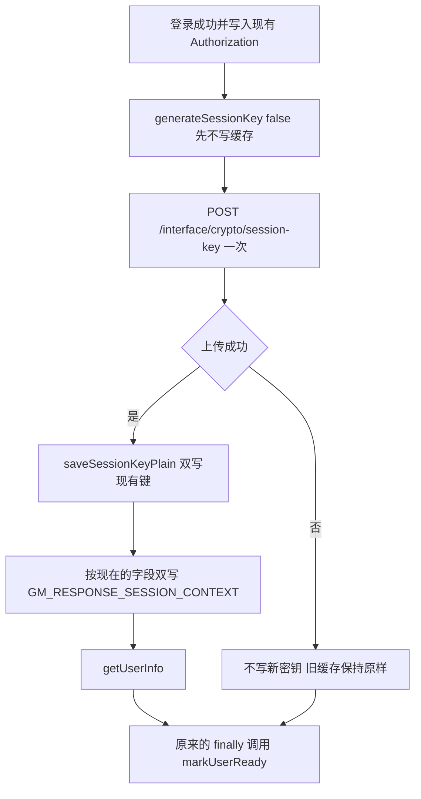

# 示例：完整方案（登录与返参解密）

路径、地址、账号和工程名已换成 `local`。行号只对下面这三个假想仓库有效。

| 工程 | 路径 | 角色 |
| --- | --- | --- |
| local-server | `D:\workspace\local\local-server` | 后端 |
| local-web | `D:\workspace\local\local-web` | PC |
| local-app | `D:\workspace\local\local-app` | 移动端 |

---

# 登录与返参解密 完善方案

- 文档日期：2026-10-03
- 写法：按 codeplan-multireview。本文件是完善后的完整方案，不是补充说明
- 状态：2026-10-03 再次拉取后，登录、刷新、返参密钥和两端加密文件的行号没有移动。后端新增 `local1111`（属主校验），PC 新增 `local2222`（个人信息服务），移动端仍是 `local3333`。这些提交没有改方案锚点。已按「代码实现操作方案」改三个仓库
- 注释：代码块里的注释，开始改代码时原样写进源文件。注释说明原因
- 行号对应当天工作区，落地时以函数名为准
- 修订：对照当前三个仓库吸收文末评审。缓存调用按 core 现有注释对齐。刷新锁的判重以存储的 TOKEN 为准。第 1.0 节复用片段替换现有 455–456 行，`sessionId` 和 `principalId` 只声明一次。复用依赖 481 行把 `TOKEN` 写成 JWT 原文。PC 成功回调替换范围是 146–169 行，含收尾括号。两端 `encryp-decrypt.js` 必须先于或同批于对应的 `App.vue` 和 `request.js`。2026-10-03 重拉代码与这些锚点没有冲突，方案里的执行位置不用改行号。三个业务仓库已按本文改完。发布时后端（锁、续期、登出）先上，再按端把 `encryp-decrypt.js` 与该端的 `App.vue`、`request.js` 一起发。移动端同批发 `loginFlow.js`。文末审核原文不改

## 1. 背景与目标

登录和返参解密是两次绑定，也是两套缓存。`LoginSessionManager.createSession` 每次新建 `sessionId`。登录态是 Hash，缓存区 `auth:login:state`，业务键 `sid:{SM3("auth-login-state-session:" + sessionId)}`。盐以 `LoginStateCacheUtil` 常量第 53 行为准。类注释第 35 行写成 `local-auth-login-state-session:`，和常量不一致。浏览器再生成 `sessionKey`，`POST /interface/crypto/session-key` 把它写成 String，缓存区 `crypto:session`，业务键 `session:{SM3(sessionId)}`，SM3 的输入没有登录态那串盐。`CacheManager` 还会在业务键前加 region。业务代码不要自己拼 region，也不要把缓存区名改成以冒号结尾。之后加密接口用这把密钥加密 `JsonModelResult.data`。

现在重新登录时，前端在上传完成前就把新密钥写进浏览器缓存，在途响应和别的标签页仍用旧密钥加密，解密失败。无感刷新不换 `sessionId`，却又上传一次甚至再生成一把密钥。登出只删登录态，不删返参密钥。

目标：

1. 新登录仍是先登录，再生成新密钥，上传成功后才写入现在这两个缓存键。
2. 无感刷新不上传、不生成。后端把已绑定记录的有效期延到和新登录态一样。前端只替换 token。
3. 登出按同一个 `sessionId` 删除返参密钥。
4. 不改缓存键名、JSON 形状、加密算法、配置文件，不改推荐页的读法。

## 2. 当前上下文与约束

| 工程 | 绝对路径 | 角色 |
| --- | --- | --- |
| 后端 local-server | `D:\workspace\local\local-server` | 创建 sessionId、保存返参密钥、签发 `X-New-Token`、登出 |
| PC local-web | `D:\workspace\local\local-web` | 本地 `?code=`、SSO `?token=`、上传密钥、替换 token、解密 |
| 移动端 local-app | `D:\workspace\local\local-app` | `bridge.auth`、`direct=1` 本地登录、上传密钥、替换 token、解密 |

约束来自已经在用的读法，不是偏好：

- `RecommendPanel.vue` 把 `CRYPTO_V2_SESSION_KEY_PLAIN`、`GM_RESPONSE_SESSION_CONTEXT` 放进 `postMessage`。先读 localStorage，没有再读 sessionStorage。`Authorization` 和 `USER_LOGIN_ID` 只读 sessionStorage。
- 解密用 `getBothStorageItem`，同样是 localStorage 优先。响应里自带 `keyId`、`keyVersion`、`nonce`、`iv`、`tag` 时，不依赖本地上下文的 `expireAt`。
- `userReady.js` 写明登录失败也必须 `markUserReady()`，否则文书、首页和每次业务请求会一直等。
- 不新增第三方依赖。密钥续期复用 `CryptoSessionCacheService`。错误返回继续用现有 `JsonModelResult`，这次不新增错误码。

## 3. 对已有建议的评估

### 3.1 可采纳内容

| 建议 | 采纳原因 | 源码依据 |
| --- | --- | --- |
| 每次新登录生成新 sessionKey，上传成功后再写缓存 | 这把密钥是返参根密钥。响应里的 nonce、iv、keyId 是明文，根密钥能解开以后所有返参。复用旧密钥会让同一浏览器的下一个账号继续用上一把密钥 | `generateSessionKey` 在 PC `encryp-decrypt.js` 1745 行、移动端 1724 行返回前就双写 |
| 无感刷新不上传、不生成，只延长已绑定缓存 | `sessionId` 不变。再上传多一次加密交互。PC `onTokenRefreshed` 85–87 行在没有本地密钥时调用 `establishCryptoSession()`，真正的 `generateSessionKey()` 在 `App.vue` 111 行，会把密钥换成新的 | `expireLoginState` 在 488 行，`return newToken` 在 491 行。473 行生成裸 JWT。中间没有返参缓存调用 |
| 续期必须改 JSON 里的 `expireAt`，再用 `saveBySessionId` 一次写回 | 拦截器比较的是缓存 JSON 的 `expireAt`。返参记录是 String，不是 Hash | `expireBySessionId` 只调 `cache.expire`。`saveBySessionId` 走 `cache.put(key, json, seconds)`。`ReplayGuardService` 注释写明这个 `put` 是 Redis SETEX，值和 TTL 一起写 |
| `X-New-Token` 替换前补 `Bearer ` | 登录体是 `Bearer ` + JWT。响应头是裸 JWT。631 行用 `startsWithIgnoreCase` 匹配带尾空格的 `Bearer `，`bearer xxx` 也能过。对不上才返回 null，再由 `getTokenCredential` 342–347 行去读 Cookie `LOCAL_TOKEN` | `LoginResponse.getAuthorization` 的拼接在 165 行。`AuthConstants` 48 行的前缀是 `"Bearer "` |
| 移动端用 `setToken` 写 sessionStorage，并删掉 localStorage 里的 `Authorization` | 139 行写进 localStorage，没有读取方。不删的话这份残留会一直留在设备上 | `auth.js` 的 `getToken` / `setToken` 用 sessionStorage。全工程没有 `localStorage.getItem('Authorization')` |
| 登录成功后上下文也双写 | 推荐页和 `getSessionContext` 都是 localStorage 优先。只写一侧时，另一侧的旧 JSON 会先被读到。刷新若只改已有副本的 `expireAt`，旧副本会被续成新时间 | PC `establishCryptoSession` 123 行只写 sessionStorage。移动端 `handleLoginRes` 74 行只写 localStorage。键名常量已是 `SESSION_CONTEXT_STORAGE_KEY` |
| 登出时 `removeBySessionId` | 方法注释写明预留给登出，目前没有调用方 | `CryptoSessionCacheService.removeBySessionId`。`SsoAuthController.invalidateRedisLoginState` 只调 `removeLoginState` |
| 头还在的失败响应也替换 token，401 不写回 | 认证失败的 401 在 `tryRefreshToken` 之前返回。加密拦截器每一条拒绝都会走 `writeJsonError`，622 行 `response.reset()` 清掉已写的头。不限于密钥过期：未登录、缓存异常、密钥不存在、状态不可用、已过期、缺 keyId、协议缺失或不支持都会。没有「keyId 不匹配」这条。前端仍不在 401 上写回 token | PC `err` 用 `error.response.status`。移动端 `err` 65 行已有 `status`。不要把移动端的变量名抄到 PC |

### 3.2 有条件采纳内容

| 建议 | 条件 | 原因 |
| --- | --- | --- |
| 替换 token 时用新 JWT 的 `exp` 改本地已有上下文的 `expireAt` | `atob` 前按 4 的倍数补 `=`，再用 `TextDecoder` 解 UTF-8。解析失败返回 0。只改已存在的那份，不新建键 | 主站解密不靠这份过期时间。推荐页把整段 JSON 交给 iframe。iframe 源码不在这三个仓库。JWT payload 经常没有 base64 padding |
| 移动端 `direct=1` 且已有 token 时重新登录一次 | 同一次登录只进行一次。`started` 之后的调用只等待。401 里 `reset()` 之后，下一次请求可以再登录 | `App.vue` 27 行没有 `removeToken`，必须和 `ensureLogin` 一起改 import。`ensureLogin` 170 行先看 `getToken()`，`direct` 在 179 行 |
| `generateSessionKey` 增加「先不落缓存」 | 不传参数时仍立刻双写，避免未知调用方丢缓存 | 两个前端目前只有 `App.vue` 调用。默认行为不变 |
| 同一 `sessionId` 的无感刷新加 `@DistributedLock` | 锁键 `"'auth:refresh:' + #authUser.sessionId"`。`waitTime = 2`、`timeout = 10`、`failStrategy = FAIL_OPEN`。进锁后 `getLoginState` 新读存储态。存储的 `tokenId` 已经不是 `getJwtId(currentToken)`，存储的 `EXPIRE_AT` 剩余时间仍大于阈值，并且 `getJwtId(存储的 TOKEN)` 等于存储的 `tokenId` 时，返回存储的 `LoginStateKeys.TOKEN`，不再 `generateToken` | 页面并发请求都会进 `tryRefreshToken`。482 行每次都换新 jti，后写覆盖先写。锁只负责排队。用 `getJwtId(currentToken)` 去对存储的 `tokenId` 判「命中」会恒为 false，锁就白加。`UserPersistService.persistUser` 也是进锁后再查一次，不是拿到锁就插入 |

### 3.3 暂不建议采纳内容

| 建议 | 原因 |
| --- | --- |
| 缓存里已有密钥就复用，绑到新 sessionId | 和「每次登录新密钥」相反。换账号后旧密钥仍然能解新返参 |
| 无感刷新再 `POST /interface/crypto/session-key` | 多一次交互，也是用户明确不要的。后端续期可以去掉这次调用 |
| 只调用 `expireBySessionId`，或把返参记录改成 `putMap` | `expire` 只改 TTL。登录态才是 Hash，`putMap` 还不带 TTL。返参键已经是 String，改成 Hash 会和现有值类型冲突 |
| 失败时不调用 `markUserReady` | `userReady.js` 要求失败也放行。不放行会把等待方挂住 |
| 修改 `clearPreviousSession`，让它停止删除 sessionStorage 里的密钥 | 它本来就不删 localStorage。解密先读 localStorage。改删除范围会改变现有清理行为，又解决不了重传 |
| 刷新进行中再排队补传一次 | 那次补传就是被否定的上传。`isRefreshingSession` 只留在登录绑定上 |
| 文书、网关 axios 也读 `X-New-Token` | 那些客户端不经过本系统 `TokenAuthInterceptor`。主 axios 换好 sessionStorage 后，它们下次读取就是新 token |
| 改 `application-prod.yml` 或新增配置 | 有效期沿用 `refreshAccessToken` 已经算好的 `expiresIn` 和 `newExpireAt` |
| 按 sessionId 拆开浏览器缓存键 | 推荐页认固定键名。这次不改它的读法 |
| 新引 Redisson，或在 `LoginSessionManager` 里自己 `cache.getRedisLocker()` | 业务代码已经在用 `@DistributedLock`。`RedisLockerProvider` 只给切面用。自己拿锁还得自己释放 | 
| 注解保持默认 `waitTime = 0` | 锁被占用时切面抛 `BUSINESS_DUPLICATE_SUBMIT`，这条在 `failStrategy` 分支之外（`DistributedLockAspect` 132–137 行）。`waitTime = 0` 会马上抛。`tryRefreshToken` 347–349 行吞掉异常，这笔响应没有 `X-New-Token`。`waitTime = 2` 时，等满 2 秒仍拿不到锁也会同样被吞。这和选 `FAIL_OPEN` 还是 `FAIL_CLOSE` 无关 |
| 使用 `FAIL_CLOSE` | `FAIL_OPEN` / `FAIL_CLOSE` 只在锁服务本身异常时分叉（343–359 行）。`FAIL_CLOSE` 抛 `SYSTEM_CACHE_ERROR`，同样被 `tryRefreshToken` 吞掉，故障期间这笔就不刷新。`FAIL_OPEN` 放行，退回今天的无锁刷新。材料保存用 `waitTime = 0` 和 `FAIL_CLOSE`，是因为重复提交应该拒绝，不适用于刷新 |
| 锁键用 `currentToken`、`userId` 或 `principalId` | `currentToken` 每笔都不同，锁互不排斥。`userId` 会把同一用户的多个会话也串在一起。键必须是 `sessionId` |
| 用 jti 白名单让旧 token 继续通过绑定校验 | 要改 `checkTokenBinding`。407–409 行的策略 A 和 482 行覆写 `tokenId` 本来就矛盾。这次让并发请求共用已经签发的那一把，不让新旧 jti 同时有效 |
| 修改 `writeJsonError` 的 `response.reset()` | 续期写在 `refreshAccessToken` 返回前，order 3 能读到新的 `expireAt`。改 reset 会碰到每一条加密拒绝。这次不改拦截器 |
| 移动端解密失败时把 `success` 改成 false | 上传失败盖住旧密钥的路径，由 `generateSessionKey(false)` 关掉。其余失败仍是两端既有差异。这次不改 `decryptResponse` |
| 401 或登出时删除浏览器里的两把密钥 | 推荐页还读这两个键。下次登录上传成功后再覆盖 |
| 让推荐页监听 `token-refreshed` 再发 `postMessage` | 这次要删掉这个事件。iframe 只在 onload 后 1 秒发一次（161–187 行）。要重发就要改 `RecommendPanel.vue` |
| 改 `registrationfile.js` 的模块级 `Authorization` | 50–56 行在 sessionStorage 有值时会覆盖。这次不改该文件 |
| 对齐移动端 `sm3Text` 的空参 | 现有调用先 `stringifyPlainData`。这次不改 |
| 去掉 `local` 或加上 `NODE_ENV` 判断 | `doLocalLogin` 134 行保持原样。生产风险记在第 10 节 |
| 按 `Docs` 里的 Redis 配置做环境隔离 | `Docs/application-prod.yml`、`application-test.yml` 是仓库副本，不是 Nacos 现网。这次不改配置 |

### 3.4 需要进一步讨论内容

1. 会删除 Redis 登录态的生产代码只有 `SsoAuthController.invalidateRedisLoginState`。PC 真正调用 `GET /auth/sso/logout` 的是 `Navbar.doLocalLogout`。`UserInfoPanel`、PC 的 401、移动端的 401 都不打这个接口。过期 JWT：`parseTokenResult` 291–296 行丢掉 `ExpiredJwtException` 里的 claims，`getClaims` 464–469 行返回 null，循环 294–296 行 `continue`。外层 catch 接的是别的异常，文案是「JWT 解析失败」。本次只在这个循环里多删返参密钥。401 和用户面板要不要也算登出，需要单独定。
2. 推荐页 iframe 只在加载后收到一次 `postMessage`（`RecommendPanel.vue` 161–187 行）。本地 `expireAt` 更新到不了已经发出去的那份。刷新后 Redis 的 `tokenId` 已经换成新 jti，iframe 里的旧 `Authorization` 会绑定失败。iframe 源码不在这三个仓库。本次不改推荐页。
3. 服务端 `expireAt` 用的是 `newExpireAt`。前端本地上下文用 JWT `exp` 乘 1000。两边最多差不到 1 秒。`newExpireAt` 继续由 `refreshAccessToken` 传入，不在续期方法里用另一套时钟重算。
4. `nameInfoForm.vue` 548 行的 `ensureUserInfoReady` 是组件里的局部函数。`enterpriseStartup.js` 1232 行的同名方法才是 store action。两处都会在没有姓名时补拉 `getUserInfo`，自己 catch。本次不改这两个方法。`handleLoginRes` 在上传失败时不再调用 `getUserInfo`。
5. `LoginSessionManager` 407–409 行写着旧 token 继续有效到自然过期。`LoginStateCacheUtil` 类注释第 33 行说的是另一件事：无感刷新后新旧 token 仍用同一个 sessionId，所以仍能按这个 sessionId 查到登录态 Hash。482 行会把 Hash 里的 `tokenId` 改成新 jti。`checkTokenBinding` 337–344 行要求 jti 相等，旧 JWT 在刷新提交后就不能再通过绑定校验。查得到 Hash，不等于旧 JWT 还能登录。主 axios 换上带 `Bearer ` 的新 token 后走请求头。只剩 Cookie、没有合格 Authorization 头的请求，会在刷新后立刻绑定失败。本次给同一 `sessionId` 的刷新加已有的 `@DistributedLock`，进锁后复用 Hash 里已经写下的 `token`。不改 Cookie，也不做 jti 白名单。
6. 移动端 401 现在只 `removeToken()`（`request.js` 82 行），84 行跳转登录仍是注释。`loginFlow.started` 不会回到 false，后面的 `ensureLogin` 拿到的是已经结束的 Promise。本次在 401 里增加 `reset()`，不恢复那行跳转。

## 4. 完善后的总体方案



无感刷新不进入上图。`TokenAuthInterceptor` 仍调用 `refreshAccessToken`。该方法在延长登录态之后，若 Redis 里已有返参记录，只改 `expireAt` 并重写 TTL。没有记录就不创建。前端成功响应和除 401 以外的失败响应只做三件事：补 `Bearer `、写入现在读取 token 的位置、若本地已有上下文则改它的 `expireAt`。

登出仍走 `GET/POST /auth/sso/logout`。删登录态之后再 `removeBySessionId`。浏览器缓存键留到下次登录上传成功后再覆盖。

## 5. 详细实施步骤

步骤和完整替换片段在后文「代码实现操作方案」。编码前由运维确认三件事，本次不改配置、不改 yml：P1 生产与测试 Redis 隔离；P2 Nacos 返参加密白名单不含 `/interface/crypto/session-key`；P3 Nacos 没有把 `project.distributed-lock.enabled` 设为 false，并且缓存区 `default` 上的锁在生产和测试可用。仓库里的 `application-*.yml` 没有 `project.distributed-lock`，不配就走代码默认值 `enabled=true`、`cacheName="default"`、`globalKeyPrefix=""`、`defaultFailStrategy=FAIL_OPEN`。`enabled` 为 false 时切面直接执行方法，复用去重不会发生。

顺序是：

1. 后端 `LoginSessionManager.refreshAccessToken` 增加续期，并用已有 `@DistributedLock` 串起同一 `sessionId` 的刷新。不改 `TokenAuthInterceptor`。
2. 后端 `SsoAuthController` 登出时删除返参密钥。构造器只插入参数、赋值和 `@param`，保留现有六条逐行注释。
3. 两端 `encryp-decrypt.js` 新增 `saveSessionKeyPlain`、`saveSessionContext`，并给 `generateSessionKey` 增加参数。这一文件必须先于或同一次发布该端的 `App.vue` 和 `request.js`。只发 `App.vue` 时，`saveSessionKeyPlain` 和 `saveSessionContext` 导入得到 `undefined`，调用抛 TypeError；`generateSessionKey(false)` 的 `false` 被现有无参函数丢掉，上传前仍会双写。PC 和移动端可以分开发，每一端的加密文件不能晚于该端页面。
4. PC `App.vue` 登录成功后再双写，删除 `token-refreshed` 监听。
5. PC `request.js` 只替换 token。
6. 移动端 `App.vue` 同一登录顺序。第 27 行的 import 和 `ensureLogin` 一起改。`direct=1` 在同一次登录里只登录一次。
7. 移动端 `request.js` 用 `setToken` 替换 token，并删掉 localStorage 里的 `Authorization`。401 分支调用 `loginFlow.reset()`，不恢复被注释的跳转。

## 6. 代码依据与示例

下面每条都是当前源码，用来支持第 3 节的判断。替换代码在实现方案里。

`refreshAccessToken` 在延长登录态 TTL 后直接返回新 token，中间没有返参缓存调用：

```java
loginStateCacheUtil.expireLoginState(sessionId, expiresIn);
return newToken;
```

调用在 488 行，`return newToken` 在 491 行。486–487 行和 490 行是注释。同文件已有 `org.apache.commons.lang3.StringUtils` 和 `@Slf4j`，续期方法可以复用，不必再引入日志或空判断工具。

`CryptoSessionCacheService.saveBySessionId` 在 `expireSeconds <= 0` 时抛 `IllegalArgumentException`，成功与否是 `cache.put` 的 boolean，false 不抛。`toCacheTtlSeconds`（319–324 行）会把小于等于 0 的秒数换成默认 4 小时。登录态的 `toCacheExpireSeconds`（495–498 行）小于等于 0 时返回 -1，`expireLoginState` 接着直接返回 true，不再调用 `expire`。两套转换不能互换。续期方法在调用 `toCacheTtlSeconds` 之前，`expiresIn <= 0` 就返回。`expiresIn` 是秒，`newExpireAt` 是毫秒，毫秒只写入 JSON。

core 里已经有的 Cache 调用，续期和登出都按这些注释走：

| 调用 | 现有写法 | 本次怎么用 |
| --- | --- | --- |
| `cache.put(key, value, seconds)` | `ReplayGuardService` 86–88 行：第三个参数是秒，底层 SETEX，值和 TTL 一次写入。95–98 行：`put` 还会 `serializeJson()` | 续期只走 `saveBySessionId`。它先 `JacksonJsonUtils.toJsonIncludeNull`，再 `cache.put` 这个字符串。`LoginSessionManager` 不要直接 `cache.put`，也不要把 Map 交给 `put` |
| `cache.expire` | `LoginStateCacheUtil` 95 行：`putMap` 是 HMSET，不带 TTL，登录态写完必须再 `expire`。`RateLimitRedisService` 14、70–74 行：`incr` 同样不带 TTL，才另调 `expire`，并检查返回的 boolean | 返参记录已经是带 TTL 的 String。续期不要改成 `putMap` 再 `expire`。`saveBySessionId` 返回 false 之后也不要再补 `expireBySessionId` |
| `cache.putMap` | `LoginStateCacheUtil` 86–90 行：写入前先 `cache.remove`，避免旧 String 造成 WRONGTYPE | 返参键就是 String。不要对它 `putMap`，也不要先删再写成 Hash |
| `CacheManager.getInstance` | 返参是 `getInstance("crypto:session")`，不传默认 TTL（346–349 行），TTL 来自 `put` 的第三个参数。登录态是 `getInstance(name, -1)`（481 行）。`ReplayGuardService` 170 行、`RateLimitRedisService` 56 行：Cache 在方法内部取，不注入成字段。`ReplayGuardService` 74–75 行：`getInstance` 的 name 不能以冒号结尾 | `LoginSessionManager` 只调 `CryptoSessionCacheService`。不要自己 `getInstance`，不要用 `app.util.CacheUtil`。不要把 `crypto:session`、`auth:login:state` 改成以冒号结尾 |
| `cache.remove` | `removeBySessionId`、`removeLoginState` 的注释都是「是否删除成功」。空白 sessionId 在进 Cache 之前返回 false。`TestCacheToolController` 34–43 行先 `exists` 再 `remove`，false 的文案是「缓存不存在或删除失败」。30 行的 `getInstance()` 不带缓存区名 | 登出只记 boolean。不要写成「键不存在一定返回 false」。不要用 `/test/cache/deleteByKey` 删返参密钥，那个接口不在 `crypto:session` |
| `cache.ttl` | `LoginStateCacheUtil` 185–187 行、`RateLimitRedisService` 79–80 行、`ttlBySessionId` 220 行：-1 是存在但没有过期，-2 是不存在 | 验收看 JSON 里的 `expireAt` 和 TTL 变长。不要用 `CacheUtil.getExpire`，它在取不到时返回 0，把 -1 和 -2 盖掉 |
| `CacheUtil.setValue` | 注释写返回 put 的成败。67–79 行在 `cache.put` 之后无条件 `return true` | 续期不要抄这个写法，否则 false 会被当成成功。缓存区也不是 `crypto:session` |

物理键由 `CacheManager` 在业务键前加 region。限流示例是 `local-server:ratelimit:...`（`RateLimitKeyBuilder` 22–23 行）。防重放注释写成 `local:gm:nonce:{nonce}`（`ReplayGuardService` 35 行），region 以框架配置为准，两处示例的前缀可以不同。返参注释写物理键大概率是 region 加上 `crypto:session:session:{SM3(sessionId)}`（27–31 行）。登录态业务键是 `sid:{SM3("auth-login-state-session:" + sessionId)}`。两把键的 SM3 输入不同，删一把不会删另一把。验收不要按裸 `session:{SM3(sessionId)}` 去搜，也不要用类注释里那串 `local-auth-login-state-session:`。

PC 成功拦截器现在把响应头原样写入 `Authorization`，并派发 `token-refreshed`：

```javascript
sessionStorage.setItem('Authorization', newToken)
store.commit('SET_TOKEN', newToken)
window.dispatchEvent(new CustomEvent('token-refreshed'))
```

这段在 `local-web/src/utils/request.js` 153–156 行。`App.vue` 的监听会再上传密钥。

移动端成功拦截器：

```javascript
localStorage.setItem('Authorization', newToken)
```

这段在 `local-app/src/utils/request.js` 139 行。`getToken()` 不读这里。

PC 错误函数 `err` 在 72 行进入 `if (error.response)` 后立刻 `switch (error.response.status)`。移动端 `err` 在 64 行已经取出 `status`。两边都把替换放在 `switch` 之前，并跳过 401。

## 7. 风险分析

| 风险 | 处理 |
| --- | --- |
| 上传失败仍把新密钥写进 localStorage | 登录调用 `generateSessionKey(false)`。只有 `success && data` 才 `saveSessionKeyPlain` |
| 只写 sessionStorage，解密仍读 localStorage 旧密钥 | `saveSessionKeyPlain` 走现有 `setBothStorageItem` |
| 续期失败导致换 token 也失败 | `saveBySessionId` 返回 false 不抛，和 `ReplayGuardService` 把 `cache.put` 的 false 当失败一样处理。仍返回新 token。不打印含密钥的 Map。不要再补一次 `expireBySessionId`，那改不了 JSON。刷新路径不再补上传 |
| 同一 sessionId 上并发刷新 | 锁键是 `auth:refresh:` 加 `sessionId`。进锁后返回的是存储的 `LoginStateKeys.TOKEN`，命中条件是 `getJwtId(存储的 TOKEN)` 等于存储的 `tokenId`。不要用 `getJwtId(currentToken)` 当命中条件。两笔响应的 `X-New-Token` 是同一把 JWT。返参密钥不另加锁。锁服务故障时 `FAIL_OPEN` 放行，行为回到今天的后写覆盖。等满 2 秒仍拿不到锁时，这笔没有新 token，与 `FAIL_OPEN` 无关。注解上的 `message` 到不了前端 |
| 以后把 481 行的 `TOKEN` 改成 `putSensitive` 密文 | 复用直接读原文并 `getJwtId`。密文解不出 jti，复用静默失效，锁只串行、不去重。本次保持 JWT 原文。见第 10 节第 10 条 |
| 刷新阈值内的请求在拦截器里等锁 | `waitTime` 最多阻塞 servlet 线程 2 秒。判重命中后马上返回，不重复签发。验收看这批请求没有 2 秒级尾延迟。两笔 jti 不同，就是复用判断用错了 `currentToken` |
| 两个标签页共用一个 localStorage 槽 | 接受。后登录写入新密钥后，旧标签页会解不开。要分槽必须改推荐页 |
| 401 不删 Redis 返参密钥 | 本次不改。见第 3.4 节 |
| `saveBySessionId` 的 debug 日志打印 cacheKey 和 TTL，不打印密钥 | 保持该日志。续期自己的 warn 只打 sessionId |

## 8. 验证与验收方案

1. 本地 `?code=`、SSO `?token=`、移动端没有 token 时的 `bridge.auth`，各登录一次。上传返回前，缓存里的 `sessionKey` 十六进制不变。成功后两个存储都变成新值。这次登录只有一次 `POST /interface/crypto/session-key`。随后 `getUserInfo` 能解开。
2. 让上传接口失败。旧 `sessionKey` 不被覆盖。门闩仍然放行。
3. 把 token 打进刷新阈值。有 `X-New-Token`，没有 `session-key`。返参键在缓存区 `crypto:session`，业务键 `session:{SM3(sessionId)}`，SM3 的输入就是 sessionId。登录态在缓存区 `auth:login:state`，业务键 `sid:{SM3("auth-login-state-session:" + sessionId)}`。`CacheManager` 再加 region。物理键不要按裸 `session:{SM3}` 去搜，也不要用类注释第 35 行那串 `local-auth-login-state-session:`。同一 sessionId 的 sessionKey 十六进制不变。服务端 JSON 的 `expireAt` 等于本次 `newExpireAt`，TTL 变长。前端本地 `expireAt` 来自 JWT `exp`，允许小于 1 秒的差。下一笔加密接口能解开。
4. PC `sessionStorage.Authorization` 和移动端 `getToken()` 都以 `Bearer ` 开头。移动端登录成功或替换 token 之后，localStorage 里没有 `Authorization`。
5. HTTP 200 的失败体若带 `X-New-Token`，下一笔请求使用带前缀的新 token。`response.reset()` 的 401 或 500 不要求浏览器看见这个头。401 不把已拒绝的凭证写回去。PC `Logout` 和移动端 `removeToken` 仍会清掉当前 `Authorization`，不清返参密钥。
6. 移动端已有 token 时打开 `?direct=1&code=另一个账号`。同一次登录只登录一次，后续 `ensureLogin` 不再 `removeToken`。没有 `direct=1` 时仍走 `bridge.auth`。401 并 `reset()` 之后，下一次请求可以再登录，不要求用户先刷新页面。
7. `GET /auth/sso/logout` 之后，按第 3 条的两个缓存区和业务键去查，登录态和返参密钥都消失。删其中一把不会连带删掉另一把。浏览器键名还在，下次登录上传成功后才被新密钥覆盖。
8. 推荐页的 `postMessage` 仍是原来的两个键。登录成功后 localStorage 和 sessionStorage 里的上下文是同一份 JSON。刷新后 `expireAt` 变为新 JWT 的过期时间，`sessionKey` 字符串不变。两边若差不到 1 秒，不算失败。
9. 同一 sessionId、token 已进入刷新阈值时同时发两笔请求。两笔响应的 `X-New-Token` 是同一把 JWT，jti 相同，并且都是登录态里存的那把 `token`。下一笔用这把能通过绑定校验。等待的那笔应马上返回，不出现 2 秒级尾延迟，servlet 线程不在这把锁上堆住。两笔 jti 不同，就是复用判断误用了 `currentToken`。不要要求 20 个并发各自拿到一把不同的新 token。

## 9. 最终建议

先改后端续期和登出。两端 `encryp-decrypt.js` 必须先于或同一次发布对应的 `App.vue`、`request.js`。只发 `App.vue` 时，具名导入的 `saveSessionKeyPlain`、`saveSessionContext` 是 `undefined`，调用抛 TypeError；`generateSessionKey(false)` 的参数会被现有无参函数丢掉，上传完成前仍会双写。不要先删 PC 的 `token-refreshed` 却留着后端不续期。

不要改 `RecommendPanel.vue`、两端 `decryptResponse`、`userReady.js`、`createSession`、`writeJsonError`、Cookie 写入、Redis 键格式和配置文件。刷新锁用已有的 `@DistributedLock`，不新引 Redisson，不在 `LoginSessionManager` 里自己 `getRedisLocker()`。不要把 `refreshAccessToken` 481 行的 `LoginStateKeys.TOKEN` 改成 `putSensitive`。复用读的就是这行写下的 JWT 原文。

## 10. 当前仍不确定或需要听取建议的点

1. 401 不调用登出接口。返参密钥会留到原 TTL。要不要让 401 也删 Redis 记录，本次没有产品结论。过期 JWT 登出同样删不掉，因为 claims 被丢掉了。下一版如果要修，得从 `ExpiredJwtException` 里把 sessionId 取出来。
2. 推荐页 iframe 拿到的是加载时的那一份 `authorization` 和 `cryptoSession`。刷新后存储里的 `expireAt` 会变，已经发出去的消息不会变。旧 token 还会因为 jti 被覆写而绑定失败。本次不改推荐页。
3. JWT `exp` 与 Redis `newExpireAt` 有秒级以内的时间差。验收不要要求两个整数相同。本次不加响应头。
4. 文末保留第一轮两位审核助手和二次评审的原文。正文已经按当前源码改过的地方，以正文为准。
5. `CryptoSessionKeyController` 类上是 `@RequireLogin`、`@GmEncrypted`（41–42 行），方法上没有 `@CryptoResponseEncrypted`（87–90 行）。`GmResponseProperties.enabled` 默认 false。`Docs/application-prod.yml` 406–410 行打开了返参加密，没有写 `white-list`。现网名单在 Nacos。若该路径被配进返参加密名单，上传响应会在保存新密钥之前按旧会话加密。本次不改配置，也不把 Docs 副本当成现网结论。
6. `Docs/application-prod.yml` 193–197 行和 `application-test.yml` 同位置都是 `127.0.0.1:6379`，clusterName 都会落到应用名。这是仓库里的副本。上线前让运维确认 dev、test、prod 的 Redis 是否隔离。不能据此把本次改造判成作废，本次也不改这两份文件。
7. `doLocalLogin` 仍是 `route.query.code || 'local'`。本地登录默认关闭。若生产打开 `project.auth.login.local.enabled`，这个兜底账号会变成真实登录。本次不改这一行。
8. 同一 `sessionId` 在刷新阈值内的并发请求，加锁后应返回存储的同一把 `X-New-Token`。命中看 `getJwtId(存储的 TOKEN)`，不看 `getJwtId(currentToken)`。不要验收「20 个并发各自拿到一把不同的新 token 且全部成功」。锁服务故障、等待超过 2 秒、以及 `writeJsonError` 清掉响应头这三种情况，仍可能只剩旧 jti。等待被吞和 `FAIL_OPEN` 无关。不改 Cookie，不做 jti 白名单。
9. `registrationfile.js` 14–16 行在创建 axios 时固化了当时的 Authorization。50–56 行有值时会覆盖；sessionStorage 为空时会把创建时的旧头发出去。响应拦截器不读 `X-New-Token`。本次不改。
10. 复用要求 `refreshAccessToken` 继续把 `LoginStateKeys.TOKEN` 写成 JWT 原文。现有 481 行是 `updateFields.put(LoginStateKeys.TOKEN, newToken)`，没有 `putSensitive`。登录写入仍是 `AuthUserSnapshotConverter` 169 行的密文。首次刷新之后，这把 bearer JWT 在 Redis 里是明文。这是现有行为，本次不改写入，复用里也不解密。若以后把 481 行改成密文，必须先 `getSensitive`，再取 jti，再返回明文 JWT。否则 `getJwtId` 得到 null，复用静默失效，锁只串行、不去重。
11. 锁键 SpEL 在进入 `refreshAccessToken` 之前求值。`authUser` 或 `sessionId` 为 null 时，切面抛 `SYSTEM_PARAM_INVALID`，方法内 420–421 行的 `return null` 对这两种入参不再生效。唯一调用方已经在 312、316 行挡住。本次不改切面。
12. P3：确认 Nacos 没有把 `project.distributed-lock.enabled` 设为 false，并且缓存区 `default` 上的锁在生产和测试可用。仓库 `application-*.yml` 未配 `project.distributed-lock`。字段默认值是 `enabled=true`、`cacheName="default"`、`globalKeyPrefix=""`、`defaultFailStrategy=FAIL_OPEN`。类注释里「默认 locker」与字段值不一致，以字段为准，本次不改这个类。`enabled` 为 false，或锁服务异常后按 `FAIL_OPEN` 放行，复用去重都不发生。`globalKeyPrefix` 为空时，锁键 `auth:refresh:{sessionId}` 不带环境前缀，和上面第 6 条的 Redis 隔离是同一件事。本次不改 yml。
13. 移动端 `ensureLogin` 调换判断顺序是有意的。现在 170 行 `getToken()` 在 `direct` 之前返回，已有 token 时打开 `?direct=1` 不会重新登录。改完后 `direct=1` 会 `removeToken()` 再走 `doLocalLogin`。验收第 6 条依赖这个变化。落地前需要接受「`direct=1` 会清掉当前 token 再登录」。
14. 移动端 `handleLoginRes` 在 session-key 上传失败时不再调用 `getUserInfo`。现在 78 行无条件调用。token 已经 `setToken`，门闩仍由 `finally` 放行。这是有意收紧失败路径。
15. 两端 `sm3Text` 空参处理不一致，本次不改。PC 1319–1331 行空参走 `stringifyPlainData`，归一成 `'{}'`。移动端 1306–1311 行用 `String(text || '')`，空参哈希成空串，对象变成 `'[object Object]'`。现网 `requestUtil` 先 `stringifyPlainData` 再传入。下一版再对齐。
16. `loginFlow.reset` 使用 `this`。当前调用都是属性访问：`request.js`、`enterpriseStartup.js`、签名页、`nameInfoForm.vue`、`views/index.vue`、`signBridge.js`，没有解构。以后若写成解构调用，`this` 会丢。本次不改这个方法。

---

# 代码实现操作方案

## 1. 实现前置说明

本段只说明改哪些文件、在什么位置、换成什么代码。不要直接改业务仓库。不引入新的第三方依赖，不新引 Redisson。同一 `sessionId` 的无感刷新使用已有的 `@DistributedLock`。不要在 `LoginSessionManager` 里自己调用 `cache.getRedisLocker()`，那个方法只在 `RedisLockerProvider` 里给切面用。不改架构，不新增接口，不改 `X-New-Token` 这个头的名字，不改 `writeJsonError`。

`LoginSessionManager` 已有 `StringUtils` 和 `@Slf4j`。它只调 `CryptoSessionCacheService`，不要自己 `CacheManager.getInstance`，也不要走 `CacheUtil`。前端双写已有 `setBothStorageItem`。这些都复用。

缓存调用约定，依据在第 6 节那张表：

1. 续期只调 `getBySessionId`、`toCacheTtlSeconds`、`saveBySessionId`。`saveBySessionId` 内部是 String 的 `cache.put`，SETEX，值和 TTL 一次写入。
2. 不调用 `expireBySessionId`、`putMap`、`CacheManager`、`CacheUtil`。返参键已经是 String，`putMap` 会和现有类型冲突，而且 HMSET 不带 TTL。
3. `expiresIn <= 0` 时直接返回。返参续期只用 `toCacheTtlSeconds`。这个方法在小于等于 0 时会改成默认 4 小时。登录态的 `toCacheExpireSeconds` 在小于等于 0 时返回 -1，接着不再调用 `expire`。两套转换不能互换。
4. `saveBySessionId` 返回 false 只打 warn，仍返回新 token。false 之后不要再 `expire`。
5. 登出对 `removeLoginState` 和 `removeBySessionId` 都只记 boolean。空白 sessionId 在进 Cache 前就是 false。`TestCacheToolController` 把 `cache.remove` 的 false 写成「缓存不存在或删除失败」。不要写成「不存在一定返回 false」。
6. 查 Redis 时用缓存区名加业务键，再加框架 region。不要搜裸 `session:{SM3(sessionId)}`。登录态盐用常量 `auth-login-state-session:`，不用类注释里的 `local-auth-login-state-session:`。

## 2. 已有项目能力复用分析

| 已有能力 | 位置 | 本次用法 |
| --- | --- | --- |
| `getBySessionId` | `CryptoSessionCacheService` 110 行 | 续期先读。空白 JSON 返回 null。坏 JSON 抛给调用方，按 String 读 |
| `saveBySessionId` | 同文件 73–102 行 | 续期写回。内部 `cache.put` 是 SETEX。false 不抛 |
| `toCacheTtlSeconds` | 同文件 319 行 | 只在 `expiresIn > 0` 之后把秒数收成 int |
| `removeBySessionId` | 同文件 188–213 行 | 登出删除。空白 sessionId 在进 Cache 前返回 false |
| `expireBySessionId` | 同文件 257 行 | 本次续期不用。它只改 TTL，改不了 JSON 里的 `expireAt` |
| `putMap` / `expireLoginState` | `LoginStateCacheUtil` | 只留给登录态 Hash。返参密钥不要照搬 |
| `CacheUtil.setValue` | `local-server/util/CacheUtil.java` 67–79 行 | 不用。`put` 之后无条件 `return true`，缓存区也不是 `crypto:session` |
| `getBothStorageItem` / `setBothStorageItem` | 两端 `encryp-decrypt.js` | 保存新密钥和上下文时双写。上下文键常量已是 `GM_RESPONSE_SESSION_CONTEXT` |
| `setToken` / `getToken` | 移动端 `auth.js` | 替换后的 token 写入 sessionStorage |
| `JsonModelResult` | 登出现有返回 | 不改返回模型 |

没有发现需要新的错误码。续期失败只记警告，不抛给刷新调用方。

## 3. 本次涉及文件清单

| 文件 | 作用 | 修改目的 |
| --- | --- | --- |
| `local-server/src/main/java/com/local/core/auth/login/service/LoginSessionManager.java` | 登录态与无感刷新 | 延长已绑定返参密钥，并串起同一 sessionId 的刷新 |
| `local-server/src/main/java/com/local/app/business/login/sso/controller/SsoAuthController.java` | SSO 登录与登出 | 登出时删除返参密钥 |
| `local-server/src/main/java/com/local/core/crypto/response/CryptoSessionCacheService.java` | 返参密钥缓存 | 只改 `removeBySessionId` 的注释 |
| PC `src/utils/pack/encryp-decrypt.js` | 生成密钥与解密 | 允许先不落缓存；上下文也走现有双写 |
| PC `src/App.vue` | 登录后绑定密钥 | 上传成功后再写；去掉刷新上传 |
| PC `src/utils/request.js` | 主 axios | 只替换 token |
| 移动端 `src/utils/pack/encryp-decrypt.js` | 同上 | 同上 |
| 移动端 `src/App.vue` | 移动端登录 | 同上，并修正 `direct=1` |
| 移动端 `src/utils/loginFlow.js` | 登录单例 | 401 后允许下一次 `ensureLogin` |
| 移动端 `src/utils/request.js` | 主 axios | `setToken` 替换 token，并清 localStorage 残留 |

## 4. 分步骤修改说明

### 1. 后端：无感刷新延长已绑定的返参密钥

文件：`local-server/src/main/java/com/local/core/auth/login/service/LoginSessionManager.java`

为什么改这里：全工程只有 `TokenAuthInterceptor` 338 行调用 `refreshAccessToken`。`LoginSessionManager` 是 `@Component`，这个调用跨 Bean，`@DistributedLock` 的切面会生效。不要在本类里面 `this.refreshAccessToken(...)`，自调用不走代理。sessionId 在这里不变，`newExpireAt` 和 `expiresIn` 也在这里算完。`WebMvcConfig.addInterceptors` 的顺序是 `TokenAuthInterceptor`（order 1）、`RateLimitInterceptor`（order 2）、`CryptoSessionInterceptor`（order 3）。续期必须写在 `refreshAccessToken` 返回之前，同一次请求里 order 3 才能读到新的 `expireAt`。不要挪到写响应之后。

返参密钥这次不换内容，并发写回同一份 JSON 不会把 `sessionKey` 写成另一把。它跟签发放在同一个 public 方法里，跟着这把锁排队，不必再加第二把锁。

### 1.0 给 refreshAccessToken 加上已有的分布式锁

import 增加：

```java
import com.local.core.lock.annotation.DistributedLock;
import com.local.core.lock.enums.LockFailStrategy;
```

方法上的注释换成下面这段，并加上注解。现有 407–411 行「策略 A（多 accessToken 并存）」「旧 token 继续有效直到自然过期」整段删掉，不要留着。锁键必须是 `"'auth:refresh:' + #authUser.sessionId"`。不要用 `currentToken` 拼键，每笔 token 不同，锁互不排斥。也不要用 `userId` 或 `principalId`，那会把同一用户的多个会话串在一起。`waitTime`、`timeout` 与 `UserPersistService`、`IndexService.updateUserOrg` 相同。`failStrategy` 用 `FAIL_OPEN`。切面在锁被占用时抛 `BUSINESS_DUPLICATE_SUBMIT`，与 `failStrategy` 无关。`FAIL_OPEN` 和 `FAIL_CLOSE` 只在锁服务本身异常时分叉：`FAIL_OPEN` 放行，刷新退回今天的无锁行为；`FAIL_CLOSE` 抛 `SYSTEM_CACHE_ERROR`，被 `tryRefreshToken` 吞掉后这笔就不刷新。选 `FAIL_OPEN` 是为了锁 Redis 故障时刷新还能发生，不是为了避免等待超时被吞。不要用材料保存那几处的 `waitTime = 0` 和 `FAIL_CLOSE`。

锁键在方法体之前求值。`DistributedLockAspect.around` 先 `resolveKey`（89 行），再拿锁，最后才 `point.proceed()`（141 行）。`authUser` 为 null，或 `sessionId` 为 null 时，194–197 行抛 `SYSTEM_PARAM_INVALID`（文案是「分布式锁 key 解析结果为 null」），走不到方法里 420–421 行的 `return null`。现网唯一调用方 `tryRefreshToken` 已在 312 行挡住 `authUser == null`、316 行挡住 `sessionId` 空白，都在 338 行调用之前返回。本次不改切面，也不删方法内那句守卫。以后若有别的调用方，必须自己保证 `sessionId` 非空。`project.distributed-lock.enabled` 默认 true。仓库 yml 没有这项。Nacos 若把它设成 false，切面 79–80 行直接 `proceed`，复用去重退回今天的后写覆盖。上线前按第 10 节 P3 确认。

```java
    /**
     * 无感刷新 access token。
     * 同一 sessionId 的并发请求在这把锁后面排队。
     * 先到的请求签发新 JWT，原文已经写在登录态的 token 字段。
     * 后到的请求发现 tokenId 已变、且新的剩余时间仍大于刷新阈值时，返回这把已写好的 JWT。
     * 不修改当前请求的 AuthUser，不改 Cookie。
     *
     * @param currentToken 当前 token（不含 Bearer）
     * @param authUser 当前认证用户
     * @return 新 token 字符串，刷新未触发时返回 null
     */
    @DistributedLock(
            key = "'auth:refresh:' + #authUser.sessionId",
            waitTime = 2,
            timeout = 10,
            failStrategy = LockFailStrategy.FAIL_OPEN,
            message = "登录凭证刷新处理中，请稍后重试"
    )
    public String refreshAccessToken(String currentToken, AuthUser authUser) {
```

只替换现在这份方法的注释和签名上方的注解。不要把方法再复制一份。方法体保持现有实现，只换下面这一处，并保留后面的续期调用。

下面这一段替换现有 455–456 行，连同它上面那行注释。现在的代码是：

```java
        // 从当前 token 提取 sessionId 和 principalId（刷新时保持不变）。
        String sessionId = authUser.getSessionId();
        String principalId = authUser.getPrincipalId();
```

这三行整段换成下面这一段。`sessionId` 和 `principalId` 在整个方法里只声明这一次。`principalId` 仍给后面 467 行 `claims.put(JwtClaimKeys.PRINCIPAL_ID, principalId)` 用。旧的两次赋值不要留着再贴新段，否则 javac 报 `variable sessionId is already defined`。此时方法里的 `now` 和 `threshold` 已经算好。432–446 行和拦截器 334–336 行仍用 `authUser.getExpireAt()` 做短路，那是进请求时的快照。并发的第二笔快照仍是快过期，这道门挡不住。锁内复用只认 `getLoginState(sessionId)` 新读到的 `EXPIRE_AT`、`TOKEN_ID`、`TOKEN`。

```java
        // 从当前 token 提取 sessionId 和 principalId（刷新时保持不变）。
        // 替换原来的 455–456 行。不要在原声明之后再声明一次。
        String sessionId = authUser.getSessionId();
        String principalId = authUser.getPrincipalId();

        // 后到的并发刷新复用已经签发的 JWT。空串表示还没有人签发，继续往下 generateToken。
        // 复用读的是 481 行写下的 JWT 原文。不要把那一行改成 putSensitive。
        // 若以后改成密文，必须先 getSensitive，再取 jti，再返回明文。
        String reusedToken = reuseAlreadyRefreshedToken(currentToken, sessionId, threshold, now);
        if (StringUtils.isNotBlank(reusedToken)) {
            return reusedToken;
        }
```

注解上的 `message` 只跟着 `BUSINESS_DUPLICATE_SUBMIT` 走。`tryRefreshToken` 347–350 行会吞掉这条异常，前端看不到这句话。文案留着，不要为它加提示。

复用命中后再调一次 `renewCryptoSessionExpire`，是同一把锁下的补写。签发那笔已经用同一个 `expireAt` 写过，两次结果一样。上一笔没写上时，这一次还能补上。这次调用保留。

`reuseAlreadyRefreshedToken` 放在 `renewCryptoSessionExpire` 旁边：

```java
    /**
     * 并发刷新时复用已经写入登录态的 JWT。
     * 只有 Redis 里的 tokenId 已经换成另一把，且这把的剩余时间仍大于刷新阈值时才复用。
     * 返回空串时，调用方继续签发。
     *
     * @param currentToken 当前请求的 token
     * @param sessionId 当前登录会话标识
     * @param thresholdSeconds 刷新阈值，秒
     * @param now 当前毫秒时间
     * @return 已签发的 JWT；不能复用时返回空串
     */
    private String reuseAlreadyRefreshedToken(String currentToken, String sessionId,
                                               long thresholdSeconds, long now) {
        // 没有会话时继续走原来的签发。
        if (StringUtils.isBlank(sessionId)) {
            return "";
        }
        Map<String, String> loginState = loginStateCacheUtil.getLoginState(sessionId);
        // 登录态不存在时继续签发。签发自己会因为写失败而抛，这里不造记录。
        if (loginState == null || loginState.isEmpty()) {
            return "";
        }
        // currentToken 是本请求带进来的旧 JWT。它的 jti 只用来判断 Redis 里是否还是这一把。
        // 相等：还没有别人签发，返回空串，调用方继续 generateToken。
        // 不相等：别的请求已经覆写 tokenId。不要把 getJwtId(currentToken) 等于存储 tokenId 当成复用命中，那一对比在并发里恒为 false，锁会白加。
        String currentJti = jwtAuthUtil.getJwtId(currentToken);
        String storedTokenId = loginState.get(LoginStateKeys.TOKEN_ID);
        if (StringUtils.isBlank(currentJti) || StringUtils.isBlank(storedTokenId)
                || StringUtils.equals(storedTokenId, currentJti)) {
            return "";
        }
        // 复用命中看的是存储的 LoginStateKeys.TOKEN，不是 currentToken。
        String storedToken = loginState.get(LoginStateKeys.TOKEN);
        // 登录时 token 经 putSensitive 写成 SM4-GCM 密文（AuthUserSnapshotConverter 169 行）。
        // 无感刷新 481 行写入的是 JWT 原文。这里只接受 getJwtId(存储的 TOKEN) 等于存储的 tokenId。
        // 密文解不出 jti，就继续签发，不会把密文放进 X-New-Token。不要在这里解密，也不要打印 token。
        // 481 行必须继续写原文。改成 putSensitive 之后，这里要先 getSensitive 再取 jti。
        if (StringUtils.isBlank(storedToken)
                || !StringUtils.equals(storedTokenId, jwtAuthUtil.getJwtId(storedToken))) {
            return "";
        }
        long storedExpireAt = 0L;
        String storedExpireAtText = loginState.get(LoginStateKeys.EXPIRE_AT);
        if (StringUtils.isNotBlank(storedExpireAtText)) {
            try {
                storedExpireAt = Long.parseLong(storedExpireAtText);
            } catch (NumberFormatException ignored) {
                storedExpireAt = 0L;
            }
        }
        // 剩余时间用这次 getLoginState 读到的 EXPIRE_AT。不要用 authUser.getExpireAt()，那是进锁前的快照。
        long remainingSeconds = storedExpireAt > now ? (storedExpireAt - now) / 1000L : 0L;
        // 新 token 自己也进了刷新窗口时，允许再签一次。阈值大于等于有效期的配置会走这里，原有告警仍在 AuthTokenPolicyResolver。
        if (storedExpireAt <= 0 || remainingSeconds <= thresholdSeconds) {
            return "";
        }
        // 上一笔若没把返参 expireAt 写上，这里按已经签发的绝对时间再写一次。不打印 token。
        renewCryptoSessionExpire(sessionId, storedExpireAt, remainingSeconds);
        // 返回存储的 LoginStateKeys.TOKEN。不是 currentToken。
        return storedToken;
    }
```

等待超过 2 秒仍拿不到锁时，切面抛 `BUSINESS_DUPLICATE_SUBMIT`。这条与 `FAIL_OPEN` 或 `FAIL_CLOSE` 无关。`tryRefreshToken` 现有的 catch 会吞掉，这笔响应不带 `X-New-Token`。已经拿到锁的那笔仍会带头。不要为了这个去改 `TokenAuthInterceptor`。判重写对之后，等待线程进锁就返回存储的 JWT，正常情况下不会等到这 2 秒。验收要看刷新阈值内的并发没有 2 秒级尾延迟。若两笔 `X-New-Token` 的 jti 不同，就是复用判断误用了 `currentToken`。

### 1.1 增加依赖

在现有 import 区只加这一行。`java.util.Map` 已在 `LoginSessionManager.java` 第 22 行，不要再导入。

```java
import com.local.core.crypto.response.CryptoSessionCacheService;
```

在 `authTokenPolicyResolver` 字段后面增加：

```java
    /**
     * 返参密钥缓存。
     * 无感刷新时 sessionId 不变，只延长已绑定记录的有效期。
     */
    private final CryptoSessionCacheService cryptoSessionCacheService;
```

构造器增加最后一个参数，并赋值。Spring 按这个构造器注入，没有第二处 `new LoginSessionManager`。

```java
    public LoginSessionManager(JwtProperties jwtProperties,
                               JwtAuthUtil jwtAuthUtil,
                               LoginStateCacheUtil loginStateCacheUtil,
                               AuthUserSnapshotConverter authUserSnapshotConverter,
                               AuthTokenPolicyResolver authTokenPolicyResolver,
                               CryptoSessionCacheService cryptoSessionCacheService) {
        this.jwtProperties = jwtProperties;
        this.jwtAuthUtil = jwtAuthUtil;
        this.loginStateCacheUtil = loginStateCacheUtil;
        this.authUserSnapshotConverter = authUserSnapshotConverter;
        this.authTokenPolicyResolver = authTokenPolicyResolver;
        // 无感刷新要改已绑定的返参密钥过期时间，不能只改登录态。
        this.cryptoSessionCacheService = cryptoSessionCacheService;
    }
```

构造器上的 `@param` 补一行：`@param cryptoSessionCacheService 返参密钥缓存`。

### 1.2 在返回新 token 之前续期

现在 488 行是 `expireLoginState`，491 行是 `return newToken`。486–487 行和 490 行是注释：

```java
        // 刷新 Redis 登录态 key 的 TTL，使其与新 token 有效期保持一致。
        // putLoginStateFieldsOrThrow 内部使用 HMSET，不影响 TTL，必须显式刷新。
        loginStateCacheUtil.expireLoginState(sessionId, expiresIn);

        // 返回新 token。
        return newToken;
```

换成：

```java
        // 刷新 Redis 登录态 key 的 TTL，使其与新 token 有效期保持一致。
        // putLoginStateFieldsOrThrow 内部使用 HMSET，不影响 TTL，必须显式刷新。
        loginStateCacheUtil.expireLoginState(sessionId, expiresIn);

        // 返参密钥跟这次登录态同一截止时间。不在这里生成新密钥，也不要求前端再上传。
        renewCryptoSessionExpire(sessionId, newExpireAt, expiresIn);

        // 返回新 token。
        return newToken;
```

在 `refreshAccessToken` 方法后面增加：

```java
    /**
     * 延长已绑定返参密钥的有效期。
     * 没有上传过密钥时不创建记录。失败不影响新 token 返回。
     *
     * @param sessionId 当前登录会话标识，刷新前后相同
     * @param newExpireAt 与新登录态相同的绝对过期时间，毫秒
     * @param expiresIn 新的有效秒数
     */
    private void renewCryptoSessionExpire(String sessionId, long newExpireAt, long expiresIn) {
        // 没有会话或没有正的有效期时，不改返参缓存。
        if (StringUtils.isBlank(sessionId) || newExpireAt <= 0 || expiresIn <= 0) {
            return;
        }
        try {
            // getBySessionId 按 String 读出 JSON 再还原 Map。空白返回 null。坏 JSON 会抛，由下面的 catch 接住。
            // 这里不要自己 CacheManager.getInstance，也不要走 CacheUtil。
            Map<String, Object> sessionKeyData = cryptoSessionCacheService.getBySessionId(sessionId);
            // 这次登录还没绑定返参密钥。不要写一条没有 sessionKey 的空记录。
            if (sessionKeyData == null || sessionKeyData.isEmpty()) {
                return;
            }
            // 拦截器比较的是这份 JSON 里的 expireAt。只改 TTL 时，时间一到仍会报会话密钥已过期。
            // sessionKey、keyId、keyVersion 保持原值。newExpireAt 是毫秒，不要传给 toCacheTtlSeconds。
            sessionKeyData.put("expireAt", Long.valueOf(newExpireAt));
            // 上面已经判断 expiresIn > 0。toCacheTtlSeconds 对小于等于 0 会改成默认 4 小时，不能拿到这里来兜底。
            int cacheTtl = cryptoSessionCacheService.toCacheTtlSeconds(expiresIn);
            // 这条记录是 String，不是 Hash。saveBySessionId 内部 cache.put(key, json, seconds) 是 SETEX。
            // 不要改成 putMap。putMap 不带 TTL，还会和现有 String 类型冲突。
            // 不要抄 CacheUtil.setValue：它在 put 之后无条件 return true。
            boolean saved = cryptoSessionCacheService.saveBySessionId(sessionId, sessionKeyData, cacheTtl);
            // cache.put 返回 false 时不会抛。只靠 catch 会把没写入当成成功。
            // false 之后不要再调 expireBySessionId，expire 改不了 JSON 里的 expireAt。
            if (!saved) {
                log.warn("[LoginSessionManager] 返参密钥有效期延长未写入, sessionId={}", sessionId);
            }
        } catch (Exception e) {
            // 续期失败时新 token 仍然返回。旧的 expireAt 继续用到原来的时间。
            // 不打印 sessionKeyData，里面有返参密钥。不在这条路径再上传 session-key。
            log.warn("[LoginSessionManager] 返参密钥有效期延长失败, sessionId={}", sessionId, e);
        }
    }
```

`TokenAuthInterceptor` 不改。它已经把裸 JWT 放进 `X-New-Token`。前缀由前端按登录接口的格式补，避免响应头和登录体变成两种形状。

---

### 2. 后端：登出时删除返参密钥

文件：`local-server/src/main/java/com/local/app/business/login/sso/controller/SsoAuthController.java`

为什么改这里：本系统只有这一处登出接口会删 Redis 登录态。PC `Navbar.doLocalLogout` 先调 `GET /auth/sso/logout`，再清本地 token，请求里还带得上凭证。

`CryptoSessionCacheService.removeBySessionId` 的注释从「预留给后续登出清理使用」改成：

```java
     * 根据 sessionId 删除响应加密会话。
     * 登出时由 SsoAuthController 调用。缓存键格式不变。
```

方法体不改。

### 2.1 注入

import 增加：

```java
import com.local.core.crypto.response.CryptoSessionCacheService;
```

字段插在 86 行 `loginStateCacheUtil` 和 88 行 `JwtAuthUtil` 的注释之间。不要整段替换构造器。114–125 行有六条逐行注释，整段替换会把它们删掉。

```java
    /**
     * 返参密钥缓存。登出时按 sessionId 删除，不改缓存键格式。
     */
    private final CryptoSessionCacheService cryptoSessionCacheService;
```

Javadoc 在 104 行 `@param loginStateCacheUtil` 和 105 行 `@param jwtAuthUtil` 之间补一行：`@param cryptoSessionCacheService 返参密钥缓存`。

参数列表在 111 行 `loginStateCacheUtil` 和 112 行 `jwtAuthUtil` 之间插入这一行，其余参数和 114–125 行的注释、赋值保持原样：

```java
                             CryptoSessionCacheService cryptoSessionCacheService,
```

赋值插在 121 行 `this.loginStateCacheUtil = loginStateCacheUtil;` 和 122 行「设置 JWT 工具」之间：

```java
        // 登出要和登录态一起删掉返参密钥。
        this.cryptoSessionCacheService = cryptoSessionCacheService;
```

类上没有别处 `new SsoAuthController`。

登出方法注释在 233 行，原文是「再清本系统登录态」。改成「再清本系统登录态和返参密钥」。263 行日志改成：

```java
        log.info("[SsoAuth] 退出登录，外部平台、本系统登录态与返参密钥已清除");
```

### 2.2 替换删除循环里的那一次删除

现在 303–306 行：

```java
                // 按 sessionId 删除登录态。
                loginStateCacheUtil.removeLoginState(sessionId);
                // 记录调试日志。
                log.debug("[SsoAuth] Redis 登录态已失效, sessionId={}", sessionId);
```

换成：

```java
                // 登录态和返参密钥分开删。一边失败不影响另一边，也不阻断后面的清 Cookie。
                try {
                    // removeLoginState 返回 cache.remove 的 boolean，false 不抛。只记日志，不按「键不存在」分支。
                    boolean loginStateRemoved = loginStateCacheUtil.removeLoginState(sessionId);
                    log.debug("[SsoAuth] Redis 登录态清理调用结束, sessionId={}, loginStateRemoved={}",
                            sessionId, loginStateRemoved);
                } catch (Exception e) {
                    log.warn("[SsoAuth] Redis 登录态删除失败, sessionId={}", sessionId, e);
                }
                try {
                    // removeBySessionId 的注释是「是否删除成功」。sessionId 空白时在进 Cache 之前返回 false。
                    // TestCacheToolController 把 cache.remove 的 false 写成「缓存不存在或删除失败」。
                    // Cache.remove 的实现在公司 jar 里，本仓库没有源码。不要写成「不存在一定返回 false」。
                    // 不记密钥内容。
                    boolean cryptoSessionRemoved = cryptoSessionCacheService.removeBySessionId(sessionId);
                    log.debug("[SsoAuth] 返参密钥清理调用结束, sessionId={}, cryptoSessionRemoved={}",
                            sessionId, cryptoSessionRemoved);
                } catch (Exception e) {
                    log.warn("[SsoAuth] 返参密钥删除失败, sessionId={}", sessionId, e);
                }
```

循环 288–310 行已经有一层 try。309 行的文案是「JWT 解析失败」。若把 `removeBySessionId` 直接放进这层 try，删除失败会被记成解析失败。下面两个内层 try 是为了把两种删除分开记日志，不是因为外面没有 catch。两边都只记 `cache.remove` 的 boolean，不根据「键不存在」做分支。过期或非法 JWT 是 `getClaims` 失败后走到 294–296 行的 `continue`，不是这层 catch。这时没有 sessionId，两边都不删。浏览器里的密钥这份接口碰不到，下次登录上传成功后才覆盖。登录态和返参密钥是两把键，删一把不会连带删掉另一把。

---

### 3. 两个前端：新增两个保存函数，并让 generateSessionKey 可以先不写缓存

PC 文件：`local-web/src/utils/pack/encryp-decrypt.js`，现有函数在 1745 行，无参数。

移动端文件：`local-app/src/utils/pack/encryp-decrypt.js`，现有函数在 1724 行，无参数。

`saveSessionKeyPlain` 和 `saveSessionContext` 现在都不存在，是新增，不是替换旧函数。`STORAGE_SESSION_KEY_PLAIN`、`SESSION_CONTEXT_STORAGE_KEY`、`setBothStorageItem` 都是文件私有的，不要把它们 export 出去。新函数写在 `generateSessionKey` 后面、`export default` 前面。写到 `export default` 后面的话，默认导出对象引用不到这两个名字。

两个函数体一样，只是 PC 用 `var`，移动端用 `let`。`App.vue` 用的是具名导入，漏改默认导出也能编译，仍然要改。两端 `encryp-decrypt.js` 必须先于或同一次发布该端的 `App.vue` 和 `request.js`。只发 `App.vue` 时，`saveSessionKeyPlain`、`saveSessionContext` 是 `undefined`，调用抛 TypeError；无参的 `generateSessionKey` 会丢掉 `false`，上传完成前仍会双写。

文件头第 6–9 行现在写成「对外 3 个方法、`generateSessionKey()` 无入参」。默认导出里其实已经有 `encrypt`、`sm3Text`、`encryptXEnvelope`。这次只改下面这几行，不要删掉后两个名字。

```javascript
 * 会话相关对外方法。默认导出里原有的 sm3Text、encryptXEnvelope 保持不动。
 * 1. encrypt(plainData)                          —— 加密业务参数，生成 GM-ENV-1 信封。
 * 2. generateSessionKey(persist)                 —— 生成 V2 会话密钥明文。persist 为 false 时不写缓存。
 * 3. saveSessionKeyPlain(plain)                  —— 把已生成的明文双写到现有缓存键。
 * 4. saveSessionContext(context)                 —— 把会话上下文双写到现有缓存键。
 * 5. decryptResponse(responseJson)               —— 解密后端 V2 加密响应。
```

默认导出从现在的：

```javascript
export default {
  generateSessionKey,
  decryptResponse,
  encrypt,
  sm3Text,
  encryptXEnvelope
}
```

改成：

```javascript
export default {
  generateSessionKey,
  saveSessionKeyPlain,
  saveSessionContext,
  decryptResponse,
  encrypt,
  sm3Text,
  encryptXEnvelope
}
```

为什么要拆出保存函数：解密用 `getBothStorageItem`，localStorage 优先。函数体是 PC 1195–1199 行、移动端 1187–1191 行。PC 1194 行和移动端 1186 行是上一行注释，不要把注释行算进函数体。上传成功后如果只写 sessionStorage，localStorage 里的旧密钥仍会被拿去解新会话。上下文同样先读 localStorage。PC 现在 123 行只写 sessionStorage，移动端 74 行只写 localStorage。另一侧留下的旧 JSON 会胜出，刷新时还会把那份旧副本的 `expireAt` 续成新时间。

替换 `generateSessionKey` 时连同它上面的旧 JSDoc 一起换掉。PC 旧注释在 1730–1744 行，移动端在 1709–1723 行。移动端 1713 行写着「无入参」。旧注释留着会和新签名矛盾。下面这段 JSDoc 就是换上去的注释。

PC 改成：

```javascript
/**
 * 生成 V2 响应加密 sessionKey 明文。
 *
 * @param {boolean} [persist] 传 false 时只返回明文，不写缓存。登录必须等上传成功再保存。
 * @returns {{ keyVersion: string, sessionKey: string }}
 */
export function generateSessionKey(persist) {
  // 使用浏览器安全随机数生成 32 个 hex 字符（16 字节）。
  var sessionKey = generateRandomHex(SESSION_KEY_HEX_LENGTH);
  var plain = {
    keyVersion: 'V2',
    sessionKey: sessionKey
  };
  // 无参调用保持原行为：生成后立刻双写。
  // 登录传 false。若在上传完成前双写，其他标签页会用新密钥去解仍由旧密钥加密的响应。
  if (persist !== false) {
    saveSessionKeyPlain(plain);
  }
  return plain;
}

/**
 * 把已生成的 sessionKey 明文写入现有的两个缓存。
 * 键名和 JSON 形状与原来 generateSessionKey 内部的写入相同。
 *
 * @param {{ keyVersion: string, sessionKey: string }} plain 待保存的明文
 */
export function saveSessionKeyPlain(plain) {
  // 推荐页和 decryptResponse 都先读 localStorage。只写 sessionStorage 会继续用旧密钥。
  setBothStorageItem(STORAGE_SESSION_KEY_PLAIN, JSON.stringify(plain));
}

/**
 * 把上传成功后的会话上下文写入现有的两个缓存。
 * 键名仍是 SESSION_CONTEXT_STORAGE_KEY，也就是 GM_RESPONSE_SESSION_CONTEXT。
 * 字段保持调用方 Object.assign 的结果，不新增键。
 *
 * @param {Object} context 上传成功后组装的上下文
 */
export function saveSessionContext(context) {
  // 读侧是 localStorage 优先。只写一侧时，另一侧的旧上下文会先被读到。
  setBothStorageItem(SESSION_CONTEXT_STORAGE_KEY, JSON.stringify(context));
}
```

移动端把 `var` 换成 `let`，函数名和注释相同。移动端这一段现有缩进是 4 个空格，上面片段是 2 个空格。落地时按该文件现有的 4 空格写。`decryptResponse` 不改。两端 `sm3Text` 本次也不改：PC 1319–1331 行把空参归一成 `'{}'`，移动端 1306–1311 行用 `String(text || '')`。现网调用先 `stringifyPlainData` 再传入。差异登记在第 10 节第 15 条，下一版再对齐。

---

### 4. PC：登录上传成功后再写密钥，刷新不再上传

文件：`local-web/src/App.vue`

### 4.1 import 和监听

18 行改成：

```javascript
import { generateSessionKey, saveSessionKeyPlain, saveSessionContext } from '@/utils/pack/encryp-decrypt'
```

`getSessionKeyPlain` 只被准备删除的 `onTokenRefreshed` 使用，一并去掉。

25 行注释改成：

```javascript
      isRefreshingSession: false // 防止同一次登录重复绑定返参密钥
```

34–35 行一起删除。34 行是「监听 token 刷新事件…」。只删 35 行的话，这行注释会留下来，没有对应代码。

```javascript
    // 监听 token 刷新事件，当 request.js 拦截器获取到新 token 时触发
    window.addEventListener('token-refreshed', this.onTokenRefreshed)
```

63–65 行的 `destroyed` 若只为移除这个监听，整段删除。若后面还有别的逻辑，只删 `removeEventListener` 那一行。当前这个 `destroyed` 只有这一行，整段删除。

为什么删事件：`request.js` 已经把新 token 写入 sessionStorage 和 vuex。再派发事件会走进 80–104 行，多一次 `POST /interface/crypto/session-key`，没有密钥时还会生成新密钥。

### 4.2 替换两个方法

删除整个 `onTokenRefreshed`（80–108 行）。

`refreshCryptoSessionAndUserInfo` 保持现在的锁，注释改准确：

```javascript
    async refreshCryptoSessionAndUserInfo () {
      // 只有新登录会进来。无感刷新不换 sessionId，也不走这里。
      if (this.isRefreshingSession) return
      this.isRefreshingSession = true
      try {
        await this.establishCryptoSession()
      } finally {
        this.isRefreshingSession = false
      }
    },
```

`establishCryptoSession` 整段换成：

```javascript
    async establishCryptoSession () {
      // 先不写缓存。上传失败时不能把新密钥盖到 localStorage 上。
      let sessionKeyPlain = generateSessionKey(false)
      let sessionKeyRes = await postGmAction('/interface/crypto/session-key', sessionKeyPlain)
      if (!(sessionKeyRes && sessionKeyRes.success && sessionKeyRes.data)) {
        // 新 sessionId 此时没有返参密钥。后续加密接口会得到会话密钥不存在，旧缓存仍可解开旧响应。
        return
      }
      // 解密和推荐页都先读 localStorage。saveSessionKeyPlain 已经双写密钥，不要再单侧 setItem。
      saveSessionKeyPlain(sessionKeyPlain)
      let sessionContext = Object.assign({}, sessionKeyRes.data, {
        sessionKey: sessionKeyPlain.sessionKey,
        requestKeyVersion: sessionKeyPlain.keyVersion,
        expireAt: Date.now() + sessionKeyRes.data.expireIn * 1000,
        traceId: sessionKeyRes.traceId,
        frontFlowNo: sessionKeyRes.frontFlowNo,
        createdAt: Date.now()
      })
      // 原先 123 行只写 sessionStorage。localStorage 里的旧上下文会先被读到。
      saveSessionContext(sessionContext)
      // getUserInfo 的 data 是加密的。必须先写完密钥再请求，解密时读的是当时的缓存。
      await this.getUserInfo()
    },
```

`exchangeCode`、`exchangeByToken`、`clearPreviousSession`、`created` 里的 `finally markUserReady()` 不改。本地 `?code=` 和 SSO `?token=` 都已经会进 `refreshCryptoSessionAndUserInfo`。

---

### 5. PC：只替换新 token

文件：`local-web/src/utils/request.js`

在 `service.interceptors.request` 前面增加四个函数：`toAuthorizationHeader`、`readJwtExpireAtMs`、`touchSessionContextExpireAt`、`saveRefreshedToken`。`saveRefreshedToken` 先写 sessionStorage，`SET_TOKEN` 会再写同一个带前缀的值。这是现有 mutation 的写法，保留。

```javascript
// 登录接口放进 data.Authorization 的是 “Bearer ” + JWT。
// X-New-Token 里是裸 JWT。没有前缀时 AuthContextHolder 会丢弃这个头，再去用 Cookie 里的旧 token。
function toAuthorizationHeader (value) {
  const token = String(value || '').trim()
  if (!token) {
    return ''
  }
  if (/^Bearer\s+/i.test(token)) {
    return token
  }
  return 'Bearer ' + token
}

// 只读新 JWT 的 exp，用来对齐本地上下文的过期时间。不记录 token。
function readJwtExpireAtMs (authorizationValue) {
  const raw = String(authorizationValue || '').replace(/^Bearer\s+/i, '').trim()
  const payload = raw.split('.')[1]
  if (!payload) {
    return 0
  }
  try {
    let normalized = payload.replace(/-/g, '+').replace(/_/g, '/')
    // JWT payload 经常没有 base64 padding。不补 = 时 atob 抛错，expireAt 会停在登录时的值。
    const pad = normalized.length % 4
    if (pad) {
      normalized += '='.repeat(4 - pad)
    }
    // 不用 escape。它已废弃，这里只需要把二进制串按 UTF-8 解出来。
    const bytes = Uint8Array.from(window.atob(normalized), function (ch) { return ch.charCodeAt(0) })
    const json = JSON.parse(new TextDecoder('utf-8').decode(bytes))
    const exp = Number(json && json.exp)
    if (!exp) {
      return 0
    }
    // jjwt 的 exp 是秒。已经是毫秒的值不再乘 1000。
    return exp > 1e12 ? exp : exp * 1000
  } catch (e) {
    return 0
  }
}

// 服务端已经延长返参密钥有效期。本地上下文不改的话，推荐页仍按登录时的 expireAt 判断。
// 只改已有对象的 expireAt，不新建键，不改 sessionKey。
function touchSessionContextExpireAt (expireAtMs) {
  if (!expireAtMs) {
    return
  }
  ;['localStorage', 'sessionStorage'].forEach((name) => {
    let storage
    try {
      storage = window[name]
      const text = storage.getItem('GM_RESPONSE_SESSION_CONTEXT')
      if (!text) {
        return
      }
      const context = JSON.parse(text)
      if (!context || typeof context !== 'object') {
        return
      }
      context.expireAt = expireAtMs
      storage.setItem('GM_RESPONSE_SESSION_CONTEXT', JSON.stringify(context))
    } catch (e) {
      // 上下文不是合法 JSON 时保持原样，不影响 token 替换。
    }
  })
}

function saveRefreshedToken (headerValue) {
  const authorization = toAuthorizationHeader(headerValue)
  if (!authorization) {
    return
  }
  sessionStorage.setItem('Authorization', authorization)
  // SET_TOKEN 会再写一次 sessionStorage，vuex 和缓存保持同一份带前缀的值。
  store.commit('SET_TOKEN', authorization)
  touchSessionContextExpireAt(readJwtExpireAtMs(authorization))
}
```

成功回调从 146 行 `service.interceptors.response.use(` 到 169 行收尾的 `)`，整段换成下面这一段。新片段自己带有那个 `)`。只删到 168 行会在 169 行留下一个多余的 `)`，整个文件加载失败。

```javascript
service.interceptors.response.use(
  (response) => {
    const newToken = response.headers['x-new-token']
    // 文件下载没有业务 JSON。先换 token，再把文件流交回去。
    if (response.config.responseType === 'blob') {
      saveRefreshedToken(newToken)
      return response
    }
    const responseData = response.data
    // 先解密。这次替换不改 sessionKey，解密仍用缓存里的原密钥。
    const decrypted = responseData ? decryptResponse(responseData) : response
    saveRefreshedToken(newToken)
    return decrypted
  },
  err
)
```

错误回调 `err` 在读到 `error.response` 后、`switch` 之前增加：

```javascript
    // 401 时凭证已经被拒绝，刷新也不会发生在 401 之前的失败返回里。其他 HTTP 错误仍可能带着新 token。
    if (error.response.status !== 401) {
      saveRefreshedToken(error.response.headers && error.response.headers['x-new-token'])
    }
```

不要再 `dispatchEvent('token-refreshed')`。

---

### 6. 移动端：登录与本地重新登录

文件：`local-app/src/App.vue`

当前第 27 行是 `import { getToken, setToken } from '@/utils/auth'`，没有 `removeToken`。下面的 import 和 `ensureLogin` 必须一起改。只贴 `ensureLogin` 会在运行时 `ReferenceError`。

import 改成：

```javascript
import { getToken, removeToken, setToken } from '@/utils/auth'
import { generateSessionKey, saveSessionKeyPlain, saveSessionContext } from '@/utils/pack/encryp-decrypt'
```

`handleLoginRes` 整段换成：

```javascript
const handleLoginRes = async (res) => {
  // 返回体里有 Bearer token，不能打印 res。
  if (!(res && res.success && res.data && res.data.Authorization)) {
    return
  }
  setToken(res.data.Authorization)
  // 刷新曾经把 token 写进 localStorage，没有人读。登录时清掉残留。
  localStorage.removeItem('Authorization')

  const { principalId, userId } = res.data.attributes || {}
  if (principalId || userId) {
    sessionStorage.setItem('USER_LOGIN_ID', JSON.stringify({ principalId, userId }))
  }

  // 先不写缓存。上传失败时保留浏览器里原来的密钥。
  const sessionKeyPlain = generateSessionKey(false)
  const sessionKeyRes = await postGmAction('/interface/crypto/session-key', sessionKeyPlain, { skipLoginWait: true })
  if (!(sessionKeyRes && sessionKeyRes.success && sessionKeyRes.data)) {
    return
  }
  // 改前 62 行的 generateSessionKey 已经双写；64 行是成功判断外的第二次 localStorage 写入。
  // 现在只在成功后由 saveSessionKeyPlain 双写一次，不要再单侧 setItem。
  saveSessionKeyPlain(sessionKeyPlain)
  const sessionContext = Object.assign({}, sessionKeyRes.data, {
    sessionKey: sessionKeyPlain.sessionKey,
    requestKeyVersion: sessionKeyPlain.keyVersion,
    expireAt: Date.now() + sessionKeyRes.data.expireIn * 1000,
    traceId: sessionKeyRes.traceId,
    frontFlowNo: sessionKeyRes.frontFlowNo,
    createdAt: Date.now()
  })
  // 原先 74 行只写 localStorage。另一侧的旧上下文仍会被先读到。
  saveSessionContext(sessionContext)

  // 加密的 getUserInfo 必须在密钥写入之后。上传失败时不再请求。
  const infoRes = await appApi.getUserInfo({ tmp: Date.now() }, { skipLoginWait: true })
  if (infoRes.data) {
    if (!infoRes.data.cardTypeName) {
      infoRes.data.cardTypeName = cardTypeMap[String(infoRes.data.cardType || '1791')] || '身份证'
    }
    Object.assign(nameDeclarationStore.userInfo, infoRes.data)
  }
}
```

`postGmAction` 仍带 `{ skipLoginWait: true }`。不带的话，请求拦截器会再进 `ensureLogin`，登录还没结束就 `markUserReady()`。

上传失败时这里直接 `return`，不再调用 `getUserInfo`。现在 78 行无论上传是否成功都会拉用户信息。token 已经 `setToken`，门闩仍由 `ensureLogin` 的 `finally` 放行，不会死锁。这是有意收紧，见第 10 节第 14 条。

`ensureLogin` 整段换成：

```javascript
const ensureLogin = () => {
  // 拦截器和多个页面都会调用。登录已经开始时只等待同一次，不再次 removeToken。
  if (loginFlow.started) {
    return loginFlow.promise
  }
  const isDirect = route.query.direct && route.query.direct == '1'
  // 普通打开已有 token：不重新登录，不生成密钥，不上传。
  if (!isDirect && getToken()) {
    markUserReady()
    return Promise.resolve()
  }
  // direct=1 是本地调试重新登录。只清 sessionStorage 的 Authorization，不清返参密钥缓存。
  // 新密钥要等 doLocalLogin 上传成功后再写。
  if (isDirect) {
    removeToken()
  }
  loginFlow.started = true
  loginFlow.promise = (isDirect ? doLocalLogin() : doPortalLogin())
    .finally(async () => {
      markUserReady()
      if (route.query.cityVal) {
        await setCurrentCity(route.query.cityVal)
      }
    })
  return loginFlow.promise
}
```

`started = true` 写在任何 await 之前。没有 `direct=1` 时仍走 `bridge.auth`，不因为地址栏有 `code` 就改成 `doLocalLogin`。当前 179 行是 `route.query.direct == '1'`，替换片段保持这个判断。`doLocalLogin` 里的 `route.query.code || 'local'` 不改。`finally` 里失败也放行，不改。

判断顺序相对现在的 170 行是有意调换。已有 token 时，现在的 `getToken()` 在 `direct` 之前返回，带 `?direct=1` 不会重新登录。改完后 `direct=1` 会先 `removeToken()` 再走 `doLocalLogin`。验收第 6 条依赖这个变化。见第 10 节第 13 条。

### 6.1 401 之后允许再登录

文件：`local-app/src/utils/loginFlow.js`

现在这个文件只有 `started`、`promise`、`ensureLogin`。401 清掉 token 后 `started` 仍是 true，`ensureLogin` 会返回已经结束的 Promise，用户不刷新页面就不会再登录。

整文件换成：

```javascript
// 登录流程单例：
// - started：是否已发起过尚未结束的这一次登录
// - promise：这一次登录的 Promise
// - ensureLogin：由 App.vue 注入
// - reset：401 清掉 token 后调用，让下一次请求可以重新登录
export const loginFlow = {
  started: false,
  promise: null,
  ensureLogin: null,
  reset () {
    // 只清标记，不在这里跳登录页。request.js 84 行的跳转仍保持注释。
    this.started = false
    this.promise = null
  }
}
```

`request.js` 已经 import 了 `loginFlow`，不用再加 import。

---

### 7. 移动端：只替换新 token

文件：`local-app/src/utils/request.js`

import 改成：

```javascript
import { getToken, removeToken, setToken } from '@/utils/auth'
```

把第 5 节的 `toAuthorizationHeader`、`readJwtExpireAtMs`、`touchSessionContextExpireAt` 原样加到这个文件的拦截器前面。`saveRefreshedToken` 换成移动端的版本：

```javascript
function saveRefreshedToken (headerValue) {
  const authorization = toAuthorizationHeader(headerValue)
  if (!authorization) {
    return
  }
  // getToken、文书和 appBridge 都读 sessionStorage。写 localStorage 的话新 token 不会被后续请求使用。
  setToken(authorization)
  // 清掉 139 行留下的残留。没有人读 localStorage 的 Authorization。
  localStorage.removeItem('Authorization')
  touchSessionContextExpireAt(readJwtExpireAtMs(authorization))
}
```

成功回调换成：

```javascript
service.interceptors.response.use(
  (response) => {
    const newToken = response.headers['x-new-token']
    const res = response.data
    if (!res) {
      saveRefreshedToken(newToken)
      return Promise.resolve(res)
    }
    // 先解密再换 token。换 token 不改 sessionKey。
    const decrypted = decryptResponse(res)
    saveRefreshedToken(newToken)
    return Promise.resolve(decrypted)
  },
  err
)
```

错误回调在 `if (error.response)` 里面、`switch` 之前增加和 PC 相同的判断：

```javascript
    if (status !== 401) {
      saveRefreshedToken(error.response.headers && error.response.headers['x-new-token'])
    }
```

这里的 `status` 就是现有 65 行已经取出的值。401 分支仍在现有 `if (!isRedirecting)` 里面。`removeToken()` 之后加上 `loginFlow.reset()`。84 行 `router.replace` 继续注释，不要恢复。不要新增 `token-refreshed`，不要在刷新时调用 `generateSessionKey` 或 `session-key`。

```javascript
      case 401:
        // Token 完全过期，清除认证状态。跳转登录仍不打开。
        if (!isRedirecting) {
          isRedirecting = true
          showFailToast(message || '登录已过期，请重新登录')
          removeToken()
          localStorage.removeItem('userInfo')
          // started 不重置的话，后续 ensureLogin 会一直拿到已经结束的 Promise。
          loginFlow.reset()
          // router.replace({ path: "/login" })
          // 登出完成后重置标志位，允许后续再次触发
          setTimeout(() => {
            isRedirecting = false
          }, 1000)
        }
        break
```

---

### 不改的文件

- `RecommendPanel.vue`
- 两端 `userReady.js`、`decryptResponse`
- PC `clearPreviousSession`、`created` 的 `finally`
- 移动端 `bridge.auth`、`POST /auth/portal/login` 的 body
- `registrationfile.js`、`wenshu.js`、移动端 `registrationFileApi.js`
- 移动端 `src/tools/axios.js`。它的 baseURL 是 `/api-gateway`，请求拦截器不写 Authorization，也不读 token
- `TokenAuthInterceptor` 的刷新判断和响应头名称
- `CryptoSessionInterceptor.writeJsonError`
- `createSession`、Cookie 写入、Redis 键格式、配置文件
- 移动端 `doLocalLogin` 的 `local` 兜底
- 两端 `decryptResponse`，包括移动端失败时不改 `success`

HttpOnly 的 `LOCAL_TOKEN` 刷新时不重写。主 axios 换成带 `Bearer ` 的新 JWT 之后，请求头优先于 Cookie，新 token 会用于下一笔请求。旧 JWT 不会用到自然过期：`refreshAccessToken` 482 行已经把登录态 Hash 里的 `tokenId` 换成新 jti，`checkTokenBinding` 要求 jti 相等。`LoginStateCacheUtil` 类注释第 33 行只说明同一 sessionId 仍能查到这张 Hash，不等于旧 JWT 还能登录。407–411 行的策略 A 注释和这段代码不一致，同批删掉，换成第 1.0 节的方法注释。只带 Cookie、没有合格 Authorization 头的请求，会在刷新提交后绑定失败。本次不改 Cookie，也不改这个校验。

### 核对

1. 本地 `?code=`、SSO `?token=`、移动端没有 token 时的 `bridge.auth`，各登录一次。上传返回前，缓存里的 `sessionKey` 十六进制不变。成功后两个存储都变成新值。Network 里这次登录只有一次 `POST /interface/crypto/session-key`。随后 `getUserInfo` 能解开。
2. 让上传接口失败。缓存里的旧 `sessionKey` 不被覆盖。门闩仍然放行。下一笔加密接口返回会话密钥不存在或解密失败，而不是被一把没绑定的新密钥盖掉。
3. 把 token 打进刷新阈值。响应头有 `X-New-Token`。Network 里没有 `session-key`。返参键在缓存区 `crypto:session`，业务键 `session:{SM3(sessionId)}`。登录态在缓存区 `auth:login:state`，业务键 `sid:{SM3("auth-login-state-session:" + sessionId)}`。`CacheManager` 再加 region。不要按裸 `session:{SM3}` 去搜，也不要用类注释里的 `local-auth-login-state-session:`。同一 sessionId 的 `sessionKey` 十六进制不变。服务端 JSON 的 `expireAt` 等于本次 `newExpireAt`，TTL 变长。前端本地 `expireAt` 来自 JWT `exp`，允许小于 1 秒的差。下一笔加密接口能解开。
4. PC 的 `sessionStorage.Authorization` 和移动端的 `getToken()` 都以 `Bearer ` 开头，后面是新 JWT。移动端登录成功或替换 token 之后，localStorage 里没有 `Authorization`。
5. HTTP 200 的失败体若带 `X-New-Token`，下一笔请求使用带前缀的新 token。`response.reset()` 的 401 或 500 不要求浏览器看见这个头。401 不把已拒绝的凭证写回去。PC `Logout` 和移动端 `removeToken` 仍会清掉当前 `Authorization`，不清返参密钥。
6. 移动端已有 token 时打开 `?direct=1&code=另一个账号`。同一次登录只登录一次，上传成功后才出现新密钥。同页后面的 `ensureLogin` 不再 `removeToken`。没有 `direct=1` 时仍走 `bridge.auth`。401 并 `reset()` 之后，下一次请求可以再登录。
7. `GET /auth/sso/logout` 之后，按核对项 3 的两个缓存区和业务键去查，登录态和返参密钥都消失。删其中一把不会连带删掉另一把。浏览器键名还在，下次登录上传成功后才被新密钥覆盖。
8. 打开推荐页。`postMessage` 的 `cryptoSession` 仍是原来的两个键。登录成功后 localStorage 和 sessionStorage 里的上下文是同一份 JSON。无感刷新后 `expireAt` 变为新 JWT 的过期时间，`sessionKey` 字符串不变。两边若差不到 1 秒，不算失败。
9. 同一 sessionId、token 已进入刷新阈值时同时发两笔请求。两笔响应的 `X-New-Token` 是同一把 JWT，jti 相同，并且都是登录态里存的那把 `token`。下一笔用这把能通过绑定校验。等待的那笔应马上返回，不出现 2 秒级尾延迟，servlet 线程不在这把锁上堆住。两笔 jti 不同，就是复用判断误用了 `currentToken`。不要要求 20 个并发各自拿到一把不同的新 token。

### 改完仍会存在的情况

两个标签页共用 localStorage。后登录的页面一旦上传成功并双写，还停在旧 sessionId 上的标签页会用新密钥去解旧会话的返参。这是单槽缓存决定的。按 sessionId 分槽就要改推荐页的读法，这次不做。

续期没写入时也还会留下一个窗口。新 token 和登录态已经延长，返参密钥仍按旧 `expireAt` 过期。之后加密接口会在 token 还有效时返回会话密钥已过期。若这次请求刚刚刷新过，`writeJsonError` 的 `response.reset()` 还会清掉 `X-New-Token`。刷新路径不再补上传，也不改 `reset()`。

锁服务不可用时 `FAIL_OPEN` 放行，并发刷新仍会后写覆盖。Nacos 若把 `project.distributed-lock.enabled` 设为 false，切面直接执行方法，复用去重同样不发生。等待超过 2 秒的那笔响应没有 `X-New-Token`。`writeJsonError` 仍可能清掉已经写上的头。推荐页 iframe 仍持有加载时的旧 Authorization。移动端解密失败仍只写 `_decryptError`，不改 `success`。过期 JWT 登出仍删不掉返参密钥。两个标签页的 localStorage 单槽也不在这把锁里。这些都不作为本次通过条件。

## 本轮吸收说明

审核原文在本节之后，不改写。正文已经按源码改过的地方，以正文为准。

采纳并已经写进上面的实现片段：

- 删掉重复的 `import java.util.Map`。该文件第 22 行已经导入。
- `saveBySessionId` 返回 false 时单独记警告。false 不会进 catch。
- 登录成功后不再对 `CRYPTO_V2_SESSION_KEY_PLAIN` 做第二次单侧 `setItem`。`GM_RESPONSE_SESSION_CONTEXT` 用现有 `setBothStorageItem` 双写，字段不变。
- `readJwtExpireAtMs` 在 `atob` 前按 4 的倍数补 `=`。解析失败仍返回 0。
- 登出 info 日志是 263 行，方法注释「再清本系统登录态」在 233 行。删除返参密钥的注释不再写「不存在返回 false」。
- 续期留在 `refreshAccessToken` 返回前。`WebMvcConfig` 的拦截器顺序写进第 1 节。
- 两个 `encryp-decrypt.js` 的文件头第 6–9 行和默认导出补上新函数。
- 核对项 5 不再要求任意 HTTP 500 都能在浏览器里看见新 token。

不采纳：

- 审核助手 B1 建议把移动端 `ensureLogin` 恢复成现在的 `getToken()` 短路，不要在 `direct=1` 时重登。这一条不采纳。`direct=1` 的调试重登是已经确认的行为。同一次页面加载只登录一次，`loginFlow.started` 之后的调用只等待，不再 `removeToken`。没有 `direct=1` 时仍走 `bridge.auth`。
- 审核助手 B2 建议给登录失败加标记，拦住 `nameInfoForm.ensureUserInfoReady` 和 `enterpriseStartup.ensureUserInfoReady` 的补拉。本轮不改这两个业务方法。`handleLoginRes` 自己在上传失败时不调用 `getUserInfo`。补拉打到加密接口时，失败留在它们现有的 catch 里。

仍不确定，不在本次实现片段里下结论：

- 401、`UserInfoPanel`、移动端要不要也删 Redis 返参密钥。
- 推荐页 iframe 是否读取 `expireAt`。iframe 源码不在这三个仓库。
- Nacos 返参加密白名单是否包含 `/interface/crypto/session-key`。本次不改配置。

## 审核助手 B1

### 独立扫描结论

1. `refreshAccessToken` 今天只延长登录态，不碰 `crypto:session`。`LoginSessionManager.refreshAccessToken` 只做 `loginStateCacheUtil.putLoginStateFieldsOrThrow` 和 `expireLoginState`。登录态缓存名是 `LoginStateCacheUtil` 里的 `auth:login:state`，返参密钥在 `CryptoSessionCacheService` 的 `crypto:session`，键是 `session:{SM3(sessionId)}`。全仓库只有 `TokenAuthInterceptor.tryRefreshToken` 调用 `refreshAccessToken`。过期判断在 `CryptoSessionInterceptor.isSessionExpired`：有 `expireAt` 就和当前时间比；没有则返回未过期。键被 TTL 清掉时，走的是 `loadSessionKeyData` 把 `getBySessionId` 的 null 当成「不存在」，不会先看 TTL 数字。所以只改 TTL、不改 JSON 里的 `expireAt`，时间一到仍会被判过期。这个判断成立。

2. 续期应落在 `refreshAccessToken` 返回前，并且同一次请求里 `CryptoSessionInterceptor` 能读到新时间。`WebMvcConfig.addInterceptors` 的注册顺序是 `TokenAuthInterceptor`、`RateLimitInterceptor`、`CryptoSessionInterceptor`。刷新在 order 1 的 `preHandle`，读缓存在 order 3 的 `preHandle`。方案写的「后面的加密拦截器读到新过期时间」和这条顺序一致。

3. `CryptoSessionCacheService` 的三个方法签名和方案一致，没有第二处构造。`getBySessionId(String)` 空 sessionId 或缓存空返回 null，JSON 坏了会抛，由调用方接。`saveBySessionId(String, Map<String, Object>, int)` 在 sessionId 空、Map 空、`expireSeconds <= 0` 时抛 `IllegalArgumentException`，成功与否看 `cache.put` 的 boolean。`toCacheTtlSeconds(long)` 在秒数 `<= 0` 时不抛，改回默认 4 小时。方案先判断 `expiresIn <= 0` 再调用，避免把非法有效期写成 4 小时，这点是对的。`LoginSessionManager` 只有这一处构造器，`java.util.Map` 第 22 行已经导入。全仓库没有 `new LoginSessionManager`，也没有对应测试替身。

4. 删 Redis 登录态的生产代码只有 `SsoAuthController.invalidateRedisLoginState` 里的 `loginStateCacheUtil.removeLoginState`。`removeBySessionId` 只有定义，注释仍是「预留给后续登出清理使用」，没有调用方。`JwtAuthUtil.getClaims` 对过期或非法 JWT 不抛，返回失败后 `getClaimString(null, …)` 得到空串，然后 `continue`。结果确实是登录态和返参密钥都不删，但不是方案写的「外层 catch 接住解析异常」。

5. 401 不走这条登出。`TokenAuthInterceptor` 在认证失败时先 `writeUnauthorized` 再 `return false`，`tryRefreshToken` 在这之后。PC `request.js` 的 401 只 `store.dispatch('Logout')`，`user.js` 的 `Logout` 只 `CLEAR_AUTH_DATA`。移动端 401 只 `removeToken()`。两边都不请求 `/auth/sso/logout`。PC 真正打到这个接口的是 `Navbar.doLocalLogout` → `establishAPI.logout()`（`start.js` 的 `GET /auth/sso/logout`），而且在清本地 token 之前。`UserInfoPanel.handleLogout` 走 `utils/auth.js` 的 `logout`，只清浏览器，不打后端。移动端源码里 `auth/sso/logout` 只出现在 `requestUtil.js` 的国密白名单，没有调用。

6. `X-New-Token` 是裸 JWT，登录体里的 `Authorization` 带前缀。`TokenAuthInterceptor.tryRefreshToken` 把 `generateToken` 的返回值直接放进 `AuthConstants.HEADER_NEW_TOKEN`。`LoginResponse.getAuthorization` 是 `tokenType + " " + token`，`tokenType` 来自 `jwtProperties.getTokenPrefix()`，默认 `Bearer`。`AuthContextHolder.getTokenCredentialFromAuthorizationHeader` 只用 `AuthConstants.TOKEN_PREFIX_BEARER`（`"Bearer "`）判断；对不上就返回 null，`getTokenCredential` 再读 Cookie `LOCAL_TOKEN`。没有 Cookie 时，这个头等于没带，不是改去用一个不存在的 Cookie。PC 和移动端 axios 都是 `withCredentials: true`。移动端 `portalFileApi.buildPortalFileDownloadParams` 会从 `getToken()` 去掉 `Bearer `，所以刷新后写成带前缀的值和登录时 `setToken(res.data.Authorization)` 一致。

7. 方案点名的类和方法都在：`CryptoSessionCacheService`、`LoginSessionManager`、`SsoAuthController`、`TokenAuthInterceptor`、`AuthContextHolder`、`LoginResponse.getAuthorization`。没有看到编造的配置项。行号有偏差：`getAuthorization` 的拼接在 165 行，不在 164 行；退出日志在 `SsoAuthController.logout` 263 行，不在 261 行。PC `onTokenRefreshed` 85–87 行是调用 `establishCryptoSession`，`generateSessionKey` 在那个方法里面，不是这三行直接调用。

8. 前端问题表里这几条和源码一致。PC `generateSessionKey` 立刻 `setBothStorageItem`；`establishCryptoSession` 113 行在 `success` 判断外又写了一次 sessionStorage。移动端 62 行同样立刻双写，64 行在成功判断外写 localStorage，`getUserInfo` 在成功判断外。`request.js` 139 行把新 token 写进 localStorage，`auth.js` 的 `getToken` / `setToken` 只用 sessionStorage，没有人读 localStorage 的 `Authorization`。`RecommendPanel.getCryptoSession` 两个键都是 localStorage 优先，再 sessionStorage；`Authorization` 和 `USER_LOGIN_ID` 只读 sessionStorage。`getSessionContext` 在两端都是 `expireAt` 过了就返回 null，解密仍先用响应里的 `keyId`、`keyVersion`。`clearPreviousSession` 只删 sessionStorage。`userReady.js` 写明失败也要 `markUserReady`。PC `destroyed` 里只有移除 `token-refreshed`。文书和网关那几个 axios 不经过本系统 `TokenAuthInterceptor`。

9. 方案没写到的响应头命运：`CryptoSessionInterceptor.writeJsonError` 和 `TokenAuthInterceptor.writeUnauthorized` 都会 `response.reset()`。刷新头若已在 order 1 写上，加密拦截器随后 401/500 会把 `X-New-Token` 清掉，但 `refreshAccessToken` 对 Redis 的修改已经发生。`GlobalExceptionHandler` 对 `Exception` 使用 `@ResponseStatus(HttpStatus.OK)`，多数业务异常是 HTTP 200，走成功回调。限流拒绝故意不 `reset()`，头还在，状态码来自配置。

### 可采纳

- 第 1 节的方向：在 `refreshAccessToken` 里对已有 Map 只改 `expireAt`，再用 `saveBySessionId` 把 TTL 写成同一段秒数。没有缓存就返回，不要造空记录。失败只打日志，仍返回新 token。`TokenAuthInterceptor` 继续放裸 JWT。
- 第 2 节的方向：在 `invalidateRedisLoginState` 里、sessionId 去重之后，与 `removeLoginState` 分开删除 `removeBySessionId`。解析不出 sessionId 时两边都不删。方法体不必改。
- 第 3 到 5 节里「登录先不落密钥、上传成功再双写、无感刷新不再上传、不再派 `token-refreshed`」和现有 PC 源码对得上。`saveSessionKeyPlain` 必须走 `setBothStorageItem`，因为 `getBothStorageItem` 和推荐页都是 localStorage 优先。
- 第 5、7 节补 `Bearer ` 前缀，并且已经带前缀就不再加。移动端改 `setToken`，不要再写 localStorage 的 `Authorization`。
- 不改 `userReady.js` 的失败放行、不改 `clearPreviousSession`、不改文书/网关 axios、不改配置和 Redis 键格式。这些反面结论有源码支持。

### 有条件采纳

- 第 1 节的 `renewCryptoSessionExpire` 必须看 `saveBySessionId` 的返回值。返回 false 时不会抛，现在的 `catch` 接不住，日志会像成功一样。登录态那边 `expireLoginState` 的返回值今天也被忽略，返参密钥这边不能照搬。
- 第 5、7 节「除 401 以外的失败也替换 token」只适用于头还在响应上的情况。加密拦截器 `response.reset()` 之后，浏览器看不到 `X-New-Token`。前端对 401 不写回是对的，但不能写成「401 发生在刷新之前，所以 Redis 也没变」。
- 第 7 节把 `touchSessionContextExpireAt` 加到两端可以留，但主站解密不靠它。三个仓里没有推荐 iframe 对 `expireAt` 的判断，只能确认 `RecommendPanel.getCryptoSession` 把整段字符串交出去。PC 的上下文只写 sessionStorage，移动端只写 localStorage；`touch` 在对应键不存在时不要新建。
- 核对项里的 Redis `expireAt` 用的是 `newExpireAt`（毫秒）。前端从 JWT `exp` 乘 1000，最多差不到 1 秒。不要把这两边写成同一个整数。

### 暂不建议采纳

- 第 6 节把移动端 `ensureLogin` 改成「`direct=1` 时即使已有 token 也 `removeToken` 再登录」。当前实现是先 `if (getToken()) return`，`direct` 在这之后，有 token 时根本不会重登。问题表没有这一条。它会在上传开始前清掉 sessionStorage 的 `Authorization`，和「上传失败保留旧密钥」不是同一件事。密钥修复不要绑这次控制流变化。
- 核对项 5「任意一次 HTTP 500 的下一笔请求一定带上新 token」。`GlobalExceptionHandler` 把未捕获异常收成 HTTP 200；拦截器自己写的 500 会 `reset()` 丢掉头。这条验收会误判。

### 需要进一步讨论

- 登出覆盖面。后端删除登录态确实只有 `SsoAuthController.logout`。PC `UserInfoPanel`、401、移动端都不会打这个接口，返参密钥会留到 TTL。过期 JWT 今天连登录态也删不掉，因为 `parseTokenResult` 把 `ExpiredJwtException` 里的 claims 丢了。若要「一点退出两边 Redis 都没」，要先定哪些前端入口算登出，以及过期 token 要不要从异常里把 sessionId 取出来。这次只改 `invalidateRedisLoginState` 的话，范围要写明。
- 续期失败后的窗口。新 token 和登录态已经延长，返参 `expireAt` 仍是旧的。之后加密接口会在 token 还有效时返回会话密钥过期。方案注释里有，正文「改完仍会存在的情况」只写了双标签页。建议把这个窗口也写上，并说明不在刷新路径补传。
- `Cache.remove` 不在本仓库。方案写「缓存不存在时返回 false」还不能用源码证实。调用已在 try 里，抛异常不会挡住清 Cookie，但日志文案不要写成已证实的契约。

### 应补进方案的具体修改

- 第 1.1 节代码块删掉 `import java.util.Map`。正文已经说不要重复导入，照贴会和 `LoginSessionManager` 第 22 行冲突。
- 第 1.2 节 `renewCryptoSessionExpire`：`saveBySessionId` 返回 false 时按失败打日志，不要只靠 `catch`。不要打印 `sessionKeyData`。
- 第 1 节「后面的 CryptoSessionInterceptor」补上 `WebMvcConfig.addInterceptors` 的注册顺序，避免以后有人把续期挪到返回响应之后。
- 问题表「401 上不会有这个新 token」改成两段：认证失败的 401 在 `tryRefreshToken` 之前；加密拦截器若在刷新之后拒绝，Redis 可能已经更新，但 `writeJsonError` 的 `response.reset()` 会清掉响应头。前端仍不要在 401 上写回 token。
- 第 2 节「本系统只有这一处登出」改成「只有这一处会删 Redis 登录态」。补上 PC `UserInfoPanel`、PC/移动端 401、移动端没有 `/auth/sso/logout` 调用。过期 JWT 的实际路径是 `getClaims` 失败后 `continue`，不是外层 catch。
- 第 2 节 `removeBySessionId` 的注释不要写死「不存在返回 false」，除非先看到 `Cache.remove` 的实现。
- 第 6 节 `ensureLogin` 若没有单独确认调试重登，恢复成现在的 `getToken()` 短路。`removeToken` 的 import 也一起拿掉。
- 核对项 3 把「JSON 的 expireAt 与新登录态相同」限定为服务端 `newExpireAt`。核对项 8 的前端 `expireAt` 来自 JWT `exp`，允许小于 1 秒的差。核对项 5 改成：HTTP 200 的失败体要能换 token；`response.reset()` 的 401/500 不要求浏览器看见 `X-New-Token`。
- 行号改到函数名旁注明：`getAuthorization` 在 165 行，`SsoAuthController.logout` 的 info 日志在 263 行，PC 无密钥时是 `establishCryptoSession` 间接调用 `generateSessionKey`。

## 审核助手 B2

### 独立扫描结论

两端解密都是 **localStorage 优先**。PC `getBothStorageItem`（`local-web/src/utils/pack/encryp-decrypt.js` 1194–1198 行）和 `decryptResponse`（1789 行起，经 `getSessionKeyPlain`）先读 localStorage。移动端同名函数在 `local-app/src/utils/pack/encryp-decrypt.js` 1186–1190 行，`decryptResponse` 在 1760 行。推荐页 `RecommendPanel.vue` 的 `getCryptoSession`（224–235 行）同样是 `localStorage.getItem(key) || sessionStorage.getItem(key)`，键名就是 `CRYPTO_V2_SESSION_KEY_PLAIN` 和 `GM_RESPONSE_SESSION_CONTEXT`。`getAuthorization` 只读 sessionStorage（214 行，不是 213 行）。`USER_LOGIN_ID` 在 197 行。

所以登录成功后如果 **只写 sessionStorage**，解密和推荐页都会继续用 localStorage 里的旧密钥。密钥必须双写。这不是方案臆测。

`generateSessionKey` 现在一生成就双写，而且写在上传之前：

- PC：`generateSessionKey` 1745–1756 行，`setBothStorageItem` 在 1754 行。`App.vue` 的 `establishCryptoSession` 111 行调用它，113 行又在 `if (sessionKeyRes.success)`（114 行）**外面**再写一次 sessionStorage。
- 移动端：`generateSessionKey` 1724–1735 行，`setBothStorageItem` 在 1733 行。`handleLoginRes` 62 行调用它，64 行在 `if (sessionKeyRes.success)`（65 行）**外面**再写 localStorage。

上传失败时新密钥已经公布。只把 113 / 64 行挪进成功分支不够，必须让 `generateSessionKey(false)` 先不写。

PC `getUserInfo` 已经在成功分支里面（124 行）。移动端的 `getUserInfo` 在 77–84 行，在成功判断外面，上传失败也会打。`UserController` 类上有 `@CryptoResponseEncrypted`，这个响应是加密的。`CryptoSessionKeyController` 只有 `@GmEncrypted`（请求信封），没有 `@CryptoResponseEncrypted`。`postGmAction` 用信封加密上传体，不依赖刚生成的返参 sessionKey。因此「等上传的明文 `success` 回来再落密钥，再调 `getUserInfo`」在当前注解下是成立的。拦截器解密发生在 `await` 返回之前，所以密钥必须在 `await getUserInfo()` **之前**写入，不能等 `getUserInfo` 的 Promise 结束再写。

无感刷新现在会再上传一次。PC `request.js` 成功回调 148–156 行把 `x-new-token` **原样**写入 `sessionStorage.Authorization` 和 `SET_TOKEN`，并 `dispatchEvent('token-refreshed')`。`App.vue` 35 行监听，`onTokenRefreshed`（80–108 行）再 `POST /interface/crypto/session-key`。85–87 行不是直接调用 `generateSessionKey`，而是 `establishCryptoSession()`，真正生成在 111 行。没有本地密钥时会换一把新密钥，sessionId 不变。104 行的 `getUserInfo` 还在上传成功判断外面。

`X-New-Token` 是裸 JWT。`LoginSessionManager.refreshAccessToken` 473 行 `generateToken`，491 行 `return newToken`。登录体的前缀在 `LoginResponse.getAuthorization` **165** 行拼接，164 行只是注释。`AuthConstants.TOKEN_PREFIX_BEARER` 是 `"Bearer "`（带空格）。`AuthContextHolder` 631–633 行对没有这个前缀的头 `return null`；真正改去读 Cookie `LOCAL_TOKEN` 的是 `getTokenCredential` 342–347 行。裸 JWT 写入 `Authorization` 后，下一笔请求会落到 Cookie 里的旧 token。

移动端 `request.js` 139 行把新 token 写入 **localStorage**。`auth.js` 的 `getToken` / `setToken` 只用 sessionStorage。全工程没有人读 localStorage 的 `Authorization`。`appBridge.js`、`registrationFileApi.js`、请求拦截器 113–115 行都走 `getToken()`。错误回调里 **有** `status`：65 行 `const { status } = error.response`，就在 `if (error.response)` 内、`switch` 前。PC 的 `err` 没有这个变量，用的是 `error.response.status`（73 行）。

401 不会「先按本响应写入再清掉」，但会清掉当前已经保存的 token。PC 401 走 `store.dispatch('Logout')`，`CLEAR_AUTH_DATA` 只删 sessionStorage 的 `Authorization`，不删两把密钥。移动端 401 走 `removeToken()`，只删 sessionStorage。方案若在 `switch` 前对非 401 先 `saveRefreshedToken`，同一次 401 不会写完再删。并行的另一次 200 刚刚写入的新 token，仍会被这次 401 清掉。这是现有行为。

「401 上不会有新 token」只对认证失败成立。`tryRefreshToken` 在 `TokenAuthInterceptor` 201 行和 255 行，225–230 行的 401 确实发生在刷新之前。刷新之后，`CryptoSessionInterceptor.writeJsonError`（622 行 `response.reset()`）会把已经写上的 `X-New-Token` 清掉。这类 401 前端看不到新 token，是头被 reset 掉，不是刷新还没发生。

移动端 `ensureLogin`（169–174 行）在 `getToken()` 为真时直接 `markUserReady()` 并返回，**不会看** `direct`。`direct` 在 179 行，排在 token 判断后面。调用方都会进同一个函数，而且会重复进入：`App.vue` 199 行 `router.isReady`、`request.js` 106 行、`index.vue` 103 行、`signature/index.vue` 159 行、`signBridge.js` 53 行、`nameInfoForm.vue` 551 行、`enterpriseStartup.js` 1236 行。`loginFlow.started` 能把同一次登录合成一个 Promise，但当前早退不置 `started`。`router.beforeEach` 只改标题，不会抢先发请求。`router.isReady` 时 `route.query` 已经可读。

`nameInfoForm.ensureUserInfoReady` 和 `enterpriseStartup.ensureUserInfoReady` 在登录 Promise 结束后，如果内存里没有 `userName`，会再打一次 `getUserInfo`。有 token 时 `ensureLogin` 不拉用户信息，这两处就是补拉。上传失败若只改 `handleLoginRes`，补拉仍会打加密接口。

`GM_RESPONSE_SESSION_CONTEXT` 现在就不是双写。PC `establishCryptoSession` 123 行只写 sessionStorage。移动端 74 行只写 localStorage。`getSessionContext` 过期只返回 null，不删缓存；主站解密优先用响应里的 keyId / keyVersion（PC 1800–1805 行，移动端 1774–1779 行）。推荐页把整段 JSON 交给 iframe，对方可以自己看 `expireAt`。

`saveSessionKeyPlain` 若仍 `JSON.stringify({ keyVersion: 'V2', sessionKey })`，键名不变，推荐页不会因为改函数名而坏。只改已有对象的 `expireAt` 也不改 JSON 形状。

### 可采纳

- 无感刷新不再上传 sessionKey，删掉 PC 的 `token-refreshed` 监听和 `onTokenRefreshed`。`destroyed`（63–65 行）确实只有 `removeEventListener`，可以整段删。`getSessionKeyPlain` 的外部调用只在 `App.vue` 84 行。
- 后端在 `refreshAccessToken` 返回前用同一份 Map 改 `expireAt`，再 `saveBySessionId`。`isSessionExpired`（549–565 行）比的是 JSON 里的 `expireAt`。`getBySessionId` 解出来的是可修改的 Map。没有密钥时不要新建空记录。全工程只有 `TokenAuthInterceptor` 338 行调用 `refreshAccessToken`。`LoginSessionManager` 已有 `java.util.Map` 导入，不要再导一次。
- 替换 token 时缺 `Bearer ` 就补上。PC `SET_TOKEN`（`user.js` 76–83 行）按入参原样再写一次 sessionStorage，不会自己加前缀。移动端改走 `setToken`，不要再写 localStorage。
- 登录用 `generateSessionKey(false)`，成功后再 `saveSessionKeyPlain` 双写 **密钥**。上传请求走信封，不依赖这把返参密钥。`getUserInfo` 必须放在双写之后。移动端 `postGmAction` 继续带 `skipLoginWait: true`；`userReady.js` 白名单里已有 `/interface/crypto/session-key` 和 `/user/info/getUserInfo`，否则会和 `markUserReady` 死锁。
- 移动端 `ensureLogin` 把 `direct` 放到「已有 token 就返回」之前，并且 `started = true` 仍写在任何 await 之前。这样后面的调用方复用同一个 Promise，不会再 `removeToken`。没有 `direct=1` 时仍走 `doPortalLogin` / `bridge.auth`，这点不要改。
- 失败也要 `markUserReady`。`clearPreviousSession` 只删 sessionStorage，不要扩成去清 localStorage。文书和网关那几个 axios 不经过 `TokenAuthInterceptor`，不必改。
- `handleLoginRes` 现在 49 行 `console.log('登录返回:', res)` 会把带 Bearer 的登录体打出来。方案替换函数时去掉这行是对的。

### 有条件采纳

- PC 错误回调可以在 `if (error.response)` 内、`switch` 前读 `error.response.headers['x-new-token']`。这里没有 `status` 变量。axios 1.3.5，成功回调已经用同样的小写键读到过头。401 不写入，避免把被拒绝的凭证写回去；但 401 分支仍会 `Logout`，当前 sessionStorage 里的 `Authorization` 还是会被清掉。
- 移动端用已有的 `status`（65 行）判断 `status !== 401`，只能插在这行解构之后、`switch` 之前。401 分支的 `removeToken()` 保持不动。不要把移动端的 `status` 片段抄到 PC。
- 从 JWT `exp` 改本地 `expireAt` 可以做，但 `readJwtExpireAtMs` 必须能稳定解出 `exp`。jjwt 的 `exp` 是秒（`JwtAuthUtil.generateToken` 171–189 行）。`exp > 1e12` 再当毫秒，这个判断本身没问题。
- 登出时按 sessionId 删返参密钥，方向对。`removeBySessionId` 183 行确实写着预留给登出。`Navbar.doLocalLogout` 先 `GET /auth/sso/logout`（`start.js` 的 `logout`），再 `Logout()`。日志实际在 `SsoAuthController` **263** 行，不是 261 行。注释「再清本系统登录态」在 **233** 行。删除循环 303–306 行引用是对的。

### 暂不建议采纳

- 第 4 节、第 6 节里「成功后上下文仍只写一侧」不要按原文落地。PC 片段在 `saveSessionKeyPlain` 之后又 `sessionStorage.setItem('CRYPTO_V2_SESSION_KEY_PLAIN')`，上下文只 `sessionStorage.setItem('GM_RESPONSE_SESSION_CONTEXT')`。移动端片段又 `localStorage.setItem` 密钥，上下文只写 localStorage。密钥那两行是重复的。上下文这行和推荐页的读法相反：推荐页先读 localStorage。PC 登录只更新 sessionStorage 时，只要 localStorage 里已经有旧上下文（移动端同源写过，或刷新时 `touchSessionContextExpireAt` 续过旧副本），推荐页就会一直把旧 `sessionKey` / `keyId` 交给 iframe。`touchSessionContextExpireAt` 还会把这份额外副本的 `expireAt` 续成新时间，旧密钥看起来仍有效。
- `readJwtExpireAtMs` 不要按原文落地。它用 `window.atob`，没有按 4 的倍数补 `=`。JWT payload 经常不带 padding，`atob` 抛错后函数返回 0，`touchSessionContextExpireAt` 直接 return。推荐页的 `expireAt` 会停在登录时的 `Date.now() + expireIn * 1000`，核对项 8 会失败，而且没有报错。

### 需要进一步讨论

- 上传失败时 token 已经写入（PC `exchangeCode` / `exchangeByToken` 的 `SetToken`，移动端 `setToken` 都在上传前）。方案保持这个顺序。失败后旧密钥还在，新 sessionId 在服务端没有返参密钥。门闩放行后，业务请求会走到加密接口，PC 401 会整页登出。这和「失败不覆盖旧密钥」是两件不同的事。
- 移动端补拉没有被第 6 节盖住。`handleLoginRes` 里不再调用 `getUserInfo`，`nameInfoForm.ensureUserInfoReady` 和 `enterpriseStartup.ensureUserInfoReady` 仍会在没有姓名时再请求。上传失败时这两次仍是加密的 `getUserInfo`。
- 两个标签页、以及 PC 与移动端若同域，共用一个 localStorage 槽。这次不改推荐页读法是对的，但上下文也必须在登录成功时双写，否则「只续 expireAt」会把旧槽续活。
- `project.gm.response.white-list` 不在仓库里，`GmResponseProperties.enabled` 默认 false，名单在 Nacos。落地前要确认 `/interface/crypto/session-key` 不在这份加密白名单。若在，`CryptoSessionInterceptor` 在 Controller 保存新密钥之前就按旧会话加密，或在没有旧会话时直接 401。前端要等 `success` 再落缓存，会把已经写入 Redis 的新密钥当成上传失败。当前 Controller 没有 `@CryptoResponseEncrypted`，现网若能登录，这条多半不在名单里。

### 应补进方案的具体修改

- 问题表「85–87 行还会 `generateSessionKey()`」改成：85–87 行调用 `establishCryptoSession()`，生成发生在 `App.vue` 111 行和 `encryp-decrypt.js` 1754 行。移动端「64 行只写 localStorage」改成：62 行 `generateSessionKey` 已经双写，64 行是成功判断外的第二次 localStorage 写入。PC 113 行同样是第二次，第一次在 1754 行。
- 问题表「`refreshAccessToken` 473 行返回」改成：473 行生成，491 行返回裸 JWT。`getAuthorization` 的拼接改到 165 行。`AuthContextHolder` 写清 631–633 行只拒绝非 Bearer 头，Cookie 回退在 342–347 行。登出日志行号从 261 改到 263，注释在 233 行。
- 第 4 节、第 6 节删掉成功分支里对 `CRYPTO_V2_SESSION_KEY_PLAIN` 的第二次单侧 `setItem`。`GM_RESPONSE_SESSION_CONTEXT` 改为与密钥一样两侧都写，JSON 字段保持现在的 `Object.assign` 结果，不要新键名。这样 `touchSessionContextExpireAt` 续的是同一把密钥的两份副本。
- 第 5 节、第 7 节的 `readJwtExpireAtMs` 在 `atob` 前按长度补 `=`。解析失败仍返回 0，不要抛到替换 token 的流程外面。
- 第 6 节「上传失败不再调用 `getUserInfo`」改成只约束 `handleLoginRes`。补上 `nameInfoForm.ensureUserInfoReady`、`enterpriseStartup.ensureUserInfoReady`：要么允许它们失败兜底，要么上传失败时让登录 Promise 带上失败标记，补拉不要再打加密接口。
- 第 5 节 401 说明改掉「401 上不会有这个新 token，因为 225–230 行在刷新之前」。改成：认证失败的 401 在刷新前返回；刷新之后若 `writeJsonError` 执行了 `response.reset()`，头会被清掉。前端跳过 401 是为了不把已拒绝凭证写回去。PC `Logout`、移动端 `removeToken` 仍会清掉当前已保存的 `Authorization`，不会清返参密钥。
- 两个 `encryp-decrypt.js` 文件头第 6–8 行仍写「对外 3 个方法、`generateSessionKey` 无入参」。函数注释改了之后，这里也要改，并给 `saveSessionKeyPlain` 具名导出。现有调用都是具名导入，漏改默认导出对象不会让 `App.vue` 编不过，但方案既然写了默认导出，就要一起改。

---

# 二次评审（agent B，2026-10-03）

## 0. 复核范围与总体结论

- 复核对象：本文件第 1–10 节 + 「代码实现操作方案」第 1–7 节的所有代码片段
- 复核方式：三仓库工作树逐行比对（后端 local-server、PC local-web、移动端 local-app）
- 一句话结论：**方案已吸收 B1/B2 大部分意见，技术路线正确；但仍有 2 处阻塞级实施 bug、5 处未识别的高危风险、若干行号偏差与文案错误，实施前必须补齐**
- 与 B1/B2 的关系：本轮不重复他们已提的意见，只补充新发现或方案 A 未落到位的部分

## 1. 阻塞级问题（不改就编不过 / 上线就出事）

### Z1【阻塞】移动端 `App.vue` 未 import `removeToken`，方案第 6 节 `ensureLogin` 片段直接粘贴会 ReferenceError

- 现状：`local-app/src/App.vue:27` 只 `import { getToken, setToken } from '@/utils/auth'`，**没有 `removeToken`**
- 方案第 6 节 `ensureLogin` 替换片段（第 809 行）里出现 `removeToken()`
- 方案第 740 行的 import 改造确实包含了 `removeToken`，但与 `ensureLogin` 替换分成两段代码块，实施时容易漏改
- **要求**：把 import 与 `ensureLogin` 合并成一段"改这里 → 再改这里"的强绑定说明，或直接在 `ensureLogin` 片段顶端注释「前置：先按 6.0 节改 import」

### Z2【阻塞】两端 `encryp-decrypt.js` 中 `saveSessionKeyPlain`、`saveSessionContext` **不存在**，且所需常量均为模块私有 `var/let`

- 现状：两端 `encryp-decrypt.js` 的默认导出只有 5 个（`generateSessionKey, decryptResponse, encrypt, sm3Text, encryptXEnvelope`），全文件 0 处 `saveSessionKeyPlain`/`saveSessionContext`
- 常量 `STORAGE_SESSION_KEY_PLAIN`（PC:60、M:60）、`SESSION_CONTEXT_STORAGE_KEY`（PC:63、M:63）、`SESSION_KEY_HEX_LENGTH`（PC:57）都是 **模块私有 `var`/`let`，未 export**
- `setBothStorageItem`（PC:1212–1216、M:1204–1208）也是**私有函数**
- 方案第 3 节的替换代码是"新增函数"（不是替换现有函数），实施时必须在文件内新增这两个函数 + 修改默认导出对象；片段本身是自包含的（在文件内部使用私有常量和私有函数），✅ 逻辑正确
- **要求**：方案第 3 节标题从"生成密钥时可以先不写缓存"改成"**新增** `saveSessionKeyPlain`/`saveSessionContext` 并改造 `generateSessionKey`"；实施步骤明确写"在文件末尾追加这两个函数，然后修改默认导出"

### Z3【阻塞】移动端 `generateSessionKey(false)` 参数会被**静默忽略**——必须严格保证实施顺序

- 现状：两端 `generateSessionKey` 都是**无参数**函数（PC:1745–1757、M:1724–1736），JS 传参会被静默丢弃
- 方案第 3 节要求给函数加 `persist` 参数；第 6 节 `handleLoginRes` 里使用 `generateSessionKey(false)`
- 若实施顺序颠倒（先改 App.vue 再改 encryp-decrypt.js），`generateSessionKey(false)` 会走原逻辑立即双写 → 上传失败仍会覆盖旧密钥 → 方案第 4 节的"上传失败不覆盖旧密钥"目标失效
- 方案第 5 节实施顺序（第 103–111 行）已经写明"3. encryp-decrypt.js → 4/6. App.vue"，✅ 顺序对
- **要求**：在方案第 9 节"最终建议"里再强调一次"必须先改 encryp-decrypt.js 再改 App.vue，两批不允许分开部署"

## 2. 方案未识别的高危风险（B1/B2 也未提，或提了但方案未落地修复）

### Y1【高危·阻塞级】并发无感刷新 + jti 绑定校验 = 客户端随机 401

- 代码证据：
  - `AbstractJwtLoginStateTokenAuthProvider.checkTokenBinding`（local-server 后端，307、329–345 行）要求 JWT 的 `jti` 与 Redis 里的 `tokenId` **严格相等**，不等就 `TokenAuthResult.fail(..., "会话绑定校验失败")`
  - `LoginSessionManager.refreshAccessToken:482` `updateFields.put(LoginStateKeys.TOKEN_ID, newTokenId)` 会**覆写** Redis tokenId
  - `LoginSessionManager:404–412` 注释宣称的"策略 A：旧 token 继续有效直到自然过期"与实际绑定校验**直接矛盾**
- 后果：
  1. 刷新完成的**瞬间**，旧 JWT 就已 401（不是"用到自然过期"）——方案第 893 行的表述错误
  2. 阈值窗口内的 N 个并发请求各自触发刷新，Redis `token/tokenId/expireAt` 被后写覆盖先写；只有最后一个 X-New-Token 对应的 token 能通过绑定校验，其余客户端持有的"新 token"下一次请求 401
  3. 叠加 Y2 的 `response.reset()`，X-New-Token 可能压根到不了浏览器 → 客户端被迫重登
- **方案通篇假设刷新是串行的、旧 token 能用到自然过期，与代码不符**
- **要求**：
  - 立即在方案第 3.4 节追加"策略 A 与实际绑定校验矛盾"的说明，明确"新 token 一发即废旧 token"
  - 在 `refreshAccessToken` 入口加基于 sessionId 的分布式锁（Redisson / 现有 Cache tryLock），或引入"jti 白名单集合"允许新旧 tokenId 并存 30 秒
  - 前端补一条兜底：拿到 401 时不要立即跳登录，先看 `X-New-Token` 是否有值

### Y2【高危·阻塞级】`CryptoSessionInterceptor.writeJsonError` 的 `response.reset()` 会抹掉 X-New-Token

- 代码证据：`CryptoSessionInterceptor.java:622` `response.reset();`（617–621 行先判 `isCommitted`）
- 拦截器顺序（WebMvcConfig:99–161）：TokenAuth（写 X-New-Token）→ RateLimit → CryptoSession（reset 抹掉所有头）
- 触发场景（同文件枚举）：AuthUser/sessionId 为空、cacheKey 构造失败、缓存读取异常、会话不存在/过期、status 非 ACTIVE、expireAt 已过、缺 keyId、缺 keyVersion/协议非法
- 组合后果：**"token 刚刷新 + crypto sessionKey 已过期"** 场景下，前端拿不到新 token，下次请求继续用旧 token → 401 死循环
- 方案第 50 行、第 958 行、第 991 行**已识别此现象**，但**未提出修复方案**，只在前端跳过 401 写回
- **要求**：把 `writeJsonError` 改成不 reset（只清 body），或在 reset 后从 request attribute 重新写回 X-New-Token；否则 Y1 的锁方案也救不了这条路径

### Y3【高危】移动端 401 后**永久死局**

- 代码证据：
  - `local-app/src/utils/request.js:77–90` 401 分支只 `removeToken()` + `localStorage.removeItem('userInfo')`，**跳转登录代码在 84 行被注释**
  - `src/utils/loginFlow.js` 全文 9 行，只有 `{ started, promise, ensureLogin }`，**没有 `reset()` 方法**
  - 401 后 `loginFlow.started` 仍为 true、`loginFlow.promise` 已 resolve
- 后果：`ensureLogin`（App.vue:170–176）直接返回旧的已 resolve promise，**永远不会重新登录**，后续请求全部裸奔 401，用户只能刷新页面
- 方案第 6 节 `ensureLogin` 改造**未触及此死局**；方案第 3.4 节也没提
- **要求**：
  - `loginFlow.js` 新增 `reset()` 导出（置 `started=false, promise=null`）
  - `request.js` 401 分支在 `removeToken()` 后调 `loginFlow.reset()`
  - 或恢复 84 行的跳转登录（需产品确认）

### Y4【高危】移动端 `decryptResponse` 失败**不置 `success=false`**，与 PC 版行为不一致

- 代码证据：
  - PC `encryp-decrypt.js` 有 `markDecryptFailed`（1772–1775 行）：`responseJson.success = false` + `_decryptError`，在 1792/1798/1836 行调用
  - 移动端 `encryp-decrypt.js:1764/1771/1810` **仅设 `responseJson._decryptError`，不改 `success`**；全文件无 `markDecryptFailed`
- 触发场景：session-key 上传失败但本地密钥已双写（在 Z3 未修复的实施顺序下必现）→ 后端用旧密钥加密返回 → 前端解密失败 → 业务层拿到 `success=true, data=密文对象`
- 后果：**静默数据错乱**，业务页面读到乱码/undefined，无异常抛出
- 方案第 3 节、第 7 节均未识别此差异；B2 提到了但方案 A 未落地修复
- **要求**：本次一并对齐——移动端引入 `markDecryptFailed` 并在解密失败分支调用

### Y5【高危】prod / test Redis **clusterName 同值 + host 相同**，跨环境缓存串扰

- 代码证据：
  - `Docs/application-prod.yml:193` `clusterName: local-server`
  - `Docs/application-test.yml:193` `clusterName: ${spring.application.name}` → 展开也是 `local-server`
  - 两文件 196–197 行均为 `host: 127.0.0.1 / port: 6379`
- 后果：prod/test 共用同一批 `crypto:session:*` 和 `auth:login:state:*` 键；本次新增的登出清理、无感刷新续期都会跨环境互相影响
- 方案完全未提及；dev 环境实际值需查 Nacos（仓库内无 dev cache 配置）
- **要求**：
  - 前置：让运维立即确认 Nacos 中 dev/prod/test 实际生效的 clusterName 与 Redis host
  - 若真共用，本次改动全部作废，必须先做环境隔离

## 3. 方案已识别但未落地修复的问题

### W1 过期 JWT 登出无法清理返参密钥

- 代码证据：`JwtAuthUtil.getClaims`（464–470 行）委托 `parseTokenResult`，后者对 `ExpiredJwtException` 返回 failure（291–296 行），故 `getClaims` **返回 null 不抛异常**；`invalidateRedisLoginState` 循环内 sessionId 为空 → `continue`（SsoAuthController.java:296，warn 日志 295 行）
- 方案第 431 行、第 76 行、第 982 行**已识别**，明确"本次只改这一处登出循环"
- 但方案未给出后续修复计划
- **建议**：本次至少在方案第 10 节"当前仍不确定"里加一条"过期 JWT 无法删返参密钥，密钥会留到 TTL 自然过期，属于已知缺陷，下一版通过 `parseTokenResult` 保留 ExpiredJwtException 的 claims 修复"

### W2 PC 端 `store.dispatch('Logout')` 不清密钥

- 代码证据：`user.js:106–113` `CLEAR_AUTH_DATA` 只清 Authorization/user_info/permissions；401 路径（request.js:91–105）走 action，**不经过 auth.js `logout()`**（后者会 `localStorage.clear() + sessionStorage.clear()`）
- 后果：401 后 `CRYPTO_V2_SESSION_KEY_PLAIN`、`GM_RESPONSE_SESSION_CONTEXT` 残留在两个 storage 里
- 方案第 3.3 节明确"不改 `clearPreviousSession`"，属"已知不改"
- **建议**：结合"下次登录先不落缓存 + 上传成功后覆盖"的策略，残留不会污染下次登录，但会污染 RecommendPanel 的 postMessage（推荐系统 iframe 会读到旧密钥）。至少在方案第 10 节登记为已知缺陷

### W3 `registrationfile.js` 模块级默认头固化旧 token

- 代码证据：PC `registrationfile.js:14–16` `axios.create({ headers: buildFlowHeader() })` + 46 行 `Authorization: sessionStorage.getItem("Authorization")`
- 缓解：50–57 行请求拦截器每次请求动态覆盖
- 残留风险：① 请求时 sessionStorage 为空则拦截器不覆盖，固化的旧 token 仍会发出；② 该实例响应拦截器不处理 `x-new-token`
- 方案第 889 行"不改 registrationfile.js、wenshu.js"，属既有缺陷
- **建议**：本次至少删除模块级默认头（改由拦截器全权注入），避免登出后残留

### W4 移动端 WebView localStorage 跨会话持久

- Android WebView 默认跨 App 重启持久 localStorage
- 登录失败路径下 `getBothStorageItem` localStorage 优先（M `encryp-decrypt.js:1188`）会读到上一会话的旧 sessionKey/旧上下文
- `getSessionContext` 仅在 expireAt 过期时返回 null，**密钥本身不过期**
- 方案未识别
- **建议**：移动端在 401 分支或 `removeToken` 时一并清 localStorage 的两个加密键

### W5 RecommendPanel iframe 无感刷新后不重发 postMessage

- 代码证据：postMessage 只在 iframe `onload` 后延迟 1s 发一次（RecommendPanel.vue:161–187），组件**未监听 `token-refreshed`**（全项目该事件只在 App.vue:35/64 和 request.js:156 出现）
- 方案第 170 行、第 1029 行**已识别**，但只提到 `expireAt` 会过期，**没提 authorization 也会因 Y1 立即失效**
- **建议**：本次至少让 RecommendPanel 监听 `token-refreshed`（或门户主动 postMessage），重新下发 authorization 与 cryptoSession

## 4. 方案代码片段的**具体错误**（逐条修正）

### C1 第 271 行「现在 486–491 行是」——行号偏差

- 实际：486–487 是注释，**488 行**才是 `loginStateCacheUtil.expireLoginState(sessionId, expiresIn);`，490 是注释，**491 行** `return newToken;`
- 方案片段本身正确，只是行号描述需要按 488/491 修正

### C2 第 431 行「外层解析 JWT 的 try/catch 保持原样」——描述与代码不符

- 实际：`invalidateRedisLoginState` 的 for 循环内**已有整体 try/catch**（288–310 行），304 行 `removeLoginState` 已被兜住
- 方案第 415–428 行的"两个 try 分别包"**不是必须的**——在同一 try 内追加 `removeBySessionId` 即使抛异常也会被现有 catch 兜住
- 唯一副作用：现有 catch 的日志文案是"JWT 解析失败"（309 行），追加删除失败会被误报为解析失败
- **建议**：保留方案的"两个 try 分别包"以获得精确日志，但要在方案里说明这不是异常安全需要，而是日志语义需要

### C3 第 46 行「`AuthContextHolder` 631–633 行返回 null」——大小写敏感性描述不全

- 实际：631 行 `StringUtils.startsWithIgnoreCase(authorization, TOKEN_PREFIX_BEARER)`，**大小写不敏感**（`bearer xxx` 也放行）
- `TOKEN_PREFIX_BEARER = "Bearer "`（带尾空格，AuthConstants.java:48），637 行 `substring(prefix.length()).trim()` 截取
- 方案第 46 行的表述容易被理解为"必须精确匹配 `Bearer `"
- **建议**：改成"631 行大小写不敏感匹配 `Bearer ` 前缀（带尾空格），不匹配则返回 null"

### C4 第 50 行「加密拦截器 `writeJsonError` 执行了 `response.reset()`（622 行）」——触发场景描述不全

- 方案 B1 第 958 行列了触发场景，但**方案正文第 50 行只说"加密拦截器"**，容易误解为只在密钥过期时触发
- 实际触发场景（CryptoSessionInterceptor 同文件枚举）：AuthUser/sessionId 为空、cacheKey 构造失败、缓存读取异常、会话不存在/过期、status 非 ACTIVE、expireAt 已过、缺 keyId、缺 keyVersion/协议非法
- **注意**：**不存在"keyId 不匹配"场景**——拦截器只解析 keyId，不做请求侧比对；方案 B1 第 958 行若列了此项属描述错误
- **建议**：正文补一句"任何加密拦截器拒绝路径都会 reset，不限于密钥过期"

### C5 第 111 行「7. 移动端 `request.js` 用 `setToken` 替换 token」——遗漏 localStorage 残留清理

- 现状：`local-app/src/utils/request.js:139` `localStorage.setItem('Authorization', newToken)` 是既有 bug
- 方案改造后，localStorage 里的历史残留 `Authorization` **无任何代码清理**（全项目 0 处 `localStorage.removeItem('Authorization')` / `localStorage.clear()`）
- 属"脏数据不致命"（读取只走 sessionStorage），但会永久残留在用户设备上
- **建议**：本次改造顺带在 `saveRefreshedToken` 里加一次性 `localStorage.removeItem('Authorization')`

### C6 第 780 行「`appApi.getUserInfo({ tmp: Date.now() }, { skipLoginWait: true })`」——签名核实通过

- `nameDeclarationApi.js:243–245` → `postAction` → `postGmAction`（`requestUtil.js:74–82` 透传 skipLoginWait）✅
- 无需修改，仅确认

### C7 第 79 行「`nameInfoForm.ensureUserInfoReady`」——措辞偏差

- 实际是 `views/name-declaration/nameInfoForm.vue:548–568` **组件内局部函数**，不是 store 方法
- `enterpriseStartup.ensureUserInfoReady` 才是 store action（`store/modules/enterpriseStartup.js:1232–1252`）
- **建议**：改成"`nameInfoForm.vue` 组件内的 `ensureUserInfoReady` 与 `enterpriseStartup` store 的 `ensureUserInfoReady`"

### C8 第 128 行「移动端 `registrationFileApi.js`、`tools/axios.js`：文书服务和 `/api-gateway`」——`tools/axios.js` 不读 token

- 实际：`tools/axios.js` 全文 79 行，**无 `getToken`/`Authorization` 引用**，baseURL `/api-gateway`，请求拦截器为空
- 方案表述容易让人以为它也读 sessionStorage 的 Authorization
- **建议**：改成"`tools/axios.js` 不带 Authorization，走 `/api-gateway` 自身鉴权"

### C9 第 649 行 `decodeURIComponent(escape(...))` 已废弃

- 该惯用法对合法 UTF-8 功能正确，但 `escape` 已废弃（ES2015 起）
- **建议**：改用 `TextDecoder`：
  ```javascript
  const bytes = Uint8Array.from(atob(normalized), c => c.charCodeAt(0))
  const json = JSON.parse(new TextDecoder('utf-8').decode(bytes))
  ```
- 非阻塞，可作为后续优化

### C10 移动端 `sm3Text` 空参处理与 PC 版不一致（既有缺陷）

- PC `encryp-decrypt.js:1319–1327`：空串/undefined/null/object 一律走 `stringifyPlainData` → `'{}'`
- 移动端 `encryp-decrypt.js:1306–1311`：`typeof text === 'string' ? text : String(text || '')` → 空串哈希 `''`，对象变 `'[object Object]'`
- 现网调用方（`requestUtil.js:212–213`）总是先 `stringifyPlainData` 再传入，故实际影响低
- 方案未识别
- **建议**：本次一并对齐，避免后续调用方变更时踩坑

## 5. 行号偏差汇总（不影响落地，但方案文档需要更新）

| 方案原文 | 实际 | 说明 |
| --- | --- | --- |
| `refreshAccessToken` 486–491 行是 `expireLoginState + return` | 488 行 `expireLoginState`，491 行 `return` | 486–487、490 是注释 |
| `establishCryptoSession` 111–127 行 | 110–126 行 | 偏差 1 行 |
| `getCryptoSession` 224–235 行 | 224–236 行 | 偏差 1 行 |
| `getAuthorization` 213 行 | 方法名 212 行，return 214 行 | B2 已修正为 214 |
| App.vue:113 是"第二次 sessionStorage 写入" | 属实，但与 `generateSessionKey` 内部双写（1754 行）不一致，属**冗余覆盖** | 方案第 4 节已删除该冗余 ✅ |
| `SsoAuthController.logout` info 日志 261 行 | 263 行 | B1 已修正 |
| `SsoAuthController` 方法注释「再清本系统登录态」 | 233 行属实 | ✅ |
| `LoginResponse.getAuthorization` 拼接 164 行 | 165 行 | B1/B2 已修正 |
| `CryptoSessionCacheService.saveBySessionId` 73–95 行 | 73–102 行 | 95 行是 `cache.put`，方法体到 102 |
| `CryptoSessionInterceptor.isSessionExpired` 549–565 行 | 549–566 行 | 偏差 1 行 |

## 6. 方案已吸收 B1/B2 意见的确认（无需再改）

以下条目方案 A 已正确吸收，本轮二次评审确认无误：

- ✅ 删掉重复的 `import java.util.Map`（LoginSessionManager.java:22 已导入）
- ✅ `saveBySessionId` 返回 false 时单独记警告（false 不会进 catch）
- ✅ 登录成功后不再对 `CRYPTO_V2_SESSION_KEY_PLAIN` 做第二次单侧 `setItem`
- ✅ `GM_RESPONSE_SESSION_CONTEXT` 改用 `saveSessionContext` 双写
- ✅ `readJwtExpireAtMs` 在 `atob` 前按 4 的倍数补 `=`
- ✅ 拦截器注册顺序写进第 1 节
- ✅ 核对项 5 不再要求任意 HTTP 500 都能看见新 token
- ✅ `renewCryptoSessionExpire` 先判 `expiresIn <= 0` 再调 `toCacheTtlSeconds`，避免非法值被兜底成 4 小时
- ✅ 续期不打印 `sessionKeyData`（含密钥）
- ✅ `handleLoginRes` 去掉 `console.log('登录返回:', res)`（App.vue:49 现状会打带 Bearer 的登录体）
- ✅ 移动端 `ensureLogin` 保持 `loginFlow.started = true` 在任何 await 之前（并发安全）
- ✅ 保留 `local` 兜底但方案第 3.4 节未讨论生产风险（见下 W6）

## 7. 二次评审新增的"暂不建议采纳"

### N1 不建议在本次改造中同时修复 Y1（并发刷新锁）

- 理由：加分布式锁涉及 Redisson 依赖或自研 tryLock，改动面大，与本次"登录+返参解密"主题偏离
- 但**必须**在方案第 10 节明确登记为已知缺陷，并给出下一版修复计划
- 若产品能接受"并发刷新时随机 401 重登"，本次可暂不修

### N2 不建议在本次改造中修复 W5（RecommendPanel 重发 postMessage）

- 理由：iframe 源码不在这三个仓库，改动需要跨系统协调
- 但**必须**在方案第 10 节登记；若推荐系统实际不读 `expireAt`/`authorization`，本次 `touchSessionContextExpireAt` 就是无害的多余写入

### N3 不建议在本次改造中修复 W3（registrationfile.js 模块级默认头）

- 理由：既有缺陷，本次改造不引入新风险
- 建议下一版单独处理

## 8. 二次评审新增的"需要进一步讨论"

### D1 `local` 硬编码兜底账号的生产风险

- 代码证据：`local-app/src/App.vue:134` `code: route.query.code || 'local'`
- 触发条件：`?direct=1` 且不带 code
- 后端兜底：`LocalAuthProviderProperties.java:106` `enabled = false`（默认关闭），`LocalAuthController.java:44` 注释"生产环境必须关闭"
- 生产环境后端大概率拒绝，登录失败 → `handleLoginRes` 因 `!res.success` 直接 return（App.vue:50–52），不会写入调试身份
- **但**：若生产误开 `project.auth.login.local.enabled=true`，`local` 将成为真实后门
- 方案第 54 行、第 823 行明确保留此兜底，未讨论生产风险
- **要求**：至少加环境判断（`process.env.NODE_ENV !== 'production'` 才兜底），或改成缺 code 时直接报错跳登录

### D2 `/interface/crypto/session-key` 是否可能被配到 Nacos 白名单

- 方案第 183 行、第 1060 行已识别此风险
- 代码证据：`CryptoSessionKeyController` 类和方法上均**无 `@CryptoResponseEncrypted`**（41–42、87–90 行），`@GmEncrypted` 只作用于请求侧信封解密
- 当前 prod/test 配置均未设 response white-list（`Docs/application-prod.yml:405–410` 只有 enabled/default-protocol）
- **要求**：本次改造前让运维确认 Nacos 中 `project.gm.response.white-list` 不包含此路径；若包含，会出现"鸡生蛋死锁"（协商会话的接口自己要求已有会话）

### D3 `renewCryptoSessionExpire` 的 `newExpireAt` 参数是否必要

- 代码证据：`CryptoSessionCacheService.expireBySessionId(String, int)`（257 行）已经存在，只改 TTL；但方案需要同时改 JSON `expireAt`，所以不能直接复用
- 方案第 307–332 行的实现是"读出整个 Map → 改 expireAt → 写回"，✅ 逻辑正确
- 但 `newExpireAt` 参数其实可以由 `System.currentTimeMillis() + expiresIn * 1000` 算出，不必从调用方传入
- **建议**：保留参数传入（与 `refreshAccessToken` 已算好的值一致，避免时钟漂移），无需修改

## 9. 实施顺序建议（在方案第 5 节基础上补充）

按依赖关系与风险优先级：

**前置（本次改造开始之前必须完成）**：
- P1：让运维确认 Y5（prod/test Redis clusterName 与 host 隔离）；若共用，本次改造全部作废
- P2：让运维确认 D2（Nacos `project.gm.response.white-list` 不含 `/interface/crypto/session-key`）

**第 1 批（后端，必须同一次发布）**：
- 方案第 1 节（LoginSessionManager 续期）
- 方案第 2 节（SsoAuthController 登出清密钥）
- Y2 修复（`writeJsonError` 不 reset 或 reset 后重写 X-New-Token）——**若本次不修，必须在方案第 10 节登记为已知缺陷**

**第 2 批（前端 encryp-decrypt.js，必须先于 App.vue）**：
- 方案第 3 节（两端 `generateSessionKey(persist)` + 新增 `saveSessionKeyPlain`/`saveSessionContext` + 默认导出）
- Y4 修复（移动端引入 `markDecryptFailed`）——建议同批

**第 3 批（前端 App.vue + request.js，必须与第 2 批同一次发布）**：
- 方案第 4 节（PC App.vue）
- 方案第 5 节（PC request.js）
- 方案第 6 节（移动端 App.vue，含 Z1 的 import 修复）
- 方案第 7 节（移动端 request.js，含 C5 的 localStorage 残留清理）

**第 4 批（可选，本次或下一版）**：
- Y3 修复（移动端 401 死局，新增 `loginFlow.reset()`）
- W4 修复（移动端 401 清 localStorage 加密键）
- W5 修复（RecommendPanel 监听 token-refreshed）
- D1 修复（local 加环境判断）

**第 5 批（下一版单独处理）**：
- Y1 修复（并发刷新分布式锁 / jti 白名单）
- W1 修复（过期 JWT 保留 claims）
- W2 修复（PC store Logout 清密钥）
- W3 修复（registrationfile.js 模块级默认头）
- C10 修复（移动端 sm3Text 对齐 PC）

## 10. 验收清单补充（在方案第 8 节 8 条之外追加）

9. 并发触发 20 次会刷新的请求，所有客户端持有的新 token 都能用（验证 Y1，本次若不修则记录已知失败率）
10. 构造"token 刚刷新 + crypto key 已过期"场景，前端仍能收到 X-New-Token（验证 Y2）
11. 移动端 401 后不需要刷新页面即可继续操作（验证 Y3，本次若不修则记录为已知缺陷）
12. 移动端 session-key 上传失败后，业务请求不会读到密文对象（验证 Y4）
13. prod/test 环境的 Redis `crypto:session:*` 键前缀不同（验证 Y5，前置条件）
14. 移动端 localStorage 里的历史残留 `Authorization` 在改造后被清理（验证 C5）
15. 生产构建下访问 `?direct=1`（不带 code）不会用 `local` 登录（验证 D1）
16. 过期 JWT 登出时，返参密钥留到 TTL 自然过期（验证 W1，已知缺陷）
17. RecommendPanel 打开超过 30 分钟后（触发过无感刷新），iframe 内推荐系统调后端不 401（验证 W5，本次若不修则记录为已知缺陷）

## 11. 总体评价

**方案 A 相比初版有显著改进**：
- 吸收了 B1/B2 的绝大多数意见，代码片段自包含、注释详尽
- 实施顺序（第 5 节）与依赖关系（第 9 节）表述清晰
- "暂不建议采纳"与"需要进一步讨论"章节明确划定了本次改造边界

**但仍存在必须处理的问题**：
- **Z1/Z2/Z3 三处阻塞级实施 bug**：不修就会编译失败或运行时行为与预期不符
- **Y1/Y2 两处高危后端问题**：方案通篇假设的前提（策略 A、串行刷新）与代码矛盾，若不修则本次改造的核心目标（无感刷新不重传密钥）在生产环境会随机失败
- **Y3/Y4/Y5 三处高危前端/环境问题**：方案完全未识别
- **W1–W5 五处已识别但未落地修复的问题**：需要在方案第 10 节明确登记为已知缺陷
- **C1–C10 十处代码片段的具体错误或描述偏差**：需要逐条修正

**建议**：
1. agent A 依据本二次评审修订方案（尤其把 Z1/Z2/Z3 的强绑定说明、Y1/Y2 的登记或修复、Y3/Y4/Y5 的处理章节补齐）
2. 前置完成 P1/P2 两项运维确认
3. 修订后再进入编码阶段；编码时严格按第 9 节的 5 批顺序实施，第 2 批与第 3 批不允许分开部署
4. 验收时按方案第 8 节的 8 条 + 本二次评审第 10 节的 9 条，共 17 条逐项过

## 第二轮吸收说明

这一轮对照的是当前三个仓库，不是二次评审写成时的记忆。二次评审原文保留在上面，不改写。正文和它不一致的地方，以正文为准。

已经写进正文和实现片段：

- 移动端 `App.vue` 第 27 行现在没有 `removeToken`。import 和 `ensureLogin` 绑在一起改，避免只贴后一段时运行时报 `ReferenceError`。
- `saveSessionKeyPlain`、`saveSessionContext` 标明是新增。私有常量和 `setBothStorageItem` 不导出。函数放在 `generateSessionKey` 后面、`export default` 前面。
- `generateSessionKey(false)` 和两个 `App.vue` 必须同一次发布。只发页面时，无参函数会丢掉 `false`。
- `expireLoginState` 改记为 488 行，`return newToken` 仍是 491 行。
- 登出循环 288–310 行已有 try。两个内层 try 是为了日志文案，不是因为外面没有 catch。过期 JWT 走 294–296 行的 `continue`。
- `AuthContextHolder` 631 行是大小写不敏感匹配带尾空格的 `Bearer `。
- `writeJsonError` 的拒绝路径都 `response.reset()`，不限于密钥过期，也没有 keyId 不匹配这一条。本次仍不改这个方法。
- 移动端替换 token 和登录成功时 `localStorage.removeItem('Authorization')`。
- `readJwtExpireAtMs` 先补 `=`，再用 `TextDecoder`。不再使用 `escape`。
- `nameInfoForm.vue` 548 行是组件内函数，`enterpriseStartup.js` 1232 行才是 store action。
- `src/tools/axios.js` 不读 token。路径不是 `src/utils/tools/axios.js`。
- 删掉「旧 JWT 能用到自然过期」这句。482 行覆写 `tokenId`，绑定校验要求 jti 相等。
- 移动端 401 在现有 `isRedirecting` 分支里调用 `loginFlow.reset()`。84 行跳转保持注释。

本轮不采纳，只登记：

- 不加分布式锁，不引入 jti 白名单。并发刷新后写覆盖先写，留在第 10 节。
- 不改 `writeJsonError`。续期成功时，order 3 读到的是新 `expireAt`。reset 仍会在其他拒绝路径上清掉响应头。
- 不把移动端解密失败改成 `success=false`。上传失败盖密钥的路径已经由「先不落缓存」关掉。
- 不在 401 或登出时删除浏览器里的两把密钥。
- 不改 `RecommendPanel.vue`，也不保留 `token-refreshed` 给它监听。
- 不改 `registrationfile.js` 的模块级请求头，不对齐 `sm3Text`，不改 `local`。
- 不按 `Docs` 里的 Redis 副本改配置，也不把「两环境共用 Redis」写成已证实的现网事实。

`getUserInfo` 的调用形状已再对过：`nameDeclarationApi` 把第二个参数交给 `postGmAction`，`skipLoginWait` 能透传。实现片段不用改。

---

# 第三轮评审（agent B，2026-10-03）

本轮对照的是当前三个仓库的工作树与方案第三版（1531 行）。二次评审原文（1153–1499 行）与 agent A「第二轮吸收说明」（1501–1529 行）保留不改写。本轮结论：**方案已可进入编码阶段**，Z1/Z2/Z3、C1–C9、Y3、C5 全部正确吸收，新代码片段与现有 import、作用域、行号完全兼容；剩余问题均为「登记为非阻塞」或「健壮性建议」，无阻塞级缺陷。

## 1. 已正确吸收、可直接落地的修订（本轮逐一复核代码确认）

- ✅ Z1：移动端 `App.vue` 的 `import`（27 行）与 `ensureLogin`（169–192 行）绑定修改，方案第 758 行明确「一起改」，避免只贴后段导致 `removeToken` ReferenceError。
- ✅ Z2：`saveSessionKeyPlain`/`saveSessionContext` 标明为**新增**（方案 452/458 行），私有常量与 `setBothStorageItem` 不导出，函数位置在 `generateSessionKey` 之后、`export default` 之前——与 PC 版 `encryp-decrypt.js`（1745–1865 行）结构一致，可插入。
- ✅ Z3：`generateSessionKey(false)` 与两个 `App.vue` 必须同一次发布（方案 460/185 行），第 2 批与第 3 批不允许拆分——实施顺序正确。
- ✅ Y3：新增第 6.1 节 `loginFlow.js` 整文件替换（补 `reset()`），并在移动端 `request.js` 的 `isRedirecting` 分支内调用 `loginFlow.reset()`（对应现存 77–90 行 401 分支）。
- ✅ C5：`handleLoginRes`（777 行）与 `saveRefreshedToken`（901 行）都补 `localStorage.removeItem('Authorization')`，清理历史残留（现存 `request.js:139` 误写 localStorage 是真 bug，`getToken` 读 sessionStorage）。
- ✅ C9：`readJwtExpireAtMs` 先补 `=` 再用 `TextDecoder`（668–670 行），废弃 `escape` 惯用法。
- ✅ 后端行号本轮全部核准：`LoginSessionManager.refreshAccessToken` 482/488/491、`expireLoginState` 488、`java.util.Map` 已导入（22 行）；`CryptoSessionCacheService.saveBySessionId` 73–102、`getBySessionId` 110、`removeBySessionId` 188（仍零调用方）、`expireBySessionId` 257、`toCacheTtlSeconds` 319；`SsoAuthController.logout` 242–266、`invalidateRedisLoginState` 274–312（循环内 288–310 已有 try/catch，294–296 空 sessionId 走 continue）、info 日志 263；`CryptoSessionInterceptor.isSessionExpired` 549–566、`writeJsonError` 622 `response.reset()`；`AbstractJwtLoginStateTokenAuthProvider.checkTokenBinding` 303/337–344；`AuthContextHolder` 631 大小写不敏感 `Bearer `。

## 2. 本轮新发现（均为非阻塞，建议登记或顺手修）

### N1 401 替换片段会删掉 `request.js:84` 的注释行——与方案自述矛盾

- 方案第 934 行明确「84 行 `router.replace` 继续注释，不要恢复」，但第 6.1 节给出的移动端 401 分支替换片段中**不含这一行注释** `// router.replace({ path: "/login" })`。
- 直接整段粘贴会静默删除该注释，与方案自述不符。
- **无功能影响**（注释不参与运行），但会让后续维护者以为跳转被彻底移除。
- **建议**：替换片段中保留该注释行，或方案第 934 行改述为「注释行可删可留」。

### N2 `loginFlow.reset()` 后可能与在途登录 promise 并发

- `reset()` 把 `started=false`、`promise=null`。若上一次 `doPortalLogin` 的 promise 仍在途（`bridge.auth` WebView 尚未回调），此后新请求触发 `ensureLogin` 会因 `started=false` 再次发起 `doPortalLogin`，与在途登录并发，可能二次唤起 `bridge.auth`。
- 触发条件苛刻（需在 WebView 回调前就发生 401），现网概率低。
- **建议**：`reset()` 只复位 `started`，保留 `promise` 引用并在其 resolve/reject 后自行置空；或在 `ensureLogin` 入口对「已有在途 promise」直接复用。属健壮性增强，非本次必须。

### N3 401→reset→重登录循环无熔断/退避

- `isRedirecting` 只节流 toast 与 reset，不节流「重登录」本身。若后端持续返回 401（如登录态始终建立失败），会形成「登录→401→toast→重登录」循环，无次数上限与退避。
- 这是既有前端结构的固有行为，本方案未新增该风险，但 `reset()` 让循环更易被触发。
- **建议**：登记为已知缺陷；后续可加「单位时间内重登录次数上限 + 超限跳错误页」。

### N4 `loginFlow.reset()` 使用 `this`，解构调用会丢 this

- 若将来出现 `const { reset } = loginFlow; reset()` 形式调用，`this` 会丢。当前全仓无解构调用，属预防性建议。
- **建议**：`reset` 用箭头函数，或显式写 `loginFlow.started=false`/`loginFlow.promise=null`，不依赖 `this`。

## 3. 验收清单一致性（需在编码前对齐）

- 方案第 8 节验收清单仍是 **8 条**，未吸收二次评审第 10 节补充的 9 条。其中：
  - 第 9 条「20 并发刷新全部新 token 可用」——方案已明确**拒绝**（不加分布式锁/jti 白名单，Y1 登记为已知缺陷）。本轮复核确认：并发刷新下 `LoginSessionManager:482` 后写覆盖先写 `tokenId`，`checkTokenBinding`（337–344）要求 jti 严格相等，**该验收必然失败**。方案拒绝此项是正确的，但第 8 节应显式标注「第 9 条不纳入本次验收，见第 10 节 Y1」。
  - Y2（response.reset() 抹 X-New-Token）、Y3（401 死局）、Y4（移动端解密失败静默）、C5（localStorage 残留）、D1（local 生产兜底）对应的验收条目**未登记**到第 8 节。
- **建议**：第 8 节补一句索引「二次评审第 10 节第 10–17 条随本次改造一并验收；第 9 条不纳入」，避免验收时口径不一致。

## 4. 需运行时确认的末环（非代码问题）

- `wenshu.js`（PC，独立 axios，baseURL `/gateway`，`withCredentials:true`，从不设 Authorization）纯 cookie 链路：主服务无感刷新覆写 jti 后，该请求携带的旧 JWT cookie 若命中同一 Redis 绑定校验，会 401。**末环取决于 legacy gateway 服务是否与主服务共享同一 Redis 绑定校验**——代码静态无法确认，需运行时/运维核对。方案已把 W2（登出/刷新不清密钥）与绑定校验登记为已知缺陷，此处只需补一句「wenshu.js 链路待运行时验证」。

## 5. 明确「本次不改」项本轮复核——理由成立

- Y1（并发刷新分布式锁）、Y2（writeJsonError reset）、Y4（移动端解密失败不改 success）、W2/W3/W5、D1（local 环境判断）、Y5（prod/test Redis 隔离）——方案均在第 10 节或「第二轮吸收说明」登记为不改，且理由与代码现状一致，本轮无异议。
- 特别确认：`CryptoSessionKeyController` 类上仅 `@RequireLogin`+`@GmEncrypted`（41–42），无 `@CryptoResponseEncrypted`，响应为明文 JSON——D2「鸡生蛋死锁」的前提（该接口自身不要求返参加密会话）成立，运维只需确认 Nacos `project.gm.response.white-list` 不含此路径即可。

## 6. 前置运维确认（编码前必须闭环，重申）

- P1：确认 prod/test 的 Redis `clusterName` 与 host 隔离。当前 `Docs/application-prod.yml` 193–197 与 test 同 host `127.0.0.1:6379` 同 clusterName `local-server`——若两环境共用同一 Redis，`crypto:session:*` 与 `auth:login:state` 会跨环境串扰，本次改造全部作废。方案已拒绝「按 Docs 副本改配置」，故**必须以运维实测为准**，不得以 Docs 推断现网。
- P2：确认 Nacos `project.gm.response.white-list` 不含 `/interface/crypto/session-key`（见第 5 节）。

## 7. 总体结论

方案第三版**质量达标，可进入编码**。建议编码时：
1. 先闭环 P1/P2 两项运维确认（阻塞前置）。
2. 严格按二次评审第 9 节的 5 批顺序实施，第 2 批（encryp-decrypt.js）与第 3 批（App.vue/request.js）不得拆分部署。
3. 顺手修 N1（保留 84 行注释）；N2/N3/N4 登记为已知健壮性缺陷，非本次必须。
4. 第 8 节验收清单补索引（第 3 节），第 9 条并发验收明确不纳入。
5. wenshu.js 绑定失败末环（第 4 节）运行时验证一次。

除上述登记项外，本轮未发现新的阻塞级或高危问题。

## 缓存调用约定吸收说明

这一节只补缓存工具的调用约定。三个业务仓库仍然没有按本文改代码。上面的审核原文不改。第三轮评审里「可进入编码」也不是开始改业务代码的指令。

对照的是当前工作区里这些文件的注释和调用。公司 `com.local.common.cache.Cache` 的实现在 jar 里，本仓库没有源码，所以返回值不以 jar 内部为准：

- `CryptoSessionCacheService`：值是 JSON 字符串。`cache.put(key, json, seconds)` 同时写值和 TTL。`get` 按 String 读。`removeBySessionId`、`expireBySessionId`、`ttlBySessionId` 的注释已经写了返回值。空白 sessionId 在进 Cache 之前就返回。
- `LoginStateCacheUtil`：Hash。`putMap` 不带 TTL，所以写完再 `expire`。写入前 `remove`，避免旧 String 造成 WRONGTYPE。类注释第 33 行只说明同一 sessionId 仍能查到 Hash。第 35 行的盐和常量第 53 行 `auth-login-state-session:` 不一致，方案以常量为准。
- `ReplayGuardService`：`put` 是 SETEX，还会 `serializeJson()`。`getInstance` 的 name 不能以冒号结尾。Cache 在方法内部取，不注入成字段。
- `RateLimitRedisService`、`RateLimitKeyBuilder`：`incr` 之后才 `expire`，并检查 boolean。`ttl` 为 -1 表示存在但没有过期，-2 表示不存在。物理键示例带 region，前缀是 `local-server:`。这套分步写法只属于计数器，不用于返参续期。
- `TestCacheToolController`：`remove` 返回 false 时文案是「缓存不存在或删除失败」。`getInstance()` 不带缓存区名，不能用来删 `crypto:session`。
- `CacheUtil.setValue`：注释写返回成败，实现在 `put` 之后无条件 `return true`。`getExpire` 取不到时返回 0。
- `RedisLockerProvider`：每次 `cache.getRedisLocker()`，不把 locker 存成字段。`LoginSessionManager` 不直接调用它。`DistributedLockProperties.cacheName` 字段默认 `"default"`，注释里的「默认 locker」和字段不一致，以字段为准。

正文因此改了这些地方：开头两套键和过时盐、第 3.4 节第 5 条、第 6 节调用表、实现前置的缓存约定、复用表、`renewCryptoSessionExpire` 与登出片段的注释、第 8 节和文末核对里怎么找那两把键。续期仍然只走 `saveBySessionId`。登出仍然只记 boolean。没有改 Redis 键格式，也没有改三个业务仓库。当时写的「不加锁」以下一节为准。

## 刷新竞态锁吸收说明

这一节只回答要不要用框架里的竞态锁。三个业务仓库仍然没有按本文改代码。上面的审核原文不改。

要加，但只加在 `refreshAccessToken` 上，并且不能只贴注解。

- 页面上多笔请求会同时进入 `tryRefreshToken`。每笔都 `generateToken`，482 行把 `tokenId` 改成新 jti。先回到浏览器的那把 `X-New-Token` 随后绑定失败。这是登录态上的竞态，不是返参密钥的竞态。
- 返参记录是整份 JSON 重写，`sessionKey` 不变，只改 `expireAt`。它放在同一个 public 方法里，跟着这把锁排队。不必给 `renewCryptoSessionExpire` 再加一把锁。
- 业务侧的用法是 `@DistributedLock`，锁键是 `"'auth:refresh:' + #authUser.sessionId"`。不要用 `currentToken`、`userId` 或 `principalId` 拼键。`UserPersistService` 和 `IndexService.updateUserOrg` 用 `waitTime = 2`、`timeout = 10`、`FAIL_OPEN`。材料保存的 `waitTime = 0`、`FAIL_CLOSE` 不照搬。锁被占用时抛 `BUSINESS_DUPLICATE_SUBMIT`，与 `failStrategy` 无关，等满 2 秒仍会被 `tryRefreshToken` 吞掉。`FAIL_OPEN` 的收益是锁服务故障时放行，刷新退回今天的无锁行为，不是避免这次被吞。
- 进锁后 `getLoginState` 新读存储态，不用 `authUser.getExpireAt()` 那份快照。481 行已经把新 JWT 原文写在 `LoginStateKeys.TOKEN`。480 行只是新建 `updateFields`。存储的 `tokenId` 已经不是 `getJwtId(currentToken)`，存储的 `EXPIRE_AT` 剩余时间仍大于阈值，并且 `getJwtId(存储的 TOKEN)` 等于存储的 `tokenId` 时，返回存储的 `LoginStateKeys.TOKEN`，不再签发。`getJwtId(currentToken)` 只用来确认还没有别人签发。日志不打印这把 token。
- 不新引 Redisson，不在 `LoginSessionManager` 里调用 `cache.getRedisLocker()`。`DistributedLockProperties.cacheName` 字段默认仍是 `"default"`，本次不改配置。不做 jti 白名单，不改 Cookie，不改 `checkTokenBinding`。
- 锁覆盖不了这些情况：锁服务故障时的 `FAIL_OPEN`、等待超过 2 秒、`response.reset()` 清掉响应头、两个标签页共用的 localStorage 密钥槽、推荐页 iframe 里已经发出去的旧 Authorization。

---

# 第四轮评审（agent B，2026-10-03）

本轮针对 agent A 在第三轮之后新追加的两节——「缓存调用约定吸收说明」（1764–1778 行）与「刷新竞态锁吸收说明」（1780–1792 行）。这两节是**新出现的实质内容**，尤其后者把前几轮一直登记为「不加锁」的 Y1 反转成「要加 `@DistributedLock`」。我独立核对了锁框架、切面、三处业务用法、`refreshAccessToken` 与 `tryRefreshToken` 全链路。结论：**加锁方向正确、框架可用、绝大多数技术前提属实**，但**新方案里「进锁后再读一次」的判重逻辑写法存在一处会导致锁白加的歧义（R4-1，本轮唯一高优先级项）**，另有锁 key 未指定、判重信号来源、FAIL_OPEN 归因三处需在编码前写清。

## 1. 本轮已逐一核对属实的前提（agent A 新两节）

- ✅ `@DistributedLock` 注解存在（`core/lock/annotation/DistributedLock.java`），属性 `key`（SpEL）、`waitTime` 默认 0、`timeout` 默认 30、`message`、`failStrategy` 默认 `DEFAULT`、`enabled` 默认 true——与方案描述一致。
- ✅ 切面 `DistributedLockAspect`（`@Order(AspectOrder.DISTRIBUTED_LOCK)`）：锁被占用（REJECTED）时抛 `ResultCodeException(BUSINESS_DUPLICATE_SUBMIT, message)`（132–137 行）；基础设施异常时按策略——FAIL_OPEN 放行 `point.proceed()`、FAIL_CLOSE 抛 `SYSTEM_CACHE_ERROR`（343–359 行）。
- ✅ 业务用法属实：`UserPersistService.persist` = `waitTime=2/timeout=10/FAIL_OPEN`，message「用户初始化中，请稍后重试」（73–79 行）；`IndexService.updateUserOrg` = `waitTime=2/timeout=10`（77–80 行）；材料保存 `CollectionPageServiceImpl` = `waitTime=0/timeout=300/FAIL_CLOSE`，message「材料保存处理中，请勿重复操作」（106–112 行）。方案对「照 UserPersistService 写、不照材料保存写」的判断成立。
- ✅ **代理拦截成立**：`refreshAccessToken`（`LoginSessionManager:418`，public）由**另一个 bean** `TokenAuthInterceptor.tryRefreshToken` 在 338 行调用（`loginSessionManager.refreshAccessToken(...)`），不是自调用，`@Around("@annotation(...)")` 能命中——这一点是加锁可行的硬前提，本轮确认无自调用陷阱。
- ✅ `tryRefreshToken`（303–351 行）catch 全部异常仅告警（347–350 行）——方案「抢不到锁抛出的异常会被 catch 吞掉、这笔响应没有新 token」属实。
- ✅ **再读一次可行**：`LoginStateCacheUtil.getLoginState(String sessionId)` 存在（124 行），进锁后重新读登录态有现成方法，不必新造。
- ✅ 缓存约定核对属实：`putLoginState` 先 `cache.remove`（88 行）再 `putMap`（90 行，HMSET 不带 TTL）再显式 `expire`（98 行）——方案「putMap 不带 TTL，写完再 expire；写入前 remove 避免 WRONGTYPE」与代码一致。
- ✅ 方案主动标注的两处「注释/常量不一致」均属实，且方案「以常量/字段为准」的取舍正确：
  - `LoginStateCacheUtil` 类注释 35 行盐写作 `local-auth-login-state-session:`，而真实常量 53 行是 `auth-login-state-session:`（无 `core-` 前缀）。
  - `DistributedLockProperties.cacheName` 注释 27 行写「默认 locker」，字段 29 行实际默认 `"default"`。

## 2. 本轮新发现

### R4-1（高优先级 · 会导致锁白加）「进锁后判重」的 `getJwtId(token)` 指向不明，若按字面用 `currentToken` 则判重永不命中

方案 1789 行：「`tokenId` 已经变了、剩余时间仍大于阈值、且 `getJwtId(token)` 与 `tokenId` 一致时，返回这把原文，不再签发。」

- `refreshAccessToken(String currentToken, AuthUser authUser)` 里代表「本次请求带进来的旧 token」的形参叫 **`currentToken`**（418 行）。方案句中的 `token` 若被实现者理解成 `currentToken`，则判重条件 `getJwtId(currentToken) == 存储的 tokenId` 在**它想解决的并发场景里恰好恒为 false**：另一个线程已刷新 → 存储 `tokenId` 是**新** jti（482 行覆写），而 `currentToken` 的 jti 是**旧** jti，二者永不相等。
- 后果：等待线程进锁后判重不命中 → 继续走 473 行 `generateToken` 再签发一把 → 484 行再覆写 `tokenId` → **最后写的仍然覆盖先写的**，与不加锁时的 Y1 竞态**结果相同**。锁只增加了串行与延迟，没有消除「后写覆盖先写、先返回的 X-New-Token 随后绑定失败」这个核心问题。
- 正确写法应明确：进锁后用 `getLoginState(sessionId)` 读**存储态**，判重信号取「**存储的 `EXPIRE_AT` 剩余时间 > 阈值**」（说明别的线程已刷新），一致性自校验取「`getJwtId(存储的 TOKEN)` == 存储的 `tokenId`」，命中则**返回存储的 `LoginStateKeys.TOKEN` 原文**、不再签发。方案句里的 `token` 必须写死为「存储的 TOKEN 字段」，不能是 `currentToken`。
- **要求**：编码前把 1789 行的 `getJwtId(token)` 改成 `getJwtId(存储 TOKEN)`，并把「返回这把原文」明确为「返回存储的 `LoginStateKeys.TOKEN`」。这是本轮唯一会影响方案成效的点。

### R4-2（中优先级）判重必须基于「新读的存储态」，而非现有 432–446 行的 `authUser` 快照门

- 现有 `refreshAccessToken` 是否刷新的判断（432–446 行）用的是 `authUser.getExpireAt()`——**本次请求进来时的快照**，不是 Redis 现值；拦截器侧 334–336 行的阈值门同样基于该快照。
- 并发下第二个线程持有的 `authUser` 快照仍是「快过期」，若判重沿用快照就永远判不出「已被别人刷新」。方案「进锁后要读登录态」方向对，但没点明：**锁内的已刷新分支必须用 `getLoginState` 新读到的 `EXPIRE_AT` 覆盖掉 432–446 的快照门**，否则 R4-1 的判重信号无处可取。
- **建议**：在方案里补一句「锁内以 `getLoginState(sessionId)` 的 `EXPIRE_AT`/`TOKEN_ID` 为准，快照门仅作锁外快速短路」。

### R4-3（中优先级）把「BUSINESS_DUPLICATE_SUBMIT 被吞」归因到 FAIL_CLOSE 不准确——REJECTED 路径与 failStrategy 无关

- 方案 1788 行用「材料保存 FAIL_CLOSE 抢不到锁会抛 `BUSINESS_DUPLICATE_SUBMIT`、被 catch 吞掉」作为**不照搬 FAIL_CLOSE** 的理由。但切面在**锁被占用（REJECTED）时抛 `BUSINESS_DUPLICATE_SUBMIT` 与 failStrategy 无关**（132–137 行在策略分支之外）；FAIL_OPEN/FAIL_CLOSE 只在**基础设施异常**时才分叉（343–359 行）。
- 即：选 `waitTime=2 + FAIL_OPEN` 时，若某线程等待超过 2 秒仍未抢到锁，**同样**抛 `BUSINESS_DUPLICATE_SUBMIT` → 被 `tryRefreshToken` 吞 → 这笔响应没有 X-New-Token。方案末尾 1791 行「等待超过 2 秒」已半覆盖此点，但 1788 行的归因会让人误以为「换成 FAIL_OPEN 就不会被吞」。
- **澄清**：FAIL_OPEN 相对 FAIL_CLOSE 的真正收益是「锁 Redis 宕机时刷新不硬失败（放行、退化为当前无锁行为）」，而不是「避免竞争超时被吞」。竞争超时被吞两种策略都会发生。选 FAIL_OPEN 正确，但理由应改述。

### R4-4（低优先级 · 但写错会静默失效）锁 `key` 的 SpEL 未指定，必须按 `sessionId` 收敛

- 方案 1784–1791 未给出 `@DistributedLock(key=...)` 的具体表达式。key 选择直接决定锁是否有效：
  - 必须 **sessionId 级**（与绑定校验/登录态缓存同一维度），如 `key = "'auth:refresh:' + #authUser.sessionId"`——同一会话的并发刷新才会互斥。
  - 若误用 `currentToken` 拼 key：每笔请求 token 不同 → 锁 key 各不相同 → **完全不互斥**，锁形同虚设。
  - 若用 `userId`/`principalId`：会把同一用户的多会话也串行化，粒度过粗（可接受但非最优）。
- 可行性已确认：本构建参数名 SpEL 生效（`UserPersistService` 用 `#authUser.loginAccount`），故 `#authUser.sessionId` 能解析。
- **要求**：方案明确写出 key 表达式，并强调「必须 sessionId 级」。

### R4-5（低优先级）`LoginSessionManager:407–411` 的「策略 A」代码注释与实现矛盾，加锁同批应顺手订正

- 407–411 行方法注释仍写「策略 A（多 accessToken 并存）… 旧 token 继续有效直到自然过期」，但 482 行覆写 `tokenId`、`checkTokenBinding` 要求 jti 严格相等——旧 token 刷新后**立即绑定失败**，并不「继续有效到自然过期」。
- 「第二轮吸收说明」1675 行已删掉正文里的这句表述，但**代码注释未改**（方案声明三个业务仓库尚未改代码）。既然本次要在同一方法上加锁+加判重，建议同批订正 407–411 注释，避免后续维护者按错误注释理解语义。

### R4-6（提示 · 已被 agent A 自行化解）立场反转的指针已写清

- 1680 行「本轮不采纳，只登记：不加分布式锁」与 1784 行「要加」互相矛盾。按规则前几轮评审原文不改写，agent A 已在 1778 行补「当时写的『不加锁』以下一节为准」作为指针——**这一点处理正确，无需再改**。仅提醒实施者以 1780–1792 为准，勿照 1680 的旧登记执行。

## 3. 加锁引入的新架构关注点（需登记，非阻塞）

- **认证热路径延迟**：`refreshAccessToken` 位于 `TokenAuthInterceptor` 每请求链路，仅在 token 临近过期（334–336 阈值门）时触发。加锁后该路径新增一次 Redis `tryLock`+`unlock` 往返；`waitTime=2` 意味着竞争时线程可在拦截器内**阻塞至多 2 秒**占用 servlet 线程。过期窗口内的请求突发会在同一 sessionId 锁上排队（一个胜出，其余等待）。
- 该风险**由 R4-1 的判重正确性兜底**：判重命中时等待线程进锁即快速返回存储 token，不会重复签发也不会长时间持锁。**若 R4-1 按字面误用 `currentToken`，则不仅锁白加，还会把热路径串行化+拖慢**——这也是把 R4-1 列为本轮唯一高优先级项的原因。
- **建议**：验收时对「过期窗口内 N 笔并发」压一次，确认无 servlet 线程堆积、无 2 秒级尾延迟。

## 4. 缓存调用约定节的复核结论

- 1770–1776 行对 `CryptoSessionCacheService`（JSON String + put 带 TTL）、`LoginStateCacheUtil`（Hash + putMap 后 expire + 写前 remove）、`ReplayGuardService`（SETEX + serializeJson）、`RateLimitRedisService/RateLimitKeyBuilder`（incr 后 expire、ttl -1/-2 语义、region 前缀 `local-server:`）、`CacheUtil.setValue`（注释写返回成败、实现无条件 return true、getExpire 取不到返回 0）、`RedisLockerProvider`（每次 getRedisLocker 不存字段）的描述，与本轮抽查的 `LoginStateCacheUtil`、`DistributedLockProperties` 一致，未见与代码冲突。
- `Cache` 实现在 jar 内、本仓库无源码，方案声明「返回值不以 jar 内部为准」是稳妥表述——`putMap`/`expire`/`remove` 的返回语义应以调用方注释与实测为准，本轮无异议。

## 5. 总体结论

- 加锁方向与框架选型**正确且可落地**：注解、切面、代理拦截点、再读方法、业务参照用法本轮全部核实存在且行为与方案描述一致。
- **编码前必须写清 4 点**：R4-1（判重 `getJwtId` 指向存储 TOKEN，非 currentToken——唯一高优先级）、R4-2（判重基于新读存储态而非快照门）、R4-4（锁 key 必须 sessionId 级并写出表达式）、R4-3（FAIL_OPEN 归因改述）。R4-5/R4-6 为顺手项与提示。
- 前几轮已登记的 P1/P2 运维前置、N1（84 行注释）、验收清单一致性、wenshu.js 末环运行时验证**继续有效**，本轮无推翻。
- 除 R4-1 外，本轮未发现新的阻塞级问题；R4-1 若不在方案里改清，实施者按字面编码会使加锁失去意义，务必在编码前修订该句。

## 第四轮吸收说明

第四轮原文在本节之前，不改写。三个业务仓库仍然没有按本文改代码。实施以「代码实现操作方案」第 1.0 节的片段为准。第二轮里「不加分布式锁」的旧登记仍不执行。

采纳并已经写进正文：

- R4-1：复用命中是 `getJwtId(存储的 LoginStateKeys.TOKEN)` 等于存储的 `tokenId`，返回的也是这把存储原文。`getJwtId(currentToken)` 只用来判断 Redis 里是否还是本请求这把旧 jti。相等就继续签发。用它和存储 `tokenId` 判「命中」会恒为 false，锁会白加。`reuseAlreadyRefreshedToken` 的注释按这个写死。
- R4-2：432–446 行和拦截器 334–336 行的 `authUser.getExpireAt()` 只做快照短路。锁内剩余时间只认 `getLoginState` 新读到的 `EXPIRE_AT`。
- R4-3：`BUSINESS_DUPLICATE_SUBMIT` 在锁被占用时抛出，与 `FAIL_OPEN` / `FAIL_CLOSE` 无关。等满 2 秒仍拿不到锁，两种策略都会被 `tryRefreshToken` 吞掉。选 `FAIL_OPEN` 是因为锁服务故障时放行，刷新退回今天的无锁行为。`FAIL_CLOSE` 在故障时抛 `SYSTEM_CACHE_ERROR`，被吞掉后这笔就不刷新。
- R4-4：锁键写明 `"'auth:refresh:' + #authUser.sessionId"`。不用 `currentToken`，不用 `userId` 或 `principalId`。
- R4-5：同一批删掉 407–411 行「策略 A（多 accessToken 并存）」和「旧 token 继续有效直到自然过期」。
- 第 3 节的热路径：判重命中后马上返回，不把 servlet 线程占到 2 秒。验收第 9 条加上没有 2 秒级尾延迟。两笔 jti 不同就视为复用判断写错。

不改：

- R4-6 点名的前几轮原文，包括「不加分布式锁」那句。指针仍是后面的刷新锁这一节，再以第 1.0 节片段为准。
- 第四轮第 4 节对缓存调用约定的复核，没有要求改存储方式。续期仍只走 `saveBySessionId`。
- P1、P2、N1、wenshu.js 运行时核对、N2、N3、N4。这些仍不在本次代码里。

---

# 第五轮评审（agent B，2026-10-03）

本轮针对 agent A「第四轮吸收说明」（1878–1896 行）及其新落到正文第 1.0 节（283–396 行）的**具体实现代码**——`@DistributedLock` 注解、`reuseAlreadyRefreshedToken` 复用方法、插入位置说明。这是方案第一次给出可编译级别的锁+复用片段。我把它逐行对照 `LoginSessionManager`、`JwtAuthUtil`、`AuthUserSnapshotConverter`、锁切面的真实代码核了一遍。结论：**R4-1～R4-5 全部正确落地，复用逻辑功能正确、并发场景可达成"多笔返回同一 jti"的目标**；但发现 **1 处会导致编译失败的插入歧义（R5-2，本轮唯一需在编码前改清的实现级问题）** 和 **1 处应显式登记的耦合/安全取舍（R5-1）**，另有两处次要观察。

## 1. R4 各项已被代码正确实现（本轮逐一核实）

- ✅ R4-1 已修正到代码：`reuseAlreadyRefreshedToken`（345–393 行）里 `getJwtId(currentToken)` 只用于判断"Redis 是否还是本请求这把旧 jti"（359–364 行，`storedTokenId == currentJti` 时返回空串继续签发）；**复用命中看的是存储的 `LoginStateKeys.TOKEN`**（366–371 行 `getJwtId(storedToken) == storedTokenId`），返回的也是 `storedToken`（392 行）。第四轮担心的"用 currentToken 判命中恒 false、锁白加"已彻底避免。
- ✅ R4-2 已落地：383–384 行明确用本次 `getLoginState` 读到的 `EXPIRE_AT` 算 `remainingSeconds`，注释也写了"不要用 `authUser.getExpireAt()`，那是进锁前的快照"。
- ✅ R4-3 已改述：292 行把"`BUSINESS_DUPLICATE_SUBMIT` 与 failStrategy 无关、FAIL_OPEN 只在锁服务异常时放行"讲清楚了。
- ✅ R4-4 已写死锁键：307 行 `key = "'auth:refresh:' + #authUser.sessionId"`，并在 292 行说明不用 currentToken/userId/principalId 的理由。
- ✅ R4-5 已纳入同批：292/316 行要求删掉 407–411 行"策略 A""旧 token 继续有效直到自然过期"整段。

## 2. 支撑事实核对（本轮实测，均属实）

- ✅ **`getJwtId` 对非 JWT/密文返回 null，不抛异常**：`JwtAuthUtil.getJwtId`（517–523）委托 `getClaims`（464–469，失败返回 null），`parseTokenResult` 有 catch-all（443–455）。所以 371 行对 SM4-GCM 密文调 `getJwtId` 返回 null，`!equals(storedTokenId, null)` 为真 → 返回空串继续签发，**不会抛异常打断刷新**。方案 369 行"密文解不出 jti 就继续签发"成立。
- ✅ **登录 TOKEN 是密文**：`AuthUserSnapshotConverter:169` `putSensitive(map, LoginStateKeys.TOKEN, user.getToken(), "token")`——方案 367 行注释准确。
- ✅ **明文 TOKEN 读回不会坏**：`getSensitive`（375–392）委托 `sensitiveFieldEncryptor.decrypt`，内部规则"enc:v1 走 AAD 解密，无前缀按明文返回"（390 行注释）。刷新 481 行写入的是无 `enc:v1` 前缀的 JWT 原文，`fromMap`（287 行）经 `getSensitive` 读回时按明文返回——**不会解密失败**。
- ✅ **`renewCryptoSessionExpire` 签名匹配**：正文 475 行定义 `(String sessionId, long newExpireAt, long expiresIn)`；复用路径 390 行调用 `(sessionId, storedExpireAt, remainingSeconds)`——第 2 参传绝对过期毫秒、第 3 参传剩余秒数做 TTL，与主路径 458 行 `(sessionId, newExpireAt, expiresIn)` 语义一致。
- ✅ **锁键含冒号可用**：`UserPersistService` 现有键 `'user:persist:' + #authUser.loginAccount + ':' + ...` 同样含冒号且为在产代码，`#authUser.sessionId` 的参数名 SpEL 在本构建可解析（同文件已用 `#authUser.loginAccount`）。

## 3. 并发正确性推演（本轮独立走一遍，达成目标）

同 sessionId 两笔 T1/T2 携同一旧 token（jti=A）在刷新窗口内并发：
1. 切面让 T1 拿锁、T2 等待（≤2s）。
2. T1：复用检查 → `storedTokenId(=A) == currentJti(=A)` → 返回空串 → 走原逻辑签发 B，481/482 写 `TOKEN=B`(原文)/`TOKEN_ID=B`，`expireLoginState`+`renewCryptoSessionExpire`，返回 B，释放锁。
3. T2：拿锁 → `storedTokenId(=B) != currentJti(=A)` → 读 `storedToken=B`(原文)，`getJwtId(B)=B==storedTokenId` ✓，存储 `EXPIRE_AT` 剩余 > 阈值 ✓ → 返回 B。
4. 两笔 `X-New-Token` 均为 jti=B，客户端换入后下一笔绑定校验通过。**目标达成。**

三笔及以上、以及"上一把已刷新、后续窗口再刷"的链式场景同理成立（T2/T3 都读到同一把存储 B 并复用）。

## 4. 本轮新发现

### R5-2（实现级 · 会导致编译失败）插入片段重复声明 `sessionId`/`principalId`

- 现有 `refreshAccessToken` 已在 **455–456 行**声明 `String sessionId = authUser.getSessionId();` 与 `String principalId = authUser.getPrincipalId();`（`principalId` 后续 467 行 `claims.put(PRINCIPAL_ID, principalId)` 要用）。
- 方案第 1.0 节插入片段（320–329 行）**又声明了一遍** `String sessionId = ...; String principalId = ...;`，且 318 行的措辞是"在取出 `sessionId` 之后……插入"。
- 若实施者按字面"在 456 行之后插入整段"，会得到**重复局部变量声明** → `variable sessionId is already defined` **编译失败**。
- **要求**：把 318 行措辞改明确——该片段是**替换现有 455–456 行**（连带在其后加复用判断），或明确"只插入 `reusedToken` 那 4 行、不要重复声明 sessionId/principalId"。二选一写死，避免歧义。这是本轮唯一会让代码编不过的点。

### R5-1（中 · 安全取舍/耦合，建议显式登记）复用逻辑与"刷新把 TOKEN 明文写回 Redis"强耦合

- 现状：登录写 TOKEN 用 `putSensitive`（`enc:v1` 密文，169 行），**无感刷新 481 行写的是 JWT 原文（明文，无前缀）**。即首次刷新后，承载 bearer 凭据的 JWT 在 Redis 里由"加密"变为"明文"。这是**既有行为**，非本方案引入。
- 本方案的复用逻辑**依赖**这一明文：366 行 `loginState.get(TOKEN)` 读原始值、371 行直接 `getJwtId(storedToken)`，且 369 行明确"不要在这里解密"。因此：
  1. 今天没问题（`getSensitive` 对明文按原样返回，复用读原文也能解析 jti）。
  2. **但一旦将来有人为"静态一致性/安全"把刷新写回的 TOKEN 也改成 `putSensitive` 密文**，复用路径 371 行 `getJwtId(密文)` 会返回 null → 复用**静默失效** → 每笔并发又重新签发 → 锁退化为只串行不去重（正是 R4-1 的失效形态，只是这次由"存储格式变更"触发）。
- **建议**：在第 10 节或第 1.0 节显式登记这条耦合——"复用逻辑要求刷新写回的 `LoginStateKeys.TOKEN` 保持 JWT 原文；若改为密文存储，必须同步把复用读取改成 `getSensitive` 解密后再比对/返回"。同时请团队明确接受"bearer JWT 刷新后在 Redis 明文存储"这一既有安全现状（或另立条目评估是否统一为密文并相应改复用读取）。

### R5-3（次要）锁 `message` 实际不会展示给用户

- 311 行 `message = "登录凭证刷新处理中，请稍后重试"` 只在切面抛 `BUSINESS_DUPLICATE_SUBMIT` 时携带；而 `refreshAccessToken` 的唯一调用方是 `TokenAuthInterceptor.tryRefreshToken:338`，其 catch（347–350）会吞掉该异常、不写响应。故这条 message **永远不会到达前端**。
- 无害（保留作文案占位可以），仅提示：不要期望用户看到它，也不必为它调整前端提示。

### R5-4（次要）复用路径的 `renewCryptoSessionExpire` 与主路径重复，但幂等无害

- 复用命中时 390 行会再调一次 `renewCryptoSessionExpire`，而签发那笔主路径 458 行已调过；两笔在同一把锁下串行、写入的 `expireAt` 都是同一个 `storedExpireAt`，结果一致。
- 方案 389 行注释把它定位为"上一笔若没写成功这里补写"的防御，合理。仅属一次冗余 Redis 写，非缺陷。

## 5. 已被方案正确标注、本轮复核认可的边界

- 阈值 ≥ 有效期的配置下（385–386 行），新签发的 token 剩余时间仍 ≤ 阈值 → 复用不命中 → 每笔重签，锁只串行不去重；方案已注明"原有告警仍在 `AuthTokenPolicyResolver`"。属配置边界，登记即可。
- 等待超过 2 秒被 `BUSINESS_DUPLICATE_SUBMIT` 吞掉、这笔无 `X-New-Token`（396 行）——与第四轮 R4-3 一致，方案已说明判重写对后正常不会等到 2 秒，且验收要看"刷新阈值内并发无 2 秒级尾延迟、两笔 jti 不同即判为复用误用 currentToken"。验收口径清晰。

## 6. 总体结论

- 第 1.0 节的锁+复用实现**方向与逻辑正确**，R4 五项已落到代码，并发目标经独立推演可达成；支撑事实（getJwtId 不抛、密文/明文 TOKEN 读写、renewCryptoSessionExpire 签名、锁键可解析）本轮全部实测属实。
- **编码前必须改清 R5-2**（插入片段重复声明 sessionId/principalId 会编译失败）——把"插入"明确为"替换 455–456 行"或"只加复用判断那 4 行"。
- **建议登记 R5-1**（复用与"刷新 TOKEN 明文存储"的耦合 + bearer JWT 明文落 Redis 的既有安全现状），R5-3/R5-4 为提示项。
- 前几轮的 P1/P2 运维前置、N1、验收清单一致性、wenshu.js 运行时核对，以及 N2/N3/N4 登记项**继续有效**，本轮无推翻。
- 除 R5-2 外，本轮未发现新的阻塞级问题。方案在改清 R5-2 措辞后即可进入编码。

## 第五轮吸收说明

第五轮原文在本节之前，不改写。三个业务仓库仍然没有按本文改代码。评审末句「即可进入编码」只表示方案措辞可以收口，不是现在去改 local-server、local-web、local-app。

2026-10-03 重新拉过三个仓库，和方案没有行为冲突。当天提交是没有改登录、刷新、返参密钥、锁切面和两端加密文件。锚点仍是：`refreshAccessToken` 418 行，策略 A 注释 407–411 行，快照门 432–446 行，`sessionId` / `principalId` 455–456 行，`LoginStateKeys.TOKEN` 原文写入 481 行（480 行只是 `new HashMap`），`tokenId` 482 行，`expireLoginState` 488 行，`return newToken` 491 行；`tryRefreshToken` 338 行调用、347–350 行吞异常；`saveBySessionId` 73 行，`removeBySessionId` 188 行注释仍是「预留给后续登出清理使用」，`toCacheTtlSeconds` 319 行；登出注释 233 行、info 日志 263 行、`removeLoginState` 304 行；拦截器顺序仍是 1/2/3。PC `generateSessionKey` 1745 行、`token-refreshed` 156 行、`establishCryptoSession` 仍只写 sessionStorage（113、123 行），最后改动 2026-09-22。移动端 `generateSessionKey` 1724 行，`App.vue` 27 行只导入 `getToken`、`setToken`，`direct == '1'` 在 179 行，`local` 在 134 行，`request.js` 139 行仍是 `localStorage.setItem('Authorization', newToken)`。`LoginSessionManager.java`、`SsoAuthController.java`、`CryptoSessionCacheService.java` 工作区是干净的，之前撤回的登出改动没有再写回去。

采纳：

- R5-2：第 1.0 节那一段替换 `LoginSessionManager` 现有 455–456 行及其上一行注释，并在这两次声明后面接复用判断。`sessionId` 和 `principalId` 只声明一次。`principalId` 仍给 467 行 `claims.put` 用。评审里写的 318、320–329 行是改之前的位置。
- R5-1：登记进第 10 节第 10 条，并写进第 1.0 节。复用要求 481 行继续写 JWT 原文。本次不把这行改成 `putSensitive`，复用里也不解密。首次刷新后 bearer JWT 在 Redis 里是明文，这是现有行为。若以后改成密文，复用必须先 `getSensitive`，再取 jti，再返回明文。
- R5-3：注解 `message` 到不了前端，因为 `tryRefreshToken` 会吞掉。文案保留，不加前端提示。
- R5-4：复用路径再调一次 `renewCryptoSessionExpire` 是同一把锁下的补写，保留。

不改：

- 复用方法的判断顺序。
- 把刷新 `TOKEN` 改成密文。
- `tryRefreshToken` 的 catch。
- P1、P2、N1、wenshu.js 运行时核对、N2、N3、N4。
- 三个业务仓库的源码。

---

# 第六轮评审（agent B，2026-10-03）

本轮针对 agent A「第五轮吸收说明」（1988–2007 行）及其对正文的收口修改，重点核三件事：R5-1/R5-2 是否真的落进**可执行正文**（而非只在吸收说明里口头采纳）、第 8 节验收清单是否补齐、以及 agent A 声称"2026-10-03 重新拉过三个仓库、锚点未变"是否属实。结论：**R5 两项已正确落到正文，验收清单已补到 9 条，抽查的所有前后端锚点与当前工作树一致，三个后端关键文件工作区干净**。本轮只新增两处低优先级登记项（R6-1 锁键 SpEL 先于方法体求值、R6-2 复用去重依赖锁真正生效），**无阻塞级问题，方案可进入编码**。

## 1. R5 采纳已落到可执行正文（逐处核实）

- ✅ R5-2 已改在**正文第 1.0 节的操作指令里**，不只是吸收说明：318 行"只换下面这一处"、320 行"下面这一段替换现有 455–456 行，连同它上面那行注释"、328 行明确"`sessionId` 和 `principalId` 在整个方法里只声明这一次……旧的两次赋值不要留着再贴新段，否则 javac 报 `variable sessionId is already defined`"，且替换片段（330–342）自带注释"替换原来的 455–456 行。不要在原声明之后再声明一次"。第五轮担心的编译失败歧义已消除。
- ✅ R5-1 已三处登记：第 10 节第 10 条（222 行，完整描述"481 行写 JWT 原文、登录 169 行写密文、首次刷新后 bearer JWT 在 Redis 明文、改成密文则复用必须先 getSensitive"）、复用表 187 行、第 1.0 节复用片段注释 337–338 行。表述与我第五轮的核实一致。
- ✅ R5-3/R5-4 已在正文注明：345 行"message 到不了前端，文案留着不加提示"、347 行"复用命中再调 renewCryptoSessionExpire 是同锁下补写，两次结果一样，保留"。

## 2. 验收清单已补齐（第三轮 N3 收口）

- 第 8 节现为 **9 条**（195–203 行）。第 9 条正是并发验收，口径正确："两笔响应的 `X-New-Token` 是同一把 JWT，jti 相同，并且都是登录态里存的那把 `token`……等待的那笔应马上返回，不出现 2 秒级尾延迟，servlet 线程不在这把锁上堆住。两笔 jti 不同，就是复用判断误用了 `currentToken`。不要要求 20 个并发各自拿到一把不同的新 token。"——与第 10 节第 8 条、锁设计一致。第三轮"第 8 节仍 8 条、未吸收并发验收"的问题已解决。

## 3. 锚点与工作树核对（本轮实测）

- ✅ 后端工作区干净：`LoginSessionManager.java`、`SsoAuthController.java`、`CryptoSessionCacheService.java` `git status --porcelain` 为空；这些文件的历史提交（日志、SSO 登出等）已含在当前 HEAD，我本轮读到的行号即当前工作树行号。
- ✅ 后端锚点属实：`refreshAccessToken` 418、455–456 声明、480 `new HashMap`/481 TOKEN 原文/482 tokenId/488 expireLoginState/491 return；`tryRefreshToken` 338 调用、347–350 吞异常——与第五轮核实一致。
- ✅ 前端锚点属实（本轮实读）：移动端 `request.js:139` 仍是 `localStorage.setItem('Authorization', newToken)`（C5 要清的真 bug）；移动端 `App.vue:27` 仍是 `import { getToken, setToken }`（无 `removeToken`，Z1 前提成立），29 行导入 `generateSessionKey`、30 行导入 `loginFlow`；PC `App.vue:111` 仍是无参 `generateSessionKey()`（Z3 前提成立），113/123 行仍是单侧 `sessionStorage.setItem`（待改双写）。
- ✅ `renewCryptoSessionExpire`（494–526）健壮：空白/非正入参先返回（496）、`getBySessionId` 为 null/empty 时返回不建空记录（504，无 NPE）、try/catch 兜住且不打印 `sessionKeyData`（523）、`saveBySessionId` 返回 false 只 warn（518–520）。复用路径 390 行以 `storedExpireAt>0`、`remainingSeconds>threshold≥0` 调用，落在这些守卫之内，安全。

## 4. 本轮新发现（均为低优先级登记项）

### R6-1（低）`@DistributedLock` 锁键 SpEL 先于方法体求值，会抢在 420–421 行的 null 守卫之前抛异常

- 切面 `around` 的执行顺序是：先 `resolveKey`（`DistributedLockAspect:89`）解析锁键，再 `tryAcquire`，最后 `point.proceed()`（141）才进入 `refreshAccessToken` 方法体。锁键 `'auth:refresh:' + #authUser.sessionId` 里，若 `authUser` 为 null 或 `authUser.sessionId` 为 null，`resolveKey` 会在 194–197 行抛 `ResultCodeException(SYSTEM_PARAM_INVALID, "分布式锁 key 解析结果为 null")`——**早于**方法体 420–421 行那句"该方法为 public，可能被外部调用"的 `if (authUser == null ...) return null;`。
- 现网无影响：唯一调用方 `tryRefreshToken` 已在 312 行挡 `authUser == null`、316 行挡 `sessionId` 空白，都在 338 行调用之前 return。
- 但加了注解后，方法自身对 `authUser == null` 的"优雅返回 null"实际被切面遮蔽（走不到）；将来若有**其它外部调用方**传 null authUser / null sessionId，得到的是 `SYSTEM_PARAM_INVALID` 异常而非 null。
- **建议**：在第 1.0 节补一句"锁键在方法体之前求值，null authUser/sessionId 由切面抛 `SYSTEM_PARAM_INVALID`，方法内 420–421 的 null 返回对这两种入参不再生效；调用方需自行保证 sessionId 非空"。仅登记，不改代码。

### R6-2（低 · 配置依赖，建议并入前置确认 P3）复用去重依赖锁"真正生效"

- 复用的并发安全建立在"同 sessionId 的刷新被这把锁串行化"之上。若锁没生效，等待线程与签发线程会同时通过复用检查（都读到 `storedTokenId == currentJti`）→ 都签发 → 退回 Y1 的"后写覆盖先写"。
- 锁是否生效取决于 `project.distributed-lock.enabled` 与 locker 可用性。本轮全仓检索：**所有 `application-*.yml` 都没有配 `project.distributed-lock`**，即跑默认值（`enabled=true`、`cacheName="default"`、`defaultFailStrategy=FAIL_OPEN`、`globalKeyPrefix=""`）。且 `UserPersistService`、`IndexService.updateUserOrg` 已在产环境用同一把锁机制，locker 基础设施已被证明可用——故风险低。
- 两点提示：
  1. `globalKeyPrefix` 为空 → 锁键 `auth:refresh:{sessionId}` **不带环境前缀**，与 P1（prod/test 若共用 Redis）是同一个隔离依赖；P1 不成立时锁键也会跨环境串。
  2. 切面在锁被占用（REJECTED）时抛 `BUSINESS_DUPLICATE_SUBMIT`、在锁服务异常时按 `FAIL_OPEN` 放行——放行即"无锁执行"，此时复用去重同样退化。这与第 10 节第 8 条"锁服务故障……仍可能只剩旧 jti"一致。
- **建议**：把"确认 Nacos 未将 `project.distributed-lock.enabled` 置 false、locker 缓存区 `default` 在 prod/test 可用"列为前置确认 **P3**，与 P1/P2 同批由运维核对。

## 5. 总体结论

- 方案经六轮评审已**成熟且与当前源码一致**：R5-1/R5-2 落进可执行正文，验收清单补到 9 条，前后端锚点本轮实测无偏差，三个后端关键文件工作区干净，`renewCryptoSessionExpire` 与复用路径无 NPE/编译风险。
- 本轮仅新增 R6-1（锁键 SpEL 先于 null 守卫求值）、R6-2（复用去重依赖锁生效，建议加前置确认 P3）两项**低优先级登记项**，均不改代码。
- 前几轮的 P1/P2、N1、wenshu.js 运行时核对、N2/N3/N4，以及第 10 节 1–10 条已知缺陷登记**继续有效**，本轮无推翻。
- **无阻塞级问题。方案可进入编码**；编码时以第 1.0 节替换指令为准（勿再重复声明 sessionId/principalId），并把 P3 并入运维前置确认。

---

# 终局合并审查（agent B，2026-10-03）

前六轮是分节递进的，每轮只覆盖当轮新增内容，看起来像"挤牙膏"。本节把「代码实现操作方案」**全部 8 个含代码片段的小节（§1 续期+锁、§2 登出、§3 两端 encryp-decrypt、§4/§5 PC App.vue+request.js、§6/§6.1/§7 移动端 App.vue+loginFlow+request.js）**一次性对当前三个仓库的工作树核完，合并成一份完整清单。§1 沿用四~六轮已核实的结论，§2–§7 为本轮全量核对。此后不再有"下一轮新发现"，若编码中冒出新问题，属实施阶段而非方案评审遗漏。

## 0. 先更正我此前轮次的两处判断（诚实优先）

- **第三轮 N1 判断错误，撤回**：我当时说"移动端 401 替换片段不含 `// router.replace({ path: "/login" })` 注释，整段粘贴会删掉它"。本轮实读方案第 1128 行片段与 `local-app/src/utils/request.js` 实际 84 行——**方案片段确实保留了这行注释**，N1 不成立，撤回。
- **第三轮 N4 降级为纯预防**：`loginFlow.reset()` 用 `this`（对象字面量简写方法）。本轮全仓 grep 确认所有调用点（request.js 105/106、enterpriseStartup.js 1235、signature/index.vue 159、nameInfoForm.vue 550、views/index.vue 103、signBridge.js 51）**全是属性访问，无一处解构**，当前无 this 丢失风险。保留为"将来若解构需注意"的建议，非缺陷。

## 1. 会导致"粘贴即错"的实施级问题（编码前必须在方案里改清）

### BL-1【实施级·语法错误】§5 PC `request.js` 成功回调替换范围少一行，字面粘贴残留 `)`

- 方案说替换成功回调"146–168 行"，但 `local-web/src/utils/request.js` 里 `service.interceptors.response.use(...)` 的收尾右括号 `)` 在**169 行**。若实施者按字面只删改 146–168，169 行会残留一个孤立的 `)` → **JS 语法错误，整个文件加载失败**。
- 与第五轮 R5-2（后端重复声明）同类：都是"替换范围/边界"表述不精确导致粘贴即错。
- **要求**：方案 §5 把替换范围明确为 **146–169 行（含收尾 `)`）**，或改为"替换整个 `response.use(success, err)` 成功回调函数体直到其闭合括号"。

### BL-2【实施级·运行 TypeError】§3 与 §4/§6 的发布顺序是硬约束，不是建议

- `saveSessionKeyPlain`/`saveSessionContext` 在两端 `encryp-decrypt.js` **当前均不存在**（本轮 grep 双端 0 命中），`generateSessionKey` 两端当前**均为无参**（PC 1745、移动端 1724）。
- 若只发 §4（PC App.vue）或 §6（移动端 App.vue）而不先发 §3：`import { saveSessionKeyPlain, saveSessionContext }` 会 import 到 `undefined` → 调用时 **TypeError**；`generateSessionKey(false)` 的 `false` 会被无参函数**静默吞掉**，上传前照样双写，"先不写缓存"的修复失效（不报错但无效）。
- 方案 §3 第 642 行、§9 第 207 行已自注此耦合，但它是**硬约束**，必须在终局清单里作为不可拆分的发布批次强调：**两端 `encryp-decrypt.js`（§3）必须先于或同批于对应 App.vue/request.js（§4–§7）发布**。

## 2. 行为变更项（有意修复，但需产品/开发确认知悉）

### M-1【中】§6 移动端 `ensureLogin` 判断顺序调换，改变了"已有 token + direct=1"的行为

- 现状：`getToken()` 短路（App.vue:170）在 `started` 判断（175）**之前**且不受 `direct` 约束——已有 token 时，带 `?direct=1&code=另一账号` **无法重新登录**。
- 方案改为：`started` 先判、`!isDirect && getToken()` 后判，并在 direct 分支加 `removeToken()`——使"已有 token 时 direct=1 可换账号重登"生效。
- 这是**有意的功能修复**（对应验收第 6 条），但改变了现网行为，落地前需确认产品接受"direct=1 会清掉当前 token 重登"。

### M-2【中】§6 移动端 session-key 上传失败后不再拉 `getUserInfo`

- 现状 App.vue:78 无条件拉 `getUserInfo`；方案改为上传失败即 `return`，不再拉取（token 已写、门闩由 finally 放行，无死锁）。
- 有意收紧（避免用未绑定密钥的会话去拉需解密的用户信息），但改变了失败路径行为，需知悉。

### M-3【中·登记】C10 属实：两端 `sm3Text` 空参处理不一致，本次不改

- PC `encryp-decrypt.js` 1319–1331：空参走 `stringifyPlainData` 归一化为 `'{}'`；移动端 1306–1311：`String(text || '')` 把空参哈希成空串、对象变 `'[object Object]'`。
- 现网调用方（requestUtil.js）总是先 `stringifyPlainData` 再传，故实际影响低；但两端 bodyHash 对空参结果不同，**若后端对 bodyHash 做跨端一致性校验会踩坑**。§3 本次不改 sm3Text（仅保留导出名），登记为已知差异，建议下一版对齐。

## 3. 文档/行号/注释级瑕疵（落地时顺手改，不影响功能）

- **L-1**§2 构造器片段是"整体替换"式，会删掉 `SsoAuthController` 现构造器内 6 条逐行注释（114–125），且未同步 Javadoc 的 `@param cryptoSessionCacheService`（98–107）。建议改为"在 `loginStateCacheUtil` 与 `jwtAuthUtil` 参数之间插入新参数+赋值+补 @param"的最小改动，勿整体替换。字段插入落点明确为 86 行与 88 行之间。
- **L-2**§3 `getBothStorageItem` 行号：方案说 PC 1194–1198 / 移动端 1186–1190，实际函数体为 PC **1195–1199** / 移动端 **1187–1191**（方案把注释行算进去了）。
- **L-3**§3 两端 `generateSessionKey` 旧 JSDoc 需随片段一并替换：PC 1730–1744、移动端 1709–1723（其中 1713 行明写"无入参"，不删会与新签名矛盾）。方案未明说要删旧 JSDoc。
- **L-4**§3 移动端该区域缩进为 4 空格，方案片段是 2 空格，落地统一即可。
- **L-5**§4 删掉 App.vue:35 的 `addEventListener('token-refreshed',…)` 后，34 行"监听 token 刷新事件…"成为孤立注释，方案未删。
- **L-6**§5 方案文字说"增加三个函数"，实际给了四个（`toAuthorizationHeader`/`readJwtExpireAtMs`/`touchSessionContextExpireAt`/`saveRefreshedToken`）；另 `saveRefreshedToken` 先写 sessionStorage、`SET_TOKEN` 又写同值，冗余但无害。
- **L-7**§6.1 移动端 401 片段丢掉了实际 85 行注释"// 登出完成后重置标志位…"（纯注释，无功能影响）。
- **L-8**（沿用六轮 R6-1）§1.0 锁键 SpEL `#authUser.sessionId` 由切面在方法体之前求值，null authUser/sessionId 会先抛 `SYSTEM_PARAM_INVALID`，遮蔽方法内 420–421 的 null 返回；唯一调用方已在 312/316 挡住，仅登记。

## 4. 本轮核实无误、可直接落地的关键修复（给用户信心）

- **§1**（四~六轮已核）：`@DistributedLock` + `reuseAlreadyRefreshedToken` + `renewCryptoSessionExpire` 逻辑正确，代理拦截成立，复用读存储 TOKEN 原文、并发返回同一 jti，`renewCryptoSessionExpire` 守卫完整无 NPE。
- **§2**：`logout`(233/263)、删除循环(288–310)、待替换 4 行(303–306)、`sessionId` 声明(292)、continue(294–296) 行号**逐字符准确**；`CryptoSessionCacheService` 是 `@Component`(43) 可注入；`removeBySessionId(String):boolean`(188) 空白 sessionId 进 Cache 前返 false、注释确含"预留给后续登出清理使用"、**当前零调用方**——全部属实；2.2 片段变量作用域可达、无重复声明、内层双 try 各自 catch 不与外层 309 冲突。
- **§4**：行号全准（import 18、addEventListener 35、destroyed 63–65、onTokenRefreshed 80–108、单侧 setItem 113/123）；`saveSessionKeyPlain`/`saveSessionContext` 在 §3 是具名 `export function` 且进 default，App.vue 具名 import **无矛盾**；113/123 单侧写已正确改双写，且新版**仅在 success 后写密钥**（原 113 无条件写），符合"上传失败不覆盖旧缓存"。
- **§5/§7**：`toAuthorizationHeader` 补 `Bearer ` 前缀修正了现写裸 JWT（PC 153–154）；`SET_TOKEN`(user.js 76–84) 原样存不拼前缀，方案依赖成立；移动端 139 行 `localStorage.setItem('Authorization',…)` 是**真 bug**（`getToken` 读 sessionStorage，全仓无人读 localStorage 的 Authorization，新 token 从不生效），方案改 `setToken`+`localStorage.removeItem` 键名/存储与 `getToken` 读取一致；`err` 分支 `const { status } = error.response` 在 `if(error.response)` 内，网络错误走 else，**无 TypeError**；401 保留 `store.dispatch('Logout')`。
- **§6/§6.1**：Z1 属实（App.vue:27 仅 `getToken,setToken`，方案已补 `removeToken` import）；49 行泄露 Bearer 的 `console.log` 已删；`loginFlow.js` 整文件替换无遗漏引用（App.vue:195 注入 `loginFlow.ensureLogin` 仍兼容）；`request.js:6` 已 import loginFlow。
- **W2 表述准确性**：`CLEAR_AUTH_DATA`(106–113)/`Logout`(170–175) 确实**只清** Authorization/user_info/permissions、**不清返参密钥**——方案第 10 节把 W2 登记为"登出不清密钥、残留靠下次登录覆盖"与事实一致。

## 5. 非代码的前置与登记项（继续有效）

- **P1**：prod/test 的 Redis clusterName 与 host 隔离（`Docs` 副本显示同 host 同 clusterName，须运维实测，不得据 Docs 判作废）。锁键 `auth:refresh:{sessionId}` 因 `globalKeyPrefix` 为空，与 P1 共用同一隔离依赖。
- **P2**：Nacos `project.gm.response.white-list` 不含 `/interface/crypto/session-key`（该接口类上仅 `@RequireLogin`+`@GmEncrypted`、方法无 `@CryptoResponseEncrypted`，D2 死锁前提成立）。
- **P3**（六轮新增）：确认 Nacos 未将 `project.distributed-lock.enabled` 置 false、locker 缓存区 `default` 在 prod/test 可用（全仓 `application-*.yml` 未配此前缀，跑默认 enabled=true；UserPersistService/IndexService 已证明 locker 可用，风险低）。
- **wenshu.js 末环**：PC 纯 cookie 链路刷新后旧 JWT 绑定失败与否，取决于 legacy gateway 是否与主服务共享同一 Redis 绑定校验，需运行时核对。
- 第 10 节 1–10 条已知缺陷登记（401 不删密钥、iframe 旧授权、JWT exp 秒级差、白名单、Redis 隔离、local、并发验收口径、registrationfile.js 模块级头、TOKEN 明文/密文耦合）继续有效。

## 6. 终局结论

- **全量核完 §1–§7，未发现真正的阻塞级代码缺陷**（逻辑、签名、作用域、bean 可注入性、并发正确性均成立）。
- **唯二"粘贴即错"的实施级问题是 BL-1（§5 替换范围少算 169 行收尾括号 → 语法错误）与 BL-2（§3 必须先于/同批于 §4–§7 发布，否则 import undefined / false 被吞）**。这两条都是"表述精度/发布顺序"问题，不是设计缺陷，编码前在方案里改清即可。
- M-1/M-2/M-3 为有意的行为变更或既有差异，需确认知悉或登记；L-1～L-8 为文档/行号/注释瑕疵，落地顺手改。
- 我第三轮 N1 已撤回、N4 已降级——这是分轮评审的代价，本节已一次性把全部实现片段核清并合并，**方案可进入编码**。编码时以本节 BL-1/BL-2 为硬约束、§1.0 替换指令为准，L 级瑕疵一并修正。

## 第六轮与终局吸收说明

第六轮和终局合并审查的原文在本节之前，不改写。三个业务仓库仍然没有按本文改代码。两处「方案可进入编码」只表示方案措辞可以收口，不是现在去改 local-server、local-web、local-app。

本轮对照过的源码与审查一致：仓库 `application-*.yml` 没有 `project.distributed-lock`；切面先 `resolveKey` 再 `proceed`；PC `request.js` 169 行是 `response.use` 的收尾 `)`；`getBothStorageItem` 函数体是 PC 1195–1199 行、移动端 1187–1191 行；`SsoAuthController` 114–125 行的六条注释还在；移动端 `sm3Text` 1307 行是 `String(text || '')`；PC `App.vue` 34 行仍是 token 刷新注释。

采纳：

- R6-1、L-8：写进第 1.0 节和第 10 节第 11 条。锁键在方法体之前求值。`authUser` 或 `sessionId` 为 null 时切面抛 `SYSTEM_PARAM_INVALID`。不改切面，也不删 420–421 行的守卫。
- R6-2：列为 P3，写进实施步骤开头和第 10 节第 12 条。不改 yml，不改 `DistributedLockProperties`。
- BL-1：第 5 节成功回调的替换范围改为 146–169 行，含收尾 `)`。
- BL-2：第 3、5、9 节写明，每一端的 `encryp-decrypt.js` 必须先于或同一次发布该端的 `App.vue` 和 `request.js`。只发页面时，保存函数是 `undefined`，调用抛 TypeError；`false` 会被无参函数丢掉。
- M-1：第 6 节和第 10 节第 13 条。`direct=1` 会清掉当前 token 再登录。验收第 6 条依赖这个变化。
- M-2：第 6 节和第 10 节第 14 条。上传失败不再调用 `getUserInfo`。
- M-3：第 3 节和第 10 节第 15 条。本次不改 `sm3Text`。
- L-1：第 2.1 节改为只插入字段、参数、赋值和 `@param`，保留 114–125 行的六条注释。
- L-2：`getBothStorageItem` 改记函数体行号。
- L-3：替换 `generateSessionKey` 时连同旧 JSDoc 一起换。PC 1730–1744 行，移动端 1709–1723 行。
- L-4：移动端落地时用该文件现有的 4 空格。
- L-5：PC `App.vue` 34–35 行一起删。
- L-6：第 5 节是四个函数。`SET_TOKEN` 再写同一个带前缀的值，保留。
- L-7：401 片段补回「登出完成后重置标志位」这行注释。`router.replace` 那行注释本来就在片段里。终局审查撤回了第三轮 N1，不再把「补回这行」当成待办。
- N4：降为第 10 节第 16 条。当前调用都是属性访问。`reset` 仍用 `this`，本次不改。

不改：

- 三个业务仓库的源码。
- 复用判断顺序、481 行的 JWT 原文、切面、yml、`sm3Text`、`writeJsonError`、Cookie。
- P1、P2、wenshu.js 运行时核对、N2、N3。

---

# 第七轮评审（agent B，2026-10-03）

本轮不另开发现面。终局合并审查已声明「此后不再有下一轮新发现」，故第七轮的唯一任务是：核 agent A 在「第六轮与终局吸收说明」（2147–2175 行）里声称写进正文的每一条，是否**真的落到可执行正文**（§1–§10），而不是只停在吸收说明里口头采纳。核实标准沿用第六轮对 R5-2 的要求——看正文操作指令本身。三个业务仓库本轮仍未改代码。

## 1. 吸收落地逐条核实（全部命中正文，非仅吸收说明）

| 项 | 吸收说明声称 | 正文实际落点（本轮实读） | 结论 |
| --- | --- | --- | --- |
| BL-1 | §5 替换范围改 146–169 含收尾 `)` | §5 第 909 行明写「到 169 行收尾的 `)`……只删到 168 行会在 169 行留下一个多余的 `)`，整个文件加载失败」，912–927 片段自带收尾 `)` | 落地 |
| BL-2 | §3/§5/§9 写明发布批次硬约束 | §9 第 209 行、§3 第 646 行均写「encryp-decrypt.js 必须先于或同一次发布……undefined 调用抛 TypeError……`false` 会被现有无参函数丢掉」 | 落地 |
| M-1 | §6 + §10 第 13 条 | §6 第 1041 行「判断顺序相对现在的 170 行是有意调换……见第 10 节第 13 条」，§10 第 13 条（227 行） | 落地 |
| M-2 | §6 + §10 第 14 条 | §6 第 1006 行「上传失败时这里直接 return，不再调用 getUserInfo……见第 10 节第 14 条」，§10 第 14 条（228 行） | 落地 |
| M-3 | §3 + §10 第 15 条 | §3 第 737 行「两端 sm3Text 本次也不改……差异登记在第 10 节第 15 条」，§10 第 15 条（229 行） | 落地 |
| L-1 | §2.1 改最小插入保留 6 注释 | §2.1 第 566 行「不要整段替换构造器。114–125 行有六条逐行注释」+ 575/577/583 分别给 @param/参数/赋值插入点 | 落地（但见 R7-1：未同步到 §1.1） |
| L-2 | getBothStorageItem 记函数体行号 | §3 第 685 行「函数体是 PC 1195–1199 行、移动端 1187–1191 行……不要把注释行算进函数体」 | 落地 |
| L-3 | 替换 generateSessionKey 连旧 JSDoc | §3 第 687 行「连同它上面的旧 JSDoc 一起换掉。PC 1730–1744 行，移动端 1709–1723 行……1713 行写着无入参」 | 落地 |
| L-4 | 移动端用现有 4 空格 | §3 第 737 行「移动端这一段现有缩进是 4 个空格……落地时按该文件现有的 4 空格写」 | 落地 |
| L-5 | PC App.vue 34–35 一起删 | §4.1 第 761 行「34–35 行一起删除……只删 35 行的话，这行注释会留下来」 | 落地 |
| L-6 | §5 是四个函数 | §5 第 827 行「增加四个函数：toAuthorizationHeader、readJwtExpireAtMs、touchSessionContextExpireAt、saveRefreshedToken」 | 落地 |
| L-7 | 401 片段补回「重置标志位」注释 | §7 第 1140 行含「// 登出完成后重置标志位，允许后续再次触发」，1139 行 router.replace 仍注释 | 落地 |
| L-8/R6-1 | §1.0 + §10 第 11 条 | §1.0 第 304 行「锁键在方法体之前求值……194–197 行抛 SYSTEM_PARAM_INVALID……走不到方法里 420–421 行的 return null」，§10 第 11 条（225 行） | 落地 |
| R6-2/P3 | §1.0 + 实施步骤 + §10 第 12 条 | §1.0 第 304 行「Nacos 若把它设成 false……上线前按第 10 节 P3 确认」，§10 第 12 条（226 行），§1 前置第 238 行 | 落地 |
| N4 | 降为 §10 第 16 条 | §10 第 16 条（230 行）「loginFlow.reset 使用 this……当前调用都是属性访问……本次不改这个方法」 | 落地 |

补充：**§8 验收清单**已从 8 条补到 **9 条**（195–205 行），第 9 条为并发验收，口径与 §10 第 8 条、锁设计一致；**§10** 已从 10 条扩到 **16 条**（215–230 行），新增的 11–16 正是 R6-1 / P3 / M-1 / M-2 / M-3 / N4，与吸收说明一一对应。

## 2. 源码级行号复核（本轮新测，全部逐字符命中）

吸收说明把多处行号写进正文作为插入锚点。本轮回到当前工作树逐一比对（三仓未改，行号即当前 HEAD）：

- **§2.1 SsoAuthController**（实读 82–126 行）：字段 `loginStateCacheUtil` 在 **86**、`jwtAuthUtil` 注释起 **88**；构造器 Javadoc `@param loginStateCacheUtil` **104**、`@param jwtAuthUtil` **105**；参数 `loginStateCacheUtil` **111**、`jwtAuthUtil` **112**；赋值 `this.loginStateCacheUtil = loginStateCacheUtil;` **121**、下条注释「设置 JWT 工具」**122**；六条逐行注释在 **114/116/118/120/122/124**。方案 566/575/577/583 行给的每个插入点**与源码逐字符吻合**。
- **§2.1/§2.2 登出区**（实读 231–312 行）：登出注释「再清本系统登录态」在 **233**、info 日志在 **263**、待替换 4 行在 **303–306**、外层 try **288** / catch **307–310** / 文案「JWT 解析失败」**309**、`sessionId` 声明 **292**、blank 判断 + continue **294–296**。方案 592/600/634 行引用**全部准确**。
- **§1.1 LoginSessionManager**（实读 70–95 行 + grep 字段）：字段序 jwtProperties(48) / jwtAuthUtil(53) / loginStateCacheUtil(58) / authUserSnapshotConverter(63) / authTokenPolicyResolver(68)，构造器 80–95，参数序与方案 448–453 片段一致；新增 `cryptoSessionCacheService` 作末位参数 + 末位赋值，Spring 单构造器注入成立、无第二处 `new LoginSessionManager`。**内容正确**（片段形态见 R7-1）。

## 3. 本轮唯一发现

### R7-1（低 · L-1 未同步到 §1.1）LoginSessionManager 构造器片段仍是「整段式」，字面粘贴会吃掉 5 条既有逐行注释

- 实读 `LoginSessionManager.java` **80–95** 行，构造器体内有 **5 条逐行注释**：85「设置 JWT 配置」、87「设置 JWT 工具类」、89「设置登录态缓存工具」、91「设置 AuthUser 快照转换器」、93「设置 Token 策略解析器」。
- 方案 §1.1（447–462 行）给的是一段**完整构造器**，体内只保留了新增那一条注释（459 行「无感刷新要改已绑定的返参密钥过期时间……」），**没有那 5 条既有注释**。若实施者按字面把 80–95 行整段替换，这 5 条会被删掉——与 L-1 在 §2.1 指出的缺陷**同类**。
- 差别在于：§2.1 已被明确改成「不要整段替换构造器……114–125 行有六条逐行注释」并拆成字段 / @param / 参数 / 赋值四个插入点；**§1.1 没有同步这个处理**，仍是单块片段，只在 445 行用散文说「构造器增加最后一个参数，并赋值」。散文对、片段全，两者口径不一致，落地时以哪个为准会生歧义。
- **影响**：仅注释，不影响编译、Spring 注入与运行行为，属 L 级。但既然是 L-1 已确立的处理原则，应一视同仁。
- **建议**：§1.1 比照 §2.1 补一句「不要整段替换 80–95 行的构造器；保留 85/87/89/91/93 五条逐行注释，只在末位加参数 `CryptoSessionCacheService cryptoSessionCacheService`、末位加赋值与注释，Javadoc 在 78 行 `@param authTokenPolicyResolver` 后补 `@param cryptoSessionCacheService`」。仅登记，不改代码。

## 4. 总体结论

- **吸收说明声称写进正文的 15 条（BL-1 / BL-2 / M-1 / M-2 / M-3 / L-1~L-8 / R6-1 / R6-2 / N4），本轮逐条回到正文核实，全部真实落地**，不是只在吸收说明里口头采纳。两处「粘贴即错」硬约束（BL-1 收尾括号 146–169、BL-2 发布批次）已在正文写死；§8 补到 9 条、§10 扩到 16 条。
- **本轮回到源码复核的 §2.1 / §2.2 / §1.1 行号锚点逐字符命中**，与早前 C1 / C2 的行号漂移形成对比——这一版正文的行号可信，可直接作为编码落点。
- 唯一发现 **R7-1（低）**：L-1 的「不要整段替换构造器」只落到了 §2.1，未同步到 §1.1，后者仍是会吃掉 5 条注释的单块片段。仅注释、不影响功能，建议照 §2.1 口径补齐。
- 前六轮的 P1 / P2 / P3、wenshu.js 运行时核对、第 10 节 1–16 条登记**继续有效**，本轮无推翻；第三轮 N1 已在终局撤回、N4 已降级，本轮维持。
- **无阻塞级问题，方案可进入编码。** 编码时以 §1.0 替换指令、§5 的 146–169 范围、§3→§4–§7 的发布批次为硬约束；§1.1 落地时按 R7-1 保留 5 条构造器注释。三个业务仓库本轮仍未改代码，「可进入编码」只表示方案措辞可收口，不是现在去改 local-server / local-web / local-app。
