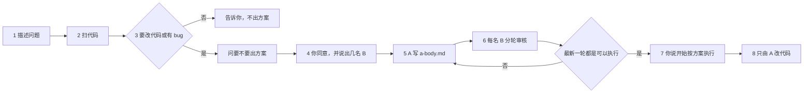

# 代码方案多审（codeplan-multireview）

**开发需求时描述一个问题。扫过代码仓后发现要改代码或有 bug，就问要不要出一版升级方案。同意后由 Agent A 写方案，再由人指定的一名或多名 Agent B 各自重读最新代码、分轮独立审核；全部 B 的最新一轮都是可以执行且人拍板后，才由 A 按方案改代码。**

触发：出一版升级方案、你是 Agent A、你是 Agent B、审核这份方案、开始按方案执行。

给要改业务代码的人。装进助手，工作区指到业务仓库，把问题说清楚。助手先扫代码。要改代码或有 bug，就先问要不要出方案。你同意并说出审核人数之后，Agent A 只写方案。你指定的每一名 Agent B 各自重读最新代码、分轮写审核。全部最新一轮都是「可以执行」，并且你说出「开始按方案执行」之后，才由 Agent A 改代码。

- **方案** — 写在业务仓的 `outputs/codeplan/CP-日期-序号/a-body.md`，不写进本技能仓库
- **分审** — 人数由你指定，至少 1 名。可以是 1、3 或更多
- **隔离** — 每个 B 只追加自己的 `B{n}.md`，不看其他 B，不改方案正文
- **重读** — 每一轮都从磁盘重读方案点名的代码。方案里的摘录不能当依据
- **拍板** — 口令是「开始按方案执行」。轮次在指定文件末尾，或由你指出全文或文件路径。格式样例不算。在这之前不改业务代码

## 和直接改代码差在哪

| | 直接让助手改 | 本技能 |
|---|---|---|
| 什么时候动代码 | 往往扫完就改 | 先问，你同意才写方案；你拍板才改代码 |
| 方案在哪 | 留在对话里 | `outputs/codeplan/` 里的文件 |
| 谁审核 | 同一次对话里顺手看一眼 | 你指定的 B，各自另开，重读磁盘 |
| 意见怎么留 | 混在方案正文里 | 只追加在该 B 自己的稿末尾 |
| 人数 | 常常被助手自己定成两名 | 你不说人数，助手只问，不开始 |

## 仓库

- Gitee：[qiusuo0226/codeplan-multireview-skill](https://gitee.com/qiusuo0226/codeplan-multireview-skill)

## 安装

```bash
git clone https://gitee.com/qiusuo0226/codeplan-multireview-skill.git
```

或把本仓复制到助手的技能目录（Grok 常见为 `~/.grok/skills/codeplan-multireview/`）。装好后，工作区指到**要改的业务代码仓**，描述问题。

## 它只做一件事



人没说出人数：只问人数，不建目录。写出方案的那场对话不再担任任一 B。任一名 B 读到其他 B 的结论：停止，回复「隔离被打破」。

## 方案落在哪

目录在业务仓，你同意出方案之后才建。

| 文件 | 谁写 | 做什么 |
|---|---|---|
| `a-body.md` | 只 Agent A | 方案正文，也是以后改代码的依据。十节：问题、代码仓、修改空间、现状、处理、执行、不改什么、验收、自审、交给审核。代码仓只授权阅读，修改空间只授权修改 |
| `B{n}.md` | 只对应的 B，且只在文末追加 | 每一轮：本轮实读、发现、结论。结论只能是「可以执行」或「不可执行」 |
| `plan.md` | 只 Agent A，全体落盘后整文件生成 | 给人读的合订本。每个 B 都不打开 |

```text
outputs/codeplan/CP-YYYYMMDD-NNN/
├── a-body.md
├── B1.md
└── plan.md
```

有几名在审的 B，就有几个 `B{n}.md`。`reviewers` 里只写你指定的那些。

## 看一段真实怎么问

对话示例里的人名、仓库和问题是假的，问法是真的。一份已经走完多轮审核的长方案在 [08](examples/08-完整方案-登录与返参解密.md)，路径和账号已换成 `local`。

目录：[examples/](examples/README.md)

建议先看 [01-先问再出方案.md](examples/01-先问再出方案.md)。人数看 [02](examples/02-人数由你指定.md)。A 写方案看 [03](examples/03-你是AgentA.md)。B 审核看 [04](examples/04-你是AgentB.md)。多名 B 看 [05](examples/05-多名B各写各的.md)。改代码看 [06](examples/06-开始按方案执行.md)。技能本身做不到看 [07](examples/07-记成升级需求.md)。

## 开口就能用

| 你说 | 它做 |
|---|---|
| （描述一个问题，扫完发现要改代码） | 先问要不要出一版升级方案。你同意前不写方案、不改代码 |
| 「出一版升级方案」（没说几名 B） | 只问人数。不建目录，也不自己定成 2 名 |
| 「出一版升级方案。B 就一名」 | Agent A 写 `a-body.md`。这场对话之后不能再当 B |
| 「你是 Agent B1，审核这份方案」 | 另开的对话里，只追加 `B1.md`。重读磁盘。不改方案，不写代码 |
| 「开始按方案执行」 | 仅当每名在审 B 的最新一轮都是「可以执行」，且对照修订等于当前 revision。轮次在指定文件末尾，或由你指出全文或文件路径。格式样例不算。然后只由 A 按「执行」和「不改什么」改代码。Agent B 不要求安装本技能 |
| 「这是 skill 的问题，记成升级需求」 | 写入业务仓 `outputs/skill-gaps/`。不改技能正文 |

## 快速开始

1. 安装本技能。把助手工作区指到要改的业务代码仓。
2. 描述问题。
3. 助手若发现要改代码或有 bug，会问要不要出方案。同意，并说出几名 B。
4. 看 `outputs/codeplan/` 里的 `a-body.md`。
5. 每一名 B 另开一场对话，只给方案正文、该 B 自己的稿和代码仓路径。
6. 全部最新一轮都是「可以执行」之后，说「开始按方案执行」。

## 本仓结构

```text
codeplan-multireview/
├── SKILL.md
├── skill.json
├── VERSION
├── CHANGELOG.md
├── LICENSE
├── README.md
├── references/
├── assets/templates/
├── examples/
├── scripts/
├── tests/
└── governance/          # 不进分发包
```

## 开发

本目录是技能开发仓。版本、基线和打包在 `governance/`。示例在 `examples/`。改技能正文时读 `governance/rules/skill-governance.md`。

```text
powershell -File governance/dev.ps1 pack
powershell -File governance/dev.ps1 release
```

## 许可证

[MIT](LICENSE) © 2026 qiusuo
