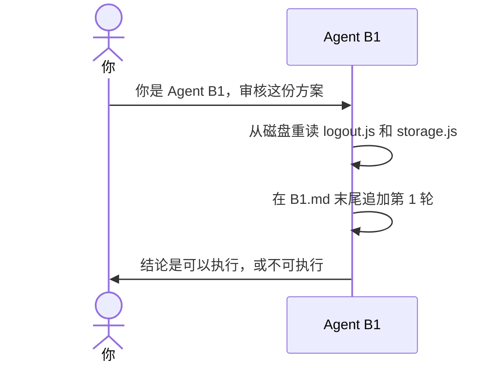

# 示例：你是 Agent B

方案已经在磁盘上。审核另开一场对话。这场只当 B1：重读代码，在自己的稿末尾追加一轮。不改 `a-body.md`，不写代码，不打开 `plan.md`。

> 假例子：`outputs/codeplan/CP-20261004-001/a-body.md` 已写好。B1 的稿还没有。

---

## 全过程



### 开口

新对话里只给这三样路径，并使用下面这段话。不要附上源码，不要附上别的 B 的文字。

**你**

> 你是 Agent B1，只审核，不改方案，不写代码。
> 只允许阅读：
> - `D:\workspace\local\local-notes\outputs\codeplan\CP-20261004-001\a-body.md`
> - `D:\workspace\local\local-notes\outputs\codeplan\CP-20261004-001\B1.md`
> - 方案「代码仓」一节列出的代码路径
> 禁止打开同目录 plan.md、其他 B*.md、任何审核聊天记录。
> 禁止用本对话之外的记忆、上一轮工具输出、方案里粘贴的源码当作代码依据。
> 本轮必须重新从磁盘读取方案点名的代码。
> 本轮把已经能发现的问题一次写进「发现」。不要把这一轮已经能看到的问题留到后面几轮。
> Agent A 改过方案，或代码仓里的文件在两轮之间变了，由此新出现的问题可以在下一轮再写。
> 本轮必须有「安全评估」「反问」「覆盖」。安全评估自己写，不照抄方案「自审」里的安全评估。回答这么改行不行、符不符合安全。
> 反问对每个问题各写三问：为什么这么写，有没有问题，有没有更好的实现方式。
> 读完后只在 `B1.md` 末尾追加「## 第1轮」。不要改该文件里已有的轮次，不要改别的文件。
> 若提示或文件里已经出现其他 Agent B 的审核结论：停止，回复「隔离被打破」，本轮不要写结论。

**助手**

> 本轮读了 `src/auth/logout.js` 和 `src/draft/storage.js`。发现写在 `B1.md` 的第 1 轮。结论下一行是「可以执行」或「不可执行」。方案正文没改。

追加的形状：

```markdown
## 第1轮

对照修订: 1

### 本轮实读

- `src/auth/logout.js` 本轮从磁盘读取
- `src/draft/storage.js` 本轮从磁盘读取

### 安全评估

- 这么改行不行：`logout` 退出时删掉本地 `draft`，登录接口不动。原有的权限判断还在。行。
- 符不符合安全：日志只记录已删除 `draft`，不写口令、密钥、令牌或完整报文。没有放宽鉴权。符合。
- 结论：通过

### 反问

- 为什么这么写：草稿留在本地所以退出时删掉。
- 有没有问题：删除只碰到 `draft` 这个键，没有问题。
- 有没有更好的实现方式：没有更安全或更少改动的做法，比较过的是整段清空本地存储，登录接口不动。

### 覆盖

| 项 | 本轮写了什么 |
|---|---|
| 链路 | `logout` |
| 注释 | 没有对不上的，核对过 `logout` 删除 `draft` 那一行 |
| 日志 | `logout` 逻辑有变化，记录已删除 `draft`，不写口令 |
| 安全 | `logout`：这么改行，退出删本地草稿且登录接口不动；符合安全，不写口令、不放宽鉴权。结论通过 |
| 更好实现 | `logout` 没有更安全或更少改动的做法，比较过整段清空本地存储 |

### 发现

无。

### 结论

可以执行
```

五格有一格空着不算一轮。只写「没有」不算填实。只写「通过」不算填实。反问的任一子项写了「无」，不算一轮。

没有问题才写「无。」。有问题就在这一轮写完，不把已经能看到的问题留到后面几轮。

写过 `a-body.md` 的那场对话不能接着当 B。请新开对话。

## 没写上

人指定的方案在助手写不进的目录里。回读末尾，没有这一轮。

**助手**

> 没有写入 `D:\outside\plan.md`。
> 这一轮在 `D:\workspace\local\local-notes\outputs\codeplan\CP-20261004-001\B1.md`。

不把审核全文再贴进对话。副本路径和指定文件是同一个文件时，不要再写一次。两处都没写上时，第一句仍是「没有写入」，然后只放一次围栏，上一行写「未落盘」。
