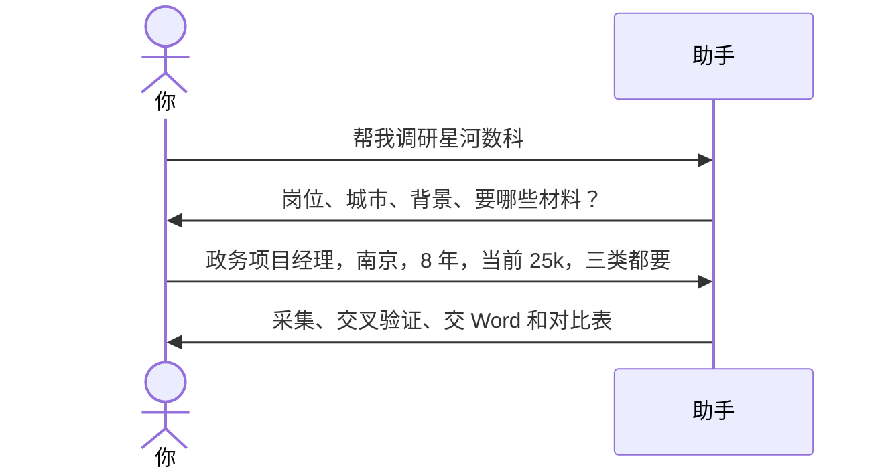

# 示例：调研一家公司

还没给全范围。说「帮我调研 XX 公司」，助手会一次问清岗位、城市、背景和要哪些交付物，再去公开来源核实，最后交报告。

> 假例子：林夏想看「星河数科」。

---

## 全过程



### 第 1 轮 · 开口

**你**

> 帮我调研星河数科这家公司怎么样。

**助手**

> 先把范围一次问清：
>
> - 目标岗位是什么？
> - 在哪个城市求职？
> - 学历、工作年限、当前薪资/职级、行业经验？
> - 要公司深度介绍、薪资福利对比、员工评价与风险，还是只要其中几样？

**你**

> 政务项目经理，南京。本科，8 年 ToG。现在税前 25k，目标 30k。三类都要。

---

### 第 2 轮 · 交付

**助手**

> 按公开来源整理，不编造。薪资写挂牌区间和样本量；员工评价区分在职/离职。
>
> 交付：
>
> - `星河数科_深度介绍_YYYYMMDD.docx`
> - `政务项目经理_薪资福利对比_YYYYMMDD.xlsx`
> - `星河数科_员工评价与风险提示_YYYYMMDD.xlsx`
>
> 末尾有信息来源清单。挂牌薪资不是实际 offer。

---

## 你可以照着说

```text
帮我调研 XX 公司。
XX 公司怎么样，值不值得去。
给我出一份公司深度调研。
```
