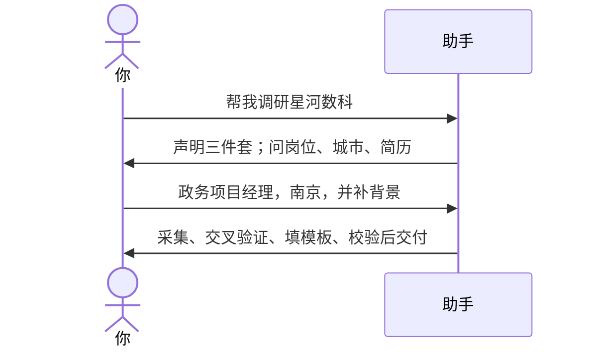

# 示例：调研一家公司

还没给全范围。说「帮我调研 XX 公司」，助手先声明将产出的三件套，再一次问清岗位、城市和简历（记忆里已有则复述、不问第二遍）。不问「要哪些材料」。

> 假例子：林夏想看「星河数科」。

---

## 全过程



### 第 1 轮 · 开口

**你**

> 帮我调研星河数科这家公司怎么样。

**助手**

> 本次将产出以下三份交付物（存当前工作区）：
>
> - `{公司名}_深度介绍_{YYYYMMDD}.docx` → 星河数科_深度介绍_YYYYMMDD.docx
> - `{岗位方向}_薪资福利对比_{YYYYMMDD}.xlsx`
> - `星河数科_员工评价与风险提示_YYYYMMDD.xlsx`
>
> 记忆/档案里暂无完整求职背景。请一次补全：
>
> - 目标岗位、城市
> - 简历（直接贴或给文件），或：学历与专业、工作年限与路径、当前岗位与薪资、代表性项目、证书、求职意向
>
> 如只要口头摘要或不生成某份文件，请直接说。

**你**

> 政务项目经理，南京。本科，8 年 ToG。现在税前 25k，目标 30k。

---

### 第 2 轮 · 交付

**助手**

> 按公开来源整理，不编造。薪资写挂牌区间和样本量；员工评价区分在职/离职并标明评价主体。
>
> 交付（已通过结构校验）：
>
> - `星河数科_深度介绍_YYYYMMDD.docx`
> - `政务项目经理_薪资福利对比_YYYYMMDD.xlsx`
> - `星河数科_员工评价与风险提示_YYYYMMDD.xlsx`
>
> 末尾有信息来源清单。挂牌薪资不是实际 offer。

若助手记忆或 `wiki/profile/` 下已有简历页：第 1 轮改为复述脱敏摘要「如有变化请补」，不再要一份完整简历。

---

## 你可以照着说

```text
帮我调研 XX 公司。
XX 公司怎么样，值不值得去。
给我出一份公司深度调研。
```
