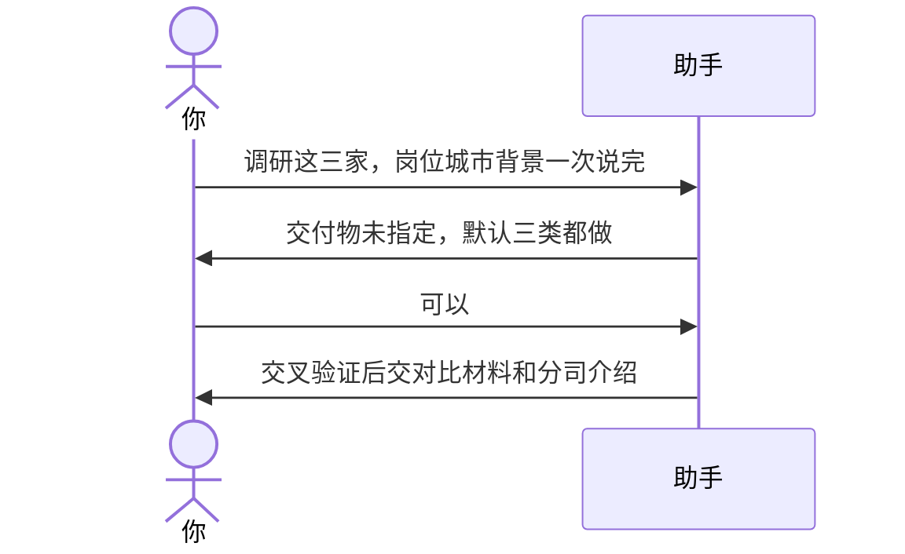

# 示例：一句话带齐调研范围

开口时已经把公司、岗位、城市和背景说完。助手只补没说的，不会把说过的再问一遍。

> 仍是林夏、政务项目经理、南京。

---

## 全过程



### 第 1 轮

**你**

> 帮我调研星河数科、云启政务、江南信创。岗位是政务项目经理，城市南京。我本科 8 年 ToG，现在税前 25k，目标 30k。三类材料都要。

**助手**

> 范围记下了，不再问公司、岗位、城市和背景。
>
> 按三类交付：每家一份深度介绍，再加一份三家薪资福利对比、一份评价与风险表。公开信息不够的会标明，不编数字。

---

## 你可以照着说

```text
调研 A、B、C 三家。岗位是……，城市是……，我目前……，目标薪资……，要公司介绍、薪资对比和风险提示。
```
