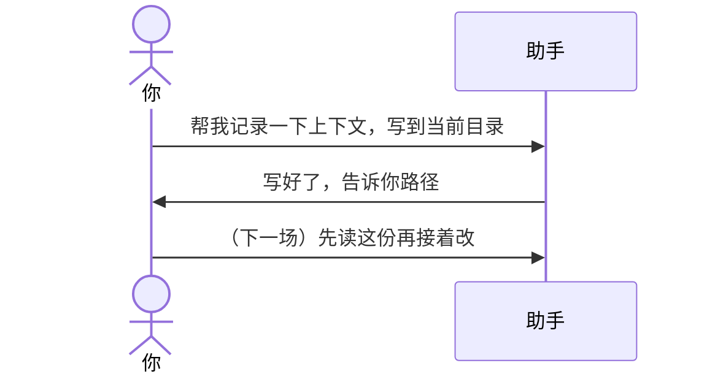

# 示例：整份会话交接

对话已经很长。说「帮我记录一下上下文」或「会话交接」，助手把需求、资料、进度和约束收成**一份**记忆 markdown。下一场只读这一份就能接着干。

> 假例子：林夏在 `api-upgrade` 里写「接口改造说明」。当前工作稿是 `接口改造说明_V1.0.docx`。

也可以说：`生成记忆 md`。

---

## 全过程



### 第 1 轮 · 开口

**你**

> 帮我记录一下上下文，写到当前目录。

**助手**

> 写好了。
>
> - 路径：`api-upgrade/api-upgrade会话交接.md`
> - 本轮记了：任务目标、必须遵守的约束、依据材料、当前工作稿、已拍板的事实、待确认事项
>
> 下一场会话先读这份。

---

记忆文件按 `assets/templates/session-memory.md` 分节，只写对话和已读文件里能核对的内容。

---

## 你可以照着说

```text
帮我记录一下上下文，写到当前目录。
```

```text
会话交接。
```

```text
生成记忆 md。
```
