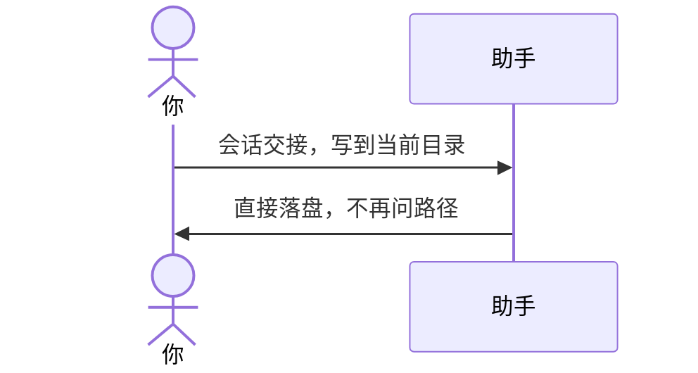

# 示例：路径已经说了不再问

同一句话里已经给出保存位置，助手不再问「存在哪儿」，直接写。

> 仍是林夏、`api-upgrade`。

---



### 第 1 轮

**你**

> 会话交接，写到当前目录。

**助手**

> 路径已经指定，不再问。
>
> 写好了：`api-upgrade/api-upgrade会话交接.md`。下一场会话先读这份。

---

回完整路径、回文件名、或说「覆盖这份」都可以。没给路径时的问法见 [03-路径未指定会先问.md](03-路径未指定会先问.md)。

---

## 你可以照着说

```text
会话交接，写到当前目录。
```

```text
生成记忆 md，保存为 C:\Users\linxia\Downloads\api-upgrade会话交接.md
```
