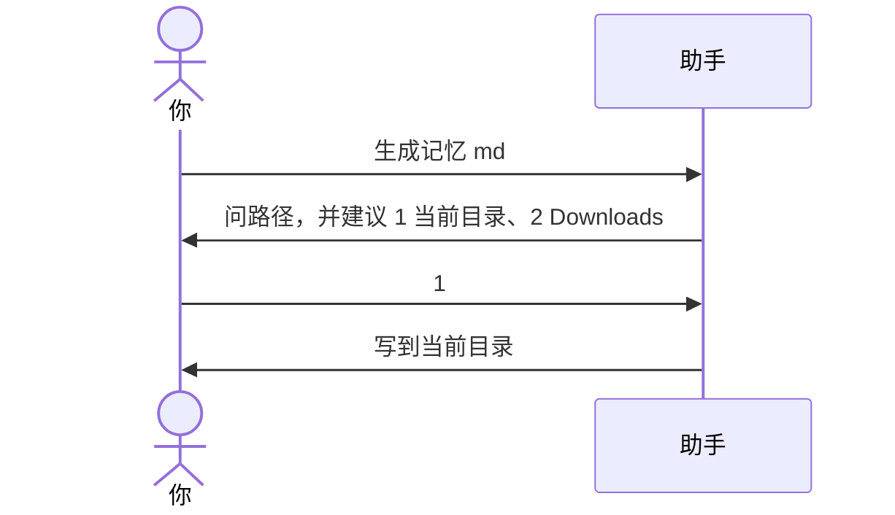

# 示例：路径未指定会先问

没说存在哪儿时，助手先问，并按操作系统给出建议（例如 Windows 下的当前目录和 Downloads）。你选之前不写盘。

> 仍是林夏。工作区在 Windows：`C:\Users\linxia\Downloads\api-upgrade`。

---



### 第 1 轮 · 先问

**你**

> 生成记忆 md。

**助手**

> 还没指定保存位置。建议写在：
>
> 1. 当前工作目录：`C:\Users\linxia\Downloads\api-upgrade\api-upgrade会话交接.md`
> 2. 本机 Downloads：`C:\Users\linxia\Downloads\api-upgrade会话交接.md`
>
> 直接回路径，或说 1 / 2。

**你**

> 1。

---

### 第 2 轮 · 再写

**助手**

> 写好了：`C:\Users\linxia\Downloads\api-upgrade\api-upgrade会话交接.md`。下一场会话先读这份。

---

工作区若就是 Downloads、桌面或用户主目录，不会用 `Downloads会话交接.md` 这种空名，会改用对话主题做文件名。

---

## 你可以照着说

```text
生成记忆 md。
```

```text
帮我记录一下上下文。
```
