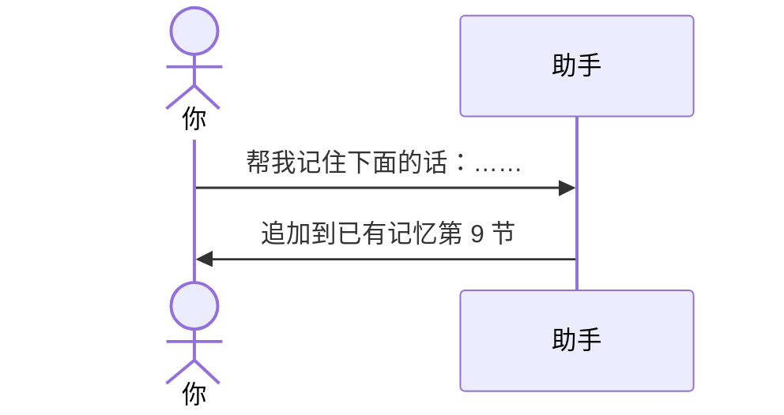

# 示例：记住下面的话

只要把指定的句子原样记下，不要改写。已有记忆文件就追加到第 9 节并加上日期；还没有就先按模板建一份，再写入原话。

> 仍是林夏。目录里已经有 `api-upgrade会话交接.md`。

---



### 第 1 轮

**你**

> 帮我记住下面的话：不要编造 AppId；测试环境口令不准写进说明。

**助手**

> 已追加到 `api-upgrade/api-upgrade会话交接.md` 第 9 节（用户要记住的原话），日期 2026-09-04。其它节没动。
>
> 下一场会话先读这份。

---

尚无记忆文件、也没给路径时，仍先问存在哪儿，见 [03-路径未指定会先问.md](03-路径未指定会先问.md)。问完后用模板新建，再写入原话，并补上本轮对话里能核实的最少上下文。

---

## 你可以照着说

```text
帮我记住下面的话：不要编造 AppId；测试环境口令不准写进说明。
```
