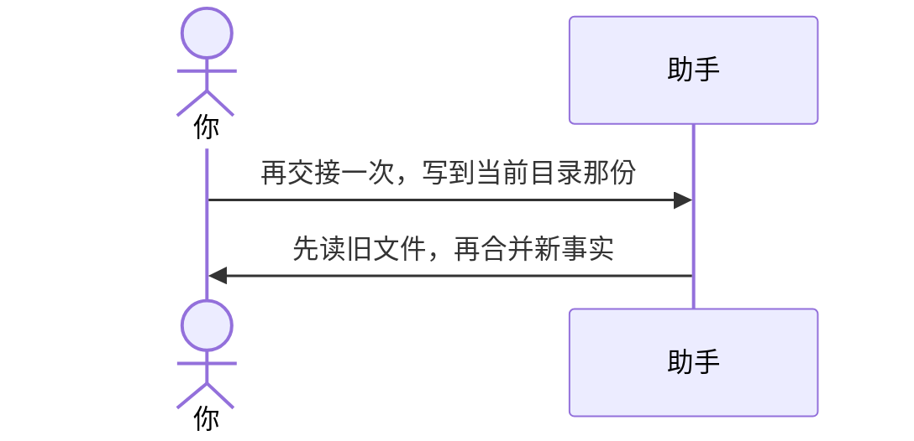

# 示例：已有记忆文件会合并

目标路径已经有记忆文件时，先读再更新，不要空白覆盖。被取代的旧结论改成现行口径；用户手写且本轮没否定的内容保留。第 9 节只追加，不删旧原话（除非你明确说忘掉某条）。

> 仍是林夏。上次已经写过 `api-upgrade会话交接.md`。后来又拍板：当前工作稿以 V1.0 为准，不要回退。

---



### 第 1 轮

**你**

> 再交接一次，写到当前目录那份。刚才定了：当前工作稿就用 `接口改造说明_V1.0.docx`，不要回退。

**助手**

> 已读旧文件并合并。
>
> - 路径：`api-upgrade/api-upgrade会话交接.md`（更新，不是另存一份）
> - 本轮更新了：当前工作稿以 V1.0 为准
> - 第 9 节原话保留
>
> 下一场会话先读这份。不要另存 `会话交接_v2.md`。

---

## 你可以照着说

```text
再交接一次，写到当前目录那份。
```
