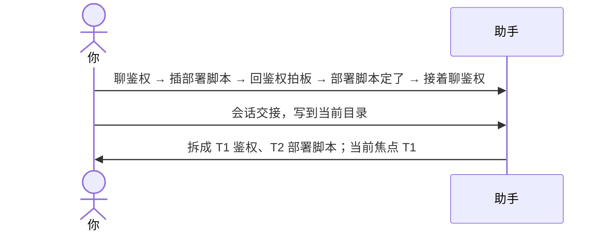

# 示例：多话题会拆开

一场对话里聊了好几件事，还来回穿插。助手按**问题**拆成话题，不按时间顺序平铺；被打断又回来的话题并回同一个编号。

> 仍是林夏、`api-upgrade`。这场先聊接口鉴权，中途插进部署脚本，又回到鉴权拍板；部署脚本随后有了结论，最后接着聊鉴权。中间闲聊了几句午饭，还说错过一次端口号、马上改了。鉴权那三步（选方案、定令牌有效期、定刷新方式）是同一个问题的子步骤。

---



### 第 1 轮 · 开口

**你**

> 会话交接，写到当前目录。

**助手**

> 写好了：`api-upgrade/api-upgrade会话交接.md`。
>
> - 拆成 2 个话题：T1 接口鉴权（进行中）、T2 部署脚本（已解决）
> - 鉴权前后两段并进 T1，三个子步骤没有单列；当前焦点 T1
> - 午饭闲聊、改过的端口口误没有算成话题
>
> 下一场会话先读这份。

---

### 写出来的开头

```markdown
## 0. 概览

在把内部接口改成走统一网关，写「接口改造说明」。当前焦点 T1：鉴权已定用网关签发的令牌，下一步写鉴权一章。T2 部署脚本已改完。（来源：对话）

| 编号 | 一句话标题 | 状态 | 依赖 |
|------|------------|------|------|
| T1 | 接口鉴权改用网关令牌 | 进行中 | — |
| T2 | 部署脚本改指网关地址 | 已解决 | — |

当前焦点：T1
```

第 10 节里每个话题固定写：问题是什么、背景、讨论要点（试过什么、否决了什么及原因）、当前状态、待办、相关文件。例如 T1 的讨论要点会写「否决各服务自签令牌：密钥分散难轮换（来源：对话）」，下一场就不会再被提一遍。

全程只有一个话题时不拆，仍是原来的九节，第 10 节只写「单话题，未拆分」。

---

## 你可以照着说

```text
会话交接，写到当前目录。
```

```text
帮我记录一下上下文。
```
