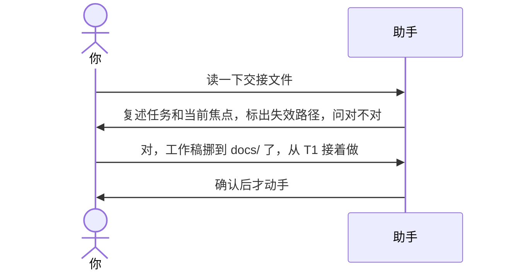

# 示例：接手先复述再动手

新开一场会话，说「读一下交接文件」或「接着上次」。助手先读、用几句话复述，并核对文件里提到的路径还在不在；你确认之前不动手改任何文件。

> 仍是林夏。上次交接写在 `api-upgrade/api-upgrade会话交接.md`，当前工作稿记的是 `api-upgrade/接口改造说明_V1.0.docx`。后来林夏把工作稿挪进了 `api-upgrade/docs/`。

---



### 第 1 轮 · 先读、先复述

**你**

> 读一下交接文件：`api-upgrade/api-upgrade会话交接.md`。

**助手**

> 读完了。
>
> 在把内部接口改成走统一网关，写「接口改造说明」。当前焦点是 T1 接口鉴权：已定用网关签发的令牌，下一步写鉴权一章。T2 部署脚本已解决。还在等王工确认网关限流阈值。
>
> 可能过期：当前工作稿 `api-upgrade/接口改造说明_V1.0.docx` 找不到了。
>
> 以上对吗？从 T1 接着做？

**你**

> 对。工作稿挪到 `api-upgrade/docs/` 下了，从 T1 接着做。

---

### 第 2 轮 · 确认后才动手

**助手**

> 好，从 T1 接着写鉴权一章，用 `api-upgrade/docs/接口改造说明_V1.0.docx`。
>
> 交接文件这次没改。要更新就说「会话交接」。

---

没给路径时，助手在当前目录和 Downloads 里找文件名含「会话交接」的文件让你选；都没有就问路径，不凭印象编。

上次已经否决的方案（记在第 11 节或话题的讨论要点里），接手后不会再提；除非你主动提起，或者前提变了并说清楚变在哪。

---

## 你可以照着说

```text
读一下交接文件。
```

```text
接着上次。
```
