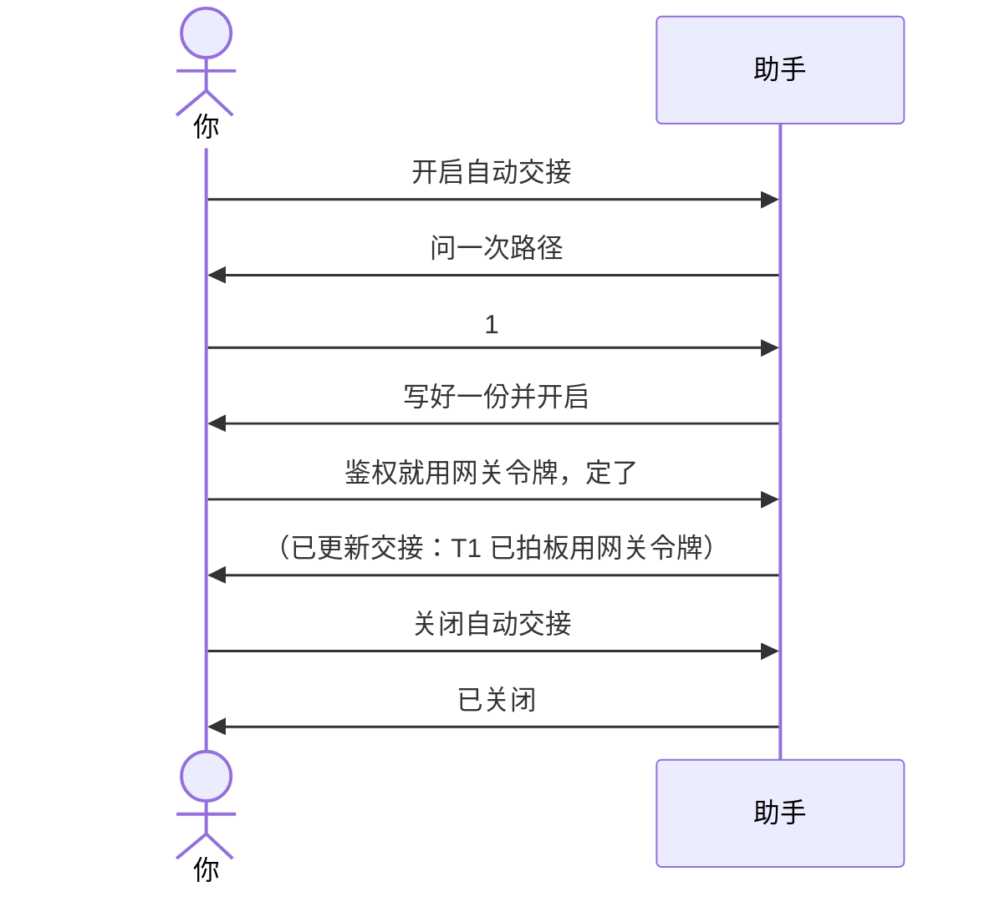

# 示例：开启自动交接

说「开启自动交接」后，助手在检查点（拍板一项决定、切换话题、完成一步）顺手更新**同一份**记忆文件，只改受影响的那几节，回一行提示。说「关闭自动交接」就停。

> 仍是林夏。工作区在 Windows：`C:\Users\linxia\Downloads\api-upgrade`。这场还没写过记忆文件，也没说存哪儿。

---



### 第 1 轮 · 开启，只问一次路径

**你**

> 开启自动交接。

**助手**

> 还没有记忆文件，也没指定保存位置。建议写在：
>
> 1. 当前工作目录：`C:\Users\linxia\Downloads\api-upgrade\api-upgrade会话交接.md`
> 2. 本机 Downloads：`C:\Users\linxia\Downloads\api-upgrade会话交接.md`
>
> 直接回路径，或说 1 / 2。只问这一次。

**你**

> 1。

**助手**

> 已写好 `C:\Users\linxia\Downloads\api-upgrade\api-upgrade会话交接.md`，自动交接已开启。之后拍板、换话题、完成一步时我会顺手更新这一份，每次只回一行。

---

### 第 2 轮 · 到检查点，只回一行

**你**

> 鉴权就用网关签发的令牌，定了。

**助手**

> 好，接下来写鉴权一章。
>
> （已更新交接：T1 已拍板用网关令牌）

---

### 第 3 轮 · 再到检查点，不再问路径

**你**

> 部署脚本那个先放一放，回头再说。

**助手**

> （已更新交接：T2 改为搁置）

还是同一份文件，没有 `_v2`，也没有带时间戳的副本。

---

### 第 4 轮 · 关闭

**你**

> 关闭自动交接。

**助手**

> 已关闭。记忆文件头注改为「自动交接：关闭」，之后不再自动写。

---

每次更新前助手都先读当前文件，你在两次更新之间手改的内容会保留。口令、密钥照旧不写，待确认的事不会写进「已拍板」。

首次整份交接写完后，助手会问一次「要开启自动交接吗？」；你说不要，本会话不再问。没开启就不会自动写盘。

---

## 你可以照着说

```text
开启自动交接。
```

```text
关闭自动交接。
```
