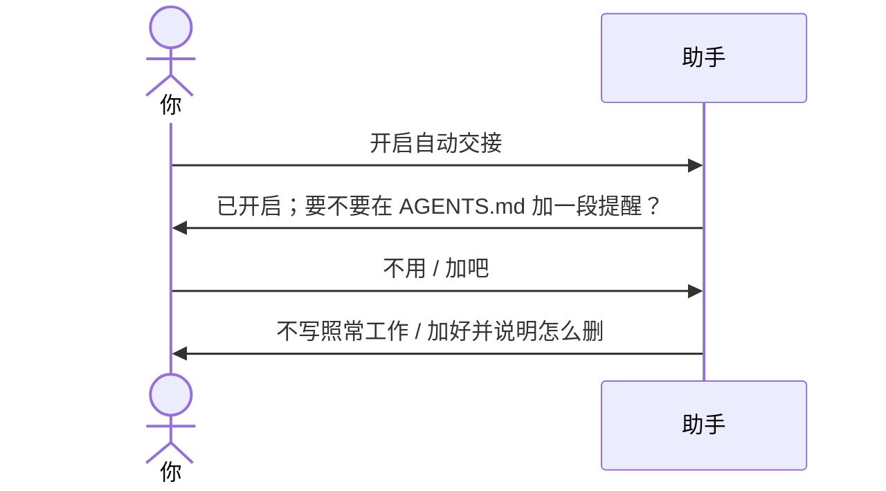

# 示例：常驻规则片段先问再写

自动交接只在本场会话有效，对话很长或上下文被压缩后，助手可能忘了。可以在项目的常驻规则文件（`AGENTS.md`、`CLAUDE.md`、Cursor 规则）里放一段提醒。写进你的文件之前，助手一定先问。

> 仍是林夏。项目根上已经有 `api-upgrade/AGENTS.md`，也已经有 `api-upgrade/api-upgrade会话交接.md`。

---



### 第 1 轮 · 先问

**你**

> 开启自动交接。

**助手**

> 已开启，沿用 `api-upgrade/api-upgrade会话交接.md`，不再问路径。
>
> 要不要在 `api-upgrade/AGENTS.md` 末尾加一段约 9 行的提醒，让后面的对话也记得自动交接已开启？不加也照常工作。

---

### 你说不用

**你**

> 不用。

**助手**

> 好，不写任何规则文件。自动交接在本场照常工作。

---

### 你说加吧

**你**

> 加吧。

**助手**

> 已在 `api-upgrade/AGENTS.md` 末尾加了一段，前后有 `session-handoff:auto-handoff BEGIN` / `END` 标记。以后说「关闭自动交接」时，我会问要不要把这段删掉。

片段模板在 `assets/templates/auto-handoff-rule.md`，只替换记忆文件路径和开启日期。同一个文件里已经有这段就只更新，不重复追加。

---

### 平台 hook 只是可选

有的平台可以在回合结束（例如 Claude Code 的 `Stop`）或压缩上下文前（`PreCompact`）挂钩子，提醒助手更新记忆文件。怎么配以平台文档为准。技能不依赖 hook，也不会替你装。

---

## 你可以照着说

```text
开启自动交接。
```

```text
不用写 AGENTS.md。
```
