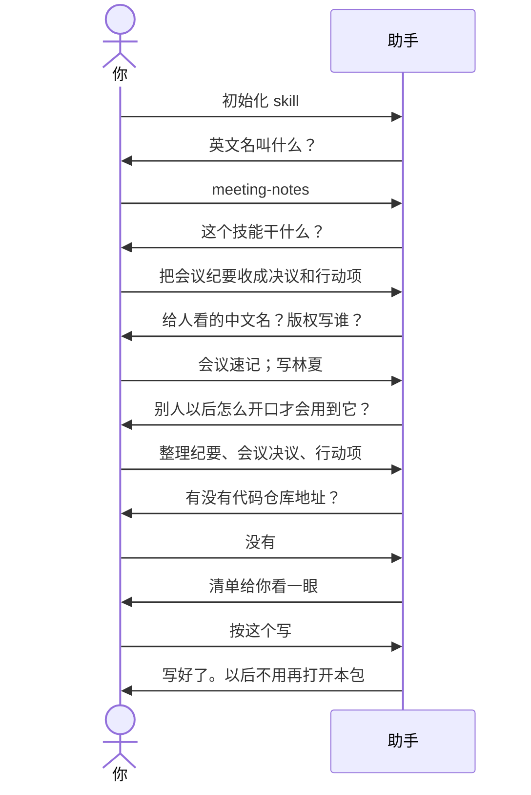

# 示例：初始化空文件夹

还没有这个技能。新建一个空文件夹，把助手的工作区指过去，说「初始化 skill」。它问几件事，你点头后才往文件夹里写。

> 假例子：林夏要做「会议速记」。空文件夹名叫 `meeting-notes`。

---

## 全过程



### 第 1 轮 · 开口

**你**

> 初始化 skill。

**助手**

> 这个文件夹是空的，可以在这里建一个新技能。
>
> 英文名只要小写字母、数字和连字符，例如 `meeting-notes`。文件夹已经叫这个名字了，要用它吗？

**你**

> 就用这个。

---

### 第 2 轮 · 干什么

**助手**

> 这个技能干什么？一句话就行。

**你**

> 把会议纪要收成决议和待办行动项。我贴一段纪要，它整理出来。

---

### 第 3 轮 · 中文名

**助手**

> 给人看的中文名，我建议叫「会议速记」。要用这个吗？

**你**

> 用这个。

---

### 第 4 轮 · 版权

**助手**

> 许可证上的版权人，我从本机 git 读到是「林夏」，要用这个吗？

**你**

> 用这个。

---

### 第 5 轮 · 别人怎么开口

**助手**

> 别人以后怎么说话，助手才会用到这个技能？说几句常用的就行。也可以让我按用途先拟一版，你在清单里改。

**你**

> 整理纪要、会议决议、行动项、贴一段纪要。

---

### 第 6 轮 · 代码仓库

**助手**

> 有没有 Gitee 或 GitHub 地址？没有就说没有。我不会替你建远程仓库，也不会擅自推上去。

**你**

> 没有。

---

### 第 7 轮 · 你点头才写

**助手**

> 按下面写。要改哪条直接说；说「按这个写」我才动手。
>
> - 版本从 0.1.0 起
> - 许可证 MIT，版权林夏
> - 中文说明
> - 在这个文件夹里建立 git
> - 写上版本、打包、以后改这个技能要用的说明
> - 别人可以这样叫它：整理纪要、会议决议、行动项、贴一段纪要
> - 没有代码仓库地址

**你**

> 按这个写。

---

### 第 8 轮 · 写好了

**助手**

> 写好了。
>
> - 文件夹：`meeting-notes/`
> - 英文名 meeting-notes，中文名会议速记，版本 0.1.0
> - 已经能打包；安装包里不会带上开发用的那些说明
>
> 本包用完了。以后改这个技能、升版本、打安装包，把工作区留在这个文件夹，直接跟助手说就行，不必再打开「Skill 开发工具包」。
>
> 下一步：把技能真正要做的规则写进去。要装到助手里试用，你开口我才拷。

---

写规则见 [10](10-初始化之后写规则.md)。升级必看 [08](08-初始化之后怎么升级.md)（方案七章、文件生成在哪）。试用见 [16](16-初始化之后装到助手里试用.md)。

## 你可以照着说

```text
初始化 skill。
```

也可以说：`开发一个 skill`、`新建技能`、`从零写 skill`。

先建一个**空文件夹**，把助手工作区指到那里，不要指到本包自己的目录上。
