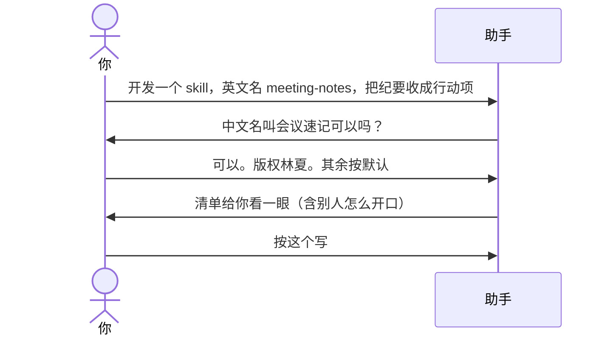

# 示例：一句话带齐信息

开口时已经把英文名和干什么说完了。助手只补没说的，不会把说过的再问一遍。

> 仍是林夏、空文件夹、做「会议速记」。

---

## 全过程



### 第 1 轮

**你**

> 开发一个 skill。英文名 meeting-notes。把会议纪要收成决议和待办行动项，我贴纪要它整理。

**助手**

> 英文名和用途记下了，这两项不再问。
>
> 给人看的中文名，我建议叫「会议速记」。要用这个吗？

**你**

> 用这个。版权人林夏。别人怎么开口你按用途拟。没有代码仓库。其余按默认。

---

### 第 2 轮 · 仍要你看一眼清单

就算你说「其余按默认」，助手还是把清单和「别人可以这样叫它」读一遍，你点头才写。全文见 [01-初始化空文件夹.md](01-初始化空文件夹.md)。

**你**

> 按这个写。

---

## 你可以照着说

```text
开发一个 skill，英文名 meeting-notes，把会议纪要收成决议和行动项。
```
