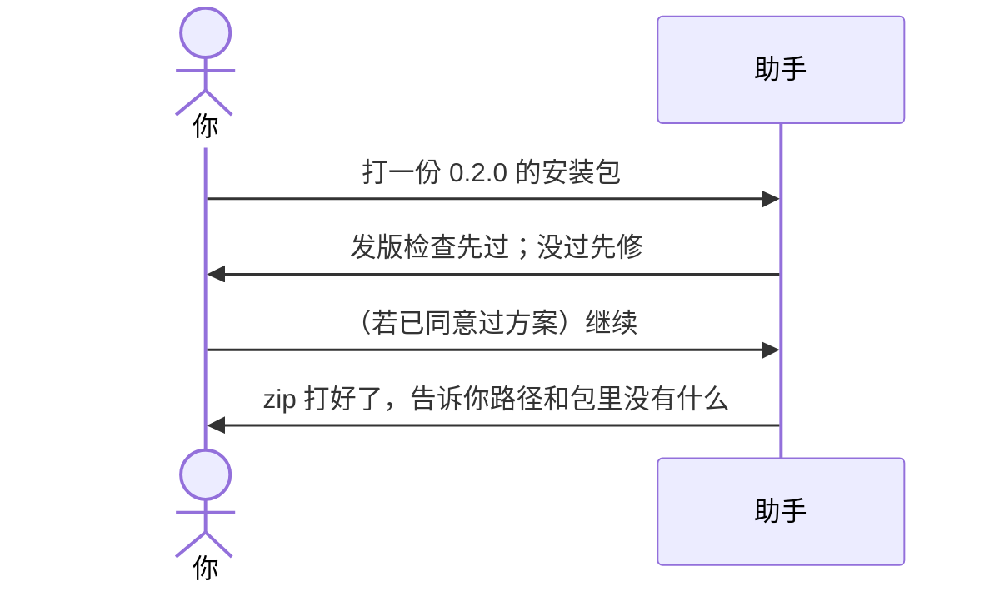

# 示例：初始化之后怎么打包

打包 = 打一份别人能安装的 zip。**不必再打开本包。** 工作区指到那个技能的文件夹。

- 规则还没写：先看 [10-初始化之后写规则.md](10-初始化之后写规则.md)
- 还要改技能、加能力：先看 [08-初始化之后怎么升级.md](08-初始化之后怎么升级.md)（先方案、同意执行，打包是同意之后的最后几步）
- 这里只演示：规则已经按方案改完，你只要安装包

> 假例子：林夏已经同意过 0.2.0 的升级方案，规则写完了，要拿安装包。

安装包文件名是**英文名**，不是中文显示名：

```text
meeting-notes-Skill-v0.2.0.zip
```

打在技能文件夹**根上**。包里没有 `governance/`、`.git/`、`AGENTS.md`、`tests/`（那些是开发用的）。

---



### 第 1 轮

**你**

> 打一份安装包。说明里写：补了纪要转行动项的规则。

**助手**

> 当前版本若还是 0.1.0，打 0.2.0 包属于升级，要先有方案。我这边看到 0.2.0 方案已经执行过，只差打包。
>
> 会做：发版检查 → 打 `meeting-notes-Skill-v0.2.0.zip`。检查盯：
>
> - 根目录 `VERSION`、`skill.json` 的 version、`CHANGELOG.md` 的 `## 0.2.0` 是同一号
> - 有 `governance/baselines/0.2.0/`
> - 包内没有 `governance/`、`.git/`、`AGENTS.md`
> - 这一版的升级方案 `governance/planning/upgrade-plan-v0.2.0.md` 发版后不应还留着
>
> 没过会停，见 [13-初始化之后发版检查没过.md](13-初始化之后发版检查没过.md)。
>
> 先预览、先不写成 zip 文件的话，说「先预览，先别写成文件」。现在按你的意思会写成文件。没有往远程推。

**你**

> 打吧。

---

### 第 2 轮

**助手**

> 检查过了。安装包在这个文件夹根上：`meeting-notes-Skill-v0.2.0.zip`。开发用的说明没有打进包。没有往远程推。

---

若你其实还没出过升级方案，助手不会直接打包，会改走 [08](08-初始化之后怎么升级.md)：先写 `governance/planning/upgrade-plan-v0.2.0.md`。

## 你可以照着说

```text
打一份安装包。
先预览安装包，先别写成文件。
```
