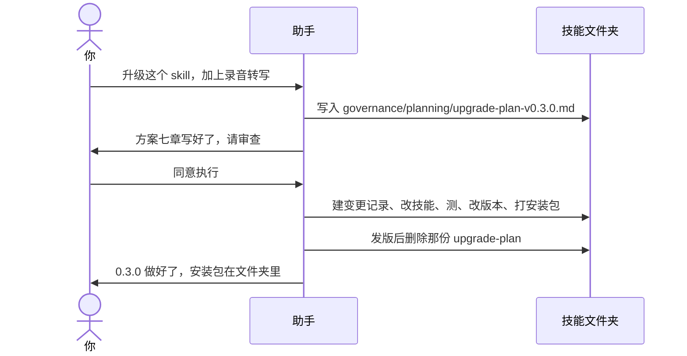

# 示例：初始化之后怎么升级

这篇写给**第一次改已经建好的技能**的人。不假设你知道 AP、基线、治理这些词。

初始化（空文件夹里说「初始化 skill」）只用一次，而且必须对本包说。  
**升级不是初始化。** 技能已经在文件夹里了，把助手的工作区指到**那个技能的文件夹**，直接说要改什么。不要再打开「Skill 开发工具包」。

> 假例子：林夏的「会议速记」已经能整理纪要，版本 0.2.0。她要加一项：贴录音转写也能抽决议。这是一次升级。

---

## 0. 先记住三件事

1. **先写升级方案，你点头，再改技能。** 方案是一份真正的文件。写方案的叫 A，不改技能。点头有两条路：**你直接说「同意执行」或「执行升级」**（见 [21](21-初始化之后A出方案人直接执行.md)）；或**另开对话让 B 审核**，B 只在方案文末追加，你再同意（见 [22](22-初始化之后B审核再执行.md)）。同一对话里刚当过 A，不能立刻转 B（见 [23](23-同一对话从A转B会停.md)）。
2. **你不必报「升到几」。** 助手会读文件夹里的版本号，拟定下一版，写进方案里给你看。
3. **一次只改一件能验收的事。** 「加转写 + 顺便修错别字 + 重构目录」必须拆开，这一轮只做一件。

工作区指错了（还对着本包说「升级」）会停，见 [09-对本包说升级会停.md](09-对本包说升级会停.md)。

---

## 1. 升级方案是什么、生成在哪儿

初始化时，技能文件夹里已经放好了空模板和规则。升级时助手**不会改空模板**，而是另存一份填好的方案。

| 文件 | 是什么 | 你要不要动手 |
|---|---|---|
| `governance/templates/upgrade-plan.md` | 空模板，永远保持空 | **不要改它凑合用** |
| `governance/planning/upgrade-plan-v0.3.0.md` | **这一轮真正的方案**（版本号换你的） | 只审查，说「同意执行」或指出要改哪章 |
| `governance/rules/skill-governance.md` | 这个技能自己的升级规矩 | 给助手读，你不必背 |

这一轮如果目标版本是 0.3.0，方案**只能**叫：

```text
governance/planning/upgrade-plan-v0.3.0.md
```

不能叫 `方案.md`、`upgrade.md`、`plan-转写.md`。同一个版本只允许这一份，不能拆成两份方案。

发版做完后，这份方案会被删掉（内容已经抄进变更记录、说明和对照底稿里）。所以你审查就在「同意执行」之前，那时文件还在。

---

## 2. 方案里固定有七章（缺一章就不要点头）

模板里的标题必须都在，一章都不能少。下面用白话说明每一章是干什么的、你看的时候盯什么。

| 章 | 标题 | 干什么 | 你盯什么 |
|---|---|---|---|
| AP-1 | 变更概述 | 这一版要干什么，一句话能验收 | 是不是你想要的那一件事；有没有偷偷混进别的 |
| AP-2 | 影响点详细分析 | 哪些能力会变、变完什么样、能不能退回去 | 有没有漏掉「旧的贴纪要还要能用」 |
| AP-3 | 变更策略与设计思路 | 打算怎么改；想过但否决的办法 | 否决理由是否站得住；有没有更简单的做法没写 |
| AP-4 | 修改范围清单 | **准备改哪些文件**、改什么、是不是核心契约 | 没有列到的文件不应被改。`SKILL.md` / `skill.json` 是核心契约，改了必须测全 |
| AP-5 | 回归测试计划 | 准备怎么测：做成了、故意用错、旧能力还在 | 正 / 反 / 旧能力各至少一条；旧的「贴纪要」必须有测 |
| AP-6 | 风险评估与回滚方案 | 可能搞砸什么、怎么回到上一版 | 回滚是不是「回到上一版已经发布的那份」，而不是打补丁 |
| AP-7 | 版本影响 | 从几升到几；用的人要不要重装、要不要搬家 | 本仓默认「无需迁移工作区」。版本跳得是否合理 |

文末必须有一句：

> 请审查以上方案。确认后回复「同意执行」。

你没有回复这四个字之前，助手改技能正文就是做错了。

核心契约 = `SKILL.md`（技能怎么干活、别人怎么开口）和 `skill.json`（名字、版本）。这两份没写进 AP-4、你也没同意，就不能改。

---

## 3. 全过程



### 第 1 轮 · 你开口

工作区已经是 `meeting-notes/`（会议速记的开发文件夹）。

**你**

> 升级这个 skill。给它加一个能力：贴录音转写也能抽决议，和贴纪要同一套。

你也可以说：「写一份升级方案」「先出方案再改」「给会议速记加一个能力：……」。不必说 0.3.0。

---

### 第 2 轮 · 助手先把方案写成文件，再给你看

助手这时**只写方案文件，不改技能正文。** 它会告诉你文件在哪，并把七章全文给你审查。下面就是这一轮你应该看到的样子（人名、版本是假的，结构和路径是真的）。

**助手**

> 当前版本 0.2.0。这回只做一件事：录音转写和纪要走同一套整理。我拟定升到 0.3.0。
>
> 升级方案已经写到：
>
> `governance/planning/upgrade-plan-v0.3.0.md`
>
> 空模板 `governance/templates/upgrade-plan.md` 没有动。确认前不改 `SKILL.md`、`references/`、`skill.json`。
>
> 七章如下。缺一章、或范围里混了别的事，请指出，不要说「同意执行」。

---

**方案全文（也就是那份文件里的内容）**

```markdown
---
AP Version: 1.0
Status: pending_review
Target Version: 0.3.0
---

# 升级方案审查文档

## AP-1. 变更概述

给「会议速记」增加：用户贴录音转写文本时，按与会议纪要相同的规则抽出决议和行动项。
旧的「贴一段纪要」必须还能用。本版不改抽决议的规则本身，只增加一种输入。

可验收：贴一段转写 → 得到决议和行动项；贴纪要 → 行为与 0.2.0 相同。

## AP-2. 影响点详细分析

| 影响项 | 当前状态 | 变更后状态 | 影响描述 | 影响程度 | 是否可逆 |
|---|---|---|---|---|---|
| 输入种类 | 只认纪要 | 纪要或转写 | 多一种入口，整理规则共用 | 中 | 是 |
| 别人怎么开口 | 整理纪要、会议决议、行动项、贴一段纪要 | 增加「转写里的决议」「贴一段转写」 | 新说法要能叫到这个技能 | 中 | 是 |
| 抽决议规则 | 0.2.0 已有 | 不改 | 转写走同一套；没有决议仍明说没有 | 无 | — |
| 已装 0.2.0 的人 | 只会整理纪要 | 换 0.3.0 后才会转写 | 无需搬家；要这个能力需重装 / 换目录 | 低 | 是（回 0.2.0 包） |

## AP-3. 变更策略与设计思路

转写和纪要在入口处分一下，后面共用现在的整理步骤。

否决：单独再做一套「转写技能」。否决原因：和会议速记重复，用户要装两份。

否决：改抽决议的宽严。否决原因：超出「加一种输入」，应另开一轮。

## AP-4. 修改范围清单

| 文件 | 修改类型 | 修改内容摘要 | 是否核心契约 |
|---|---|---|---|
| `SKILL.md` | 改 | description 补触发说法；路由增加转写 | 是 |
| `references/` 里整理规则那份 | 改 | 写明转写与纪要同一套 | 否 |
| `skill.json` | 改 | 版本同步为 0.3.0 | 是 |
| `VERSION` | 改 | 0.2.0 → 0.3.0 | 否 |
| `CHANGELOG.md` | 改 | 增加 0.3.0 段 | 否 |

未列入的文件本轮不改。

## AP-5. 回归测试计划

| 编号 | 类型 | 输入 | 期望 |
|---|---|---|---|
| P1 | 正 | 贴一段带决议的转写 | 抽出决议和行动项 |
| N1 | 反 | 贴一段没有决议的转写 | 明说没有，不编 |
| R1 | 旧 | 贴一段 0.2.0 能处理的纪要 | 结果与 0.2.0 相同 |

## AP-6. 风险评估与回滚方案

| 风险 | 缓解 | 回滚 |
|---|---|---|
| 转写把旧纪要流程带坏 | R1 必测 | 回到 `governance/baselines/0.2.0/` 对应的那版，不在 0.3.0 上打补丁 |
| 开口说法漏了 | AP-4 写进 description | 同上 |

## AP-7. 版本影响

| 维度 | 变更前 | 变更后 |
|---|---|---|
| Skill Version | 0.2.0 | 0.3.0（新能力，Minor） |
| 是否需要工作区迁移 | 否 | 否。用的人不用搬自己的纪要文件夹。要新能力则换 0.3.0 安装包 |

---

请审查以上方案。确认后回复「同意执行」。
```

---

### 你看方案时，对照这张清单

- [ ] 七章都在，标题没被改没被删
- [ ] AP-1 只有你要的那一件事
- [ ] AP-4 列出的文件你都接受；没有的文件你不希望被改
- [ ] `SKILL.md` / `skill.json` 若要改，已经标成核心契约
- [ ] AP-5 有正、有反、有旧能力
- [ ] AP-7 版本是 0.3.0（或你认为合理的号），工作区迁移是「否」（除非你真的要迁）
- [ ] 文件路径确实是 `governance/planning/upgrade-plan-v0.3.0.md`，不是改了空模板

有问题就说「AP-4 不要动某某文件」或「AP-1 混进了别的事，拆掉」。助手改方案文件，再给你看。  
没问题才回复：

**你**

> 同意执行。

---

### 第 3 轮 · 同意之后才会发生的事

助手这时才改技能，并且会在同一个技能文件夹里**再写下这些记录**（日期、序号随当天变化，格式是真的）：

| 会多出 / 会改什么 | 路径 | 干什么 |
|---|---|---|
| 变更单 | `governance/change-requests/CR-20260903-001.md` | 记录你准许执行的目标，防止中途加塞 |
| 影响分析 | `governance/impact-analysis/IA-20260903-001.md` | 把 AP-2 固化成记录 |
| 技能正文 | `SKILL.md`、`references/` 里 AP-4 列过的文件 | **这才是真正改行为** |
| 回归报告 | `governance/regression-reports/RR-20260903-001.md` | 正 / 反 / 旧能力测过没有 |
| 版本号 | 根目录 `VERSION`，再同步 `skill.json` | 唯一可读版本 |
| 本版说明 | 根目录 `CHANGELOG.md` 增加 `## 0.3.0` 一段 | 以后查这版改了什么 |
| 给上一版使用者看的说明 | `governance/migrations/upgrade-to-0.3.0.md` | 要不要重装、要不要搬家 |
| 发版检查 | 跑检查脚本，没过就停、不打坏包 | 见 [13-初始化之后发版检查没过.md](13-初始化之后发版检查没过.md) |
| 方案文件 | **删除** `upgrade-plan-v0.3.0.md` | 思路已经在 CR / CHANGELOG / upgrade-to / 基线里 |
| 对照底稿 | `governance/baselines/0.3.0/` | 这版安装包内容的冻结快照，只增不改 |
| 安装包 | `meeting-notes-Skill-v0.3.0.zip`（英文名，在技能文件夹根上） | 里面**没有** `governance/`、`.git/`、`AGENTS.md` |
| 版本标签 | git tag `v0.3.0` | 不擅自推到远程 |

初始化时留下的 `CR-000-init` 和 `upgrade-to-0.1.0.md` **不许删**。

**助手**

> 做好了。
>
> - 版本 0.3.0，安装包：`meeting-notes-Skill-v0.3.0.zip`
> - 方案文件已按规矩删掉；记录在变更单、CHANGELOG、`upgrade-to-0.3.0.md` 和 `governance/baselines/0.3.0/`
> - 开发用的说明没有打进包
> - 没有往远程推（你没让推）
>
> 以后再改，还是先出 `governance/planning/upgrade-plan-v下一版.md`，你说「同意执行」我再动技能。

---

## 4. 这些缩写以后会在文件夹里出现

| 你看到的 | 全称（可不管） | 人话 |
|---|---|---|
| AP | 升级方案 | 改文件之前那份七章文档 |
| CR | 变更单 | 你同意之后才建，用来卡住范围 |
| IA | 影响分析 | 这版碰了哪些点 |
| RR | 回归报告 | 测过的记录 |
| upgrade-to | 升级说明 | 给已经在用上一版的人 |
| 基线 / baselines | 对照底稿 | 某一版安装包内容的冻结副本，回滚对着它 |
| VERSION | 版本号文件 | 根上那一个数字，先改它 |

第一次看不懂缩写没关系：记住路径和「先方案后改文件」就够用。

---

## 5. 常见错法

| 错法 | 正确做法 |
|---|---|
| 对着 Skill 开发工具包说「升级」 | 工作区换成 `meeting-notes/` 再说，见 09 |
| 改 `governance/templates/upgrade-plan.md` 当方案 | 方案必须是 `governance/planning/upgrade-plan-v版本.md` |
| 方案叫 `升级方案.md` 或拆成两份 | 一个版本一份，文件名固定 |
| 七章缺了 AP-5 就说同意 | 缺章 = 方案不合格 |
| 「直接改吧，别出方案了」 | 助手仍要写七章，见 [11](11-初始化之后直接改会先出方案.md) |
| 一句话里又加功能又修无关 bug | 拆成两轮升级 |
| 没同意，技能正文已经被改了 | 让助手停下来，先把方案补全给你看 |
| 以为方案文件会永远留着 | 发版后会删；审查只能在同意之前做 |

错别字那种小改可以不走升版本，见 [14-初始化之后打错字.md](14-初始化之后打错字.md)。除此以外都按这篇。

刚初始化、规则还是空的：那是第一轮升级，见 [10-初始化之后写规则.md](10-初始化之后写规则.md)，同样先出方案文件。

---

## 你可以照着说

工作区换成**那个技能的文件夹**之后：

```text
升级这个 skill。给它加一个能力：贴录音转写也能抽决议。
```

```text
写一份升级方案。先出方案再改。
```

```text
按 governance/rules/skill-governance.md 处理，不要直接改。先出 AP。
```

第三句是写给助手的内部口令，和前两句效果一样：都会在 `governance/planning/` 下生成 `upgrade-plan-v某一版.md`。  
不要再说「初始化」。只要打包、方案已经执行完，见 [06-初始化之后怎么打包.md](06-初始化之后怎么打包.md)。
