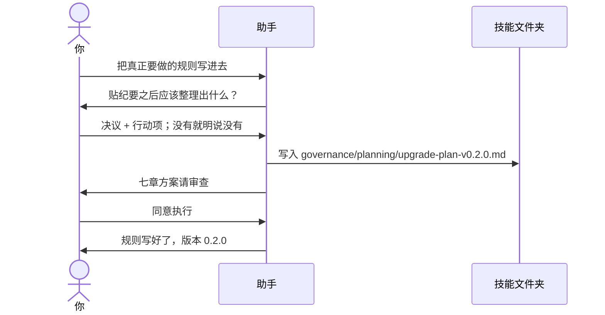

# 示例：初始化之后写规则

刚初始化完，文件夹里是**空架子**：有版本、有升级规矩，但技能还不会整理纪要。把真正要做的规则写进去，**也是一次升级**，不是初始化的一部分。

所以同样：先出升级方案文件 → 你看七章 → 回复「同意执行」→ 才写规则。七章含义、文件名规矩见 [08-初始化之后怎么升级.md](08-初始化之后怎么升级.md)。

> 假例子：会议速记刚建成，版本 0.1.0。林夏要把「贴纪要 → 决议和行动项」写进去，升到 0.2.0。

---



### 第 1 轮 · 开口

工作区是 `meeting-notes/`。

**你**

> 把技能真正要做的规则写进去。

**助手**

> 现在还是空架子，版本 0.1.0。写规则会改技能正文，要走升级：先出方案，你同意我再写。
>
> 第一步：你贴一段纪要之后，它应该整理出什么？

**你**

> 列出决议；每条跟一个行动项，写清谁来做、什么时候。没有决议就明说没有。不要编没说过的事。

---

### 第 2 轮 · 方案写成文件

**助手**

> 记下了。拟定升到 0.2.0（从空架子变成第一版能用的规则，算新能力）。
>
> 升级方案在：
>
> `governance/planning/upgrade-plan-v0.2.0.md`
>
> 没有改空模板 `governance/templates/upgrade-plan.md`。确认前不改 `SKILL.md`、`references/`。
>
> 七章摘要如下（全文在那个文件里，缺章请指出）。

**AP-1 变更概述**  
把「贴纪要 → 决议和行动项」写成技能规则。没有决议就明说没有，禁止编造。可验收：贴一段有决议的纪要能抽出行动项。

**AP-2 影响点**  
技能从「空架子」变成能整理纪要。旧能力：0.1.0 本来就不会干活，没有要保护的旧行为，但别人已经能用的开口说法要保留。

**AP-3 策略**  
细则写进 `references/`，`SKILL.md` 只留入口和路由。否决：把长规则全写进 `SKILL.md`（入口会膨胀，以后难改）。

**AP-4 修改范围**

| 文件 | 修改类型 | 是否核心契约 |
|---|---|---|
| `SKILL.md` | 补路由：贴纪要走整理规则 | 是 |
| `references/` 新建整理规则 | 抽决议、行动项、禁止编造 | 否 |
| `VERSION` `skill.json` `CHANGELOG.md` | 0.1.0 → 0.2.0 | skill.json 是 |

**AP-5 回归**  
正：有决议的纪要。反：没有决议的纪要 → 明说没有。旧：开口「整理纪要」仍能叫到这个技能。另测：纪要没说负责人时不要编。

**AP-6 风险与回滚**  
编造负责人 → 规则写死禁止。回滚：回到 `governance/baselines/0.1.0/`（空架子）。

**AP-7 版本影响**  
0.1.0 → 0.2.0。无需迁移工作区。要用这版能力，换 0.2.0 安装包。

> 请审查以上方案。确认后回复「同意执行」。

**你**

> 同意执行。

---

### 第 3 轮 · 写完

助手这时才往 `references/` 写规则，并留下变更单、回归报告、`upgrade-to-0.2.0.md`、`governance/baselines/0.2.0/`，发版后删除 `upgrade-plan-v0.2.0.md`。完整文件表见 [08](08-初始化之后怎么升级.md) 第 3 轮。

**助手**

> 规则写好了。版本 0.2.0。方案文件已按规矩删掉。
>
> 要打安装包直接说；要装到助手里试用，你开口我才拷。以后再加能力，还是先出 `governance/planning/upgrade-plan-v下一版.md`。

---

## 你可以照着说

```text
把技能真正要做的规则写进去。
```

```text
贴一段纪要，整理出决议和行动项；没有决议就明说没有，不要编。
```

写规则也是一轮升级：先出七章方案。之后你可以「执行升级」，或另开对话让 B 审，见 [21](21-初始化之后A出方案人直接执行.md)、[22](22-初始化之后B审核再执行.md)。完整七章见 [08](08-初始化之后怎么升级.md)。打包见 [06](06-初始化之后怎么打包.md)。
